# //uses-text-compression/samples/pages+cached+noadtech

[→ Parent](../..)


## Raw


```yaml
p90min: 1050
p90max: 2890
p90range: 1840
p90mean: 2290.9574468085107
p90median: 2465
p90stdev: 531.747558785494
p90skewness: -1.3823207252805705
p90eccentricity: 0.9999999999999997
p90discretization: 1.88
outlandishness: 0.9834320959025402
confidence: 227.43467680682863
p90confidence: 214.99069549574773

```

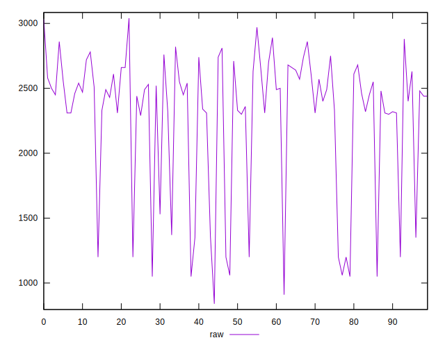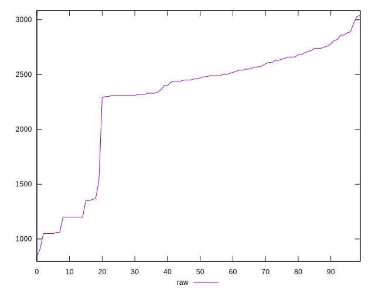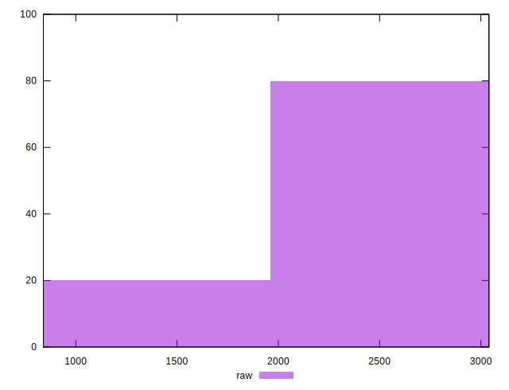
## Score


```yaml
p90min: 0.25
p90max: 0.46
p90range: 0.21000000000000002
p90mean: 0.3196808510638299
p90median: 0.3
p90stdev: 0.06238951302459331
p90skewness: 1.3530618158788525
p90eccentricity: 1.000000000000001
p90discretization: 7.833333333333333
outlandishness: 1.013301846495441
confidence: 0.026651935898130922
p90confidence: 0.025224685238675767

```

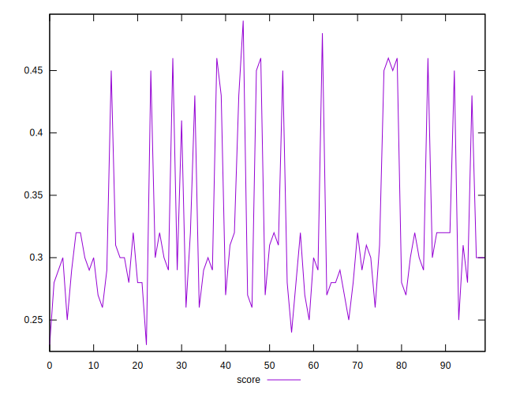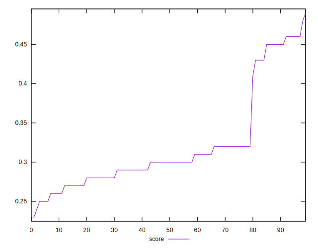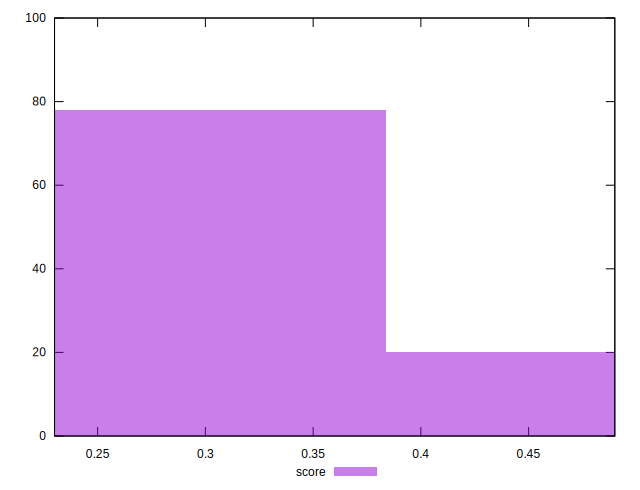
## Raw Estimate

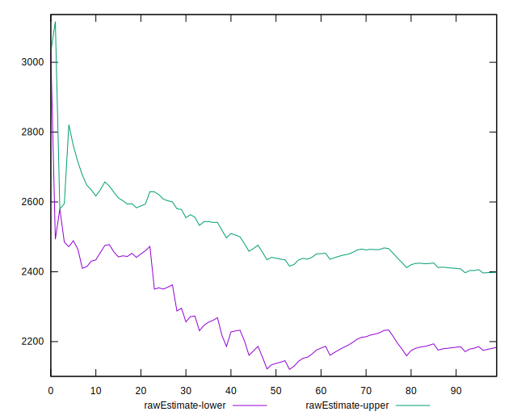
## Score Estimate

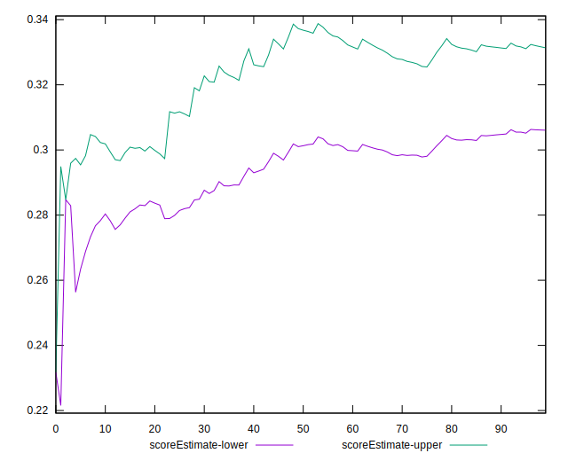
## P Score


```yaml
p90min: 0.24823529411764705
p90max: 0.4647058823529412
p90range: 0.21647058823529414
p90mean: 0.3187108886107634
p90median: 0.29823529411764704
p90stdev: 0.06255853632770517
p90skewness: 1.3823207252805731
p90eccentricity: 1.0000000000000002
p90discretization: 1.88
outlandishness: 1.0141189949246774
confidence: 0.026757020800803385
p90confidence: 0.025293022999499728

```

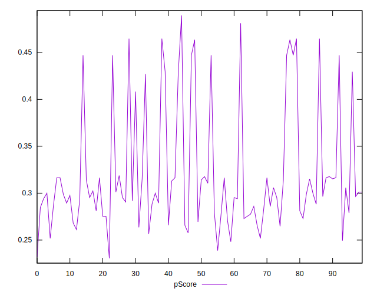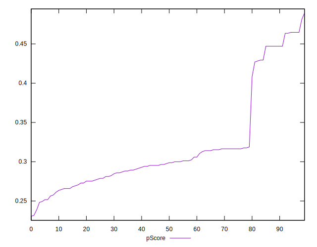
## Score Difference


```yaml
p90min: 0
p90max: 0
p90range: 0
p90mean: 0
p90median: 0
p90stdev: 0
p90skewness: .nan
p90eccentricity: .nan
p90discretization: 94
outlandishness: .inf
confidence: 2.165089820536967e-18
p90confidence: 0

```

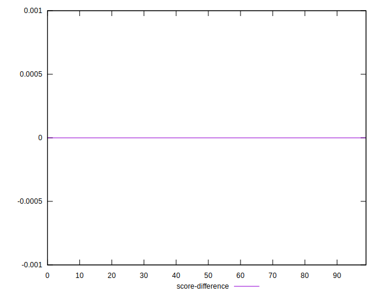
## P Score Difference


```yaml
p90min: -0.004705882352941171
p90max: 0.004705882352941171
p90range: 0.009411764705882342
p90mean: -0.0009011264080100173
p90median: -0.0011764705882353343
p90stdev: 0.002804984635136878
p90skewness: 0.4529854115275065
p90eccentricity: 1.0000000000000004
p90discretization: 3.032258064516129
outlandishness: 0.8836000000000036
confidence: 0.0011608799421894303
p90confidence: 0.0011340824938440967

```

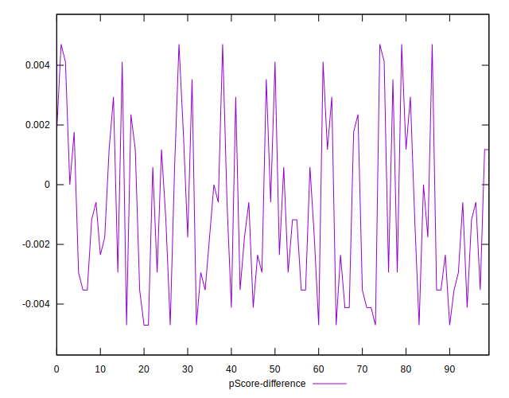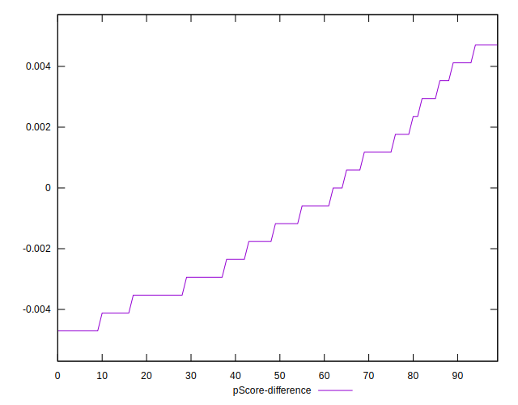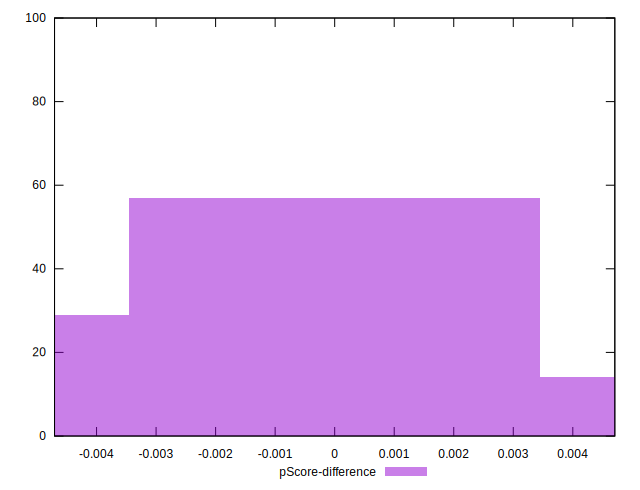