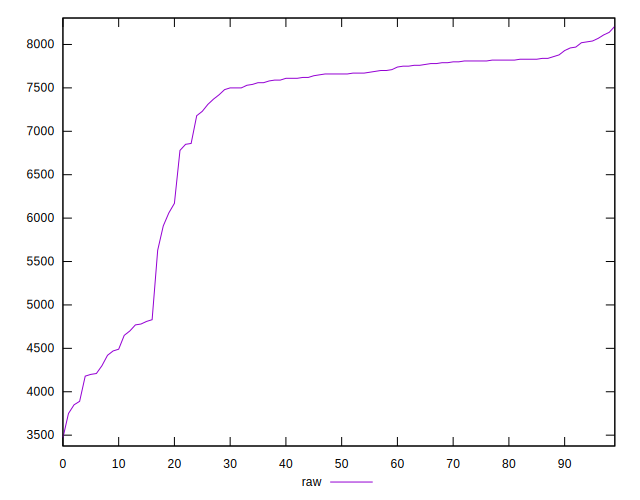
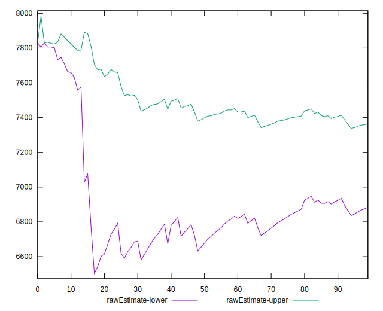

# //uses-text-compression/samples/pages

[→ Parent](../..)


## Raw


```yaml
p90min: 3890
p90max: 8070
p90range: 4180
p90mean: 7124.787234042553
p90median: 7660
p90stdev: 1186.3368693152065
p90skewness: -1.6402802353159032
p90eccentricity: 0.9999999999999999
p90discretization: 1.492063492063492
outlandishness: 0.9798389659143848
confidence: 511.7329327323405
p90confidence: 479.64750267750924

```


## Score


```yaml
p90min: 0
p90max: 0.13
p90range: 0.13
p90mean: 0.009148936170212766
p90median: 0
p90stdev: 0.025165814978838207
p90skewness: 2.9596486530249
p90eccentricity: 0.9999999999999996
p90discretization: 9.4
outlandishness: 2.113304542996215
confidence: 0.013815229879770198
p90confidence: 0.010174783081985495

```


## Raw Estimate


## Score Estimate


## P Score


```yaml
p90min: 0
p90max: 0.13058823529411762
p90range: 0.13058823529411762
p90mean: 0.009136420525657067
p90median: 0
p90stdev: 0.02530207723639163
p90skewness: 2.9849004043023575
p90eccentricity: 1.0000000000000016
p90discretization: 6.266666666666667
outlandishness: 2.0910744687558647
confidence: 0.013742164819800388
p90confidence: 0.01022987523433715

```


## Score Difference


```yaml
p90min: 0
p90max: 0
p90range: 0
p90mean: 0
p90median: 0
p90stdev: 0
p90skewness: .nan
p90eccentricity: .nan
p90discretization: 94
outlandishness: .nan
confidence: 0
p90confidence: 0

```


## P Score Difference


```yaml
p90min: -0.0035294117647059198
p90max: 0.0023529411764705715
p90range: 0.005882352941176491
p90mean: -0.00005006257822278096
p90median: 0
p90stdev: 0.0006952663034959283
p90skewness: -2.0772339333144636
p90eccentricity: 1.0000000000000013
p90discretization: 10.444444444444445
outlandishness: 3.106406249999899
confidence: 0.0004592906803015063
p90confidence: 0.00028110290996868594

```

