# //uses-webp-images/samples/pages

[→ Parent](../..)


## Raw


```yaml
p90min: 150
p90max: 590
p90range: 440
p90mean: 334.25531914893617
p90median: 310
p90stdev: 113.40465450410765
p90skewness: -0.04270029561731317
p90eccentricity: 0.9999999999999988
p90discretization: 5.222222222222222
outlandishness: 0.9960827743137171
confidence: 50.978719753541284
p90confidence: 45.850601740380185

```

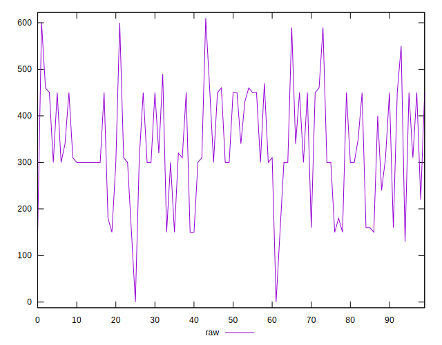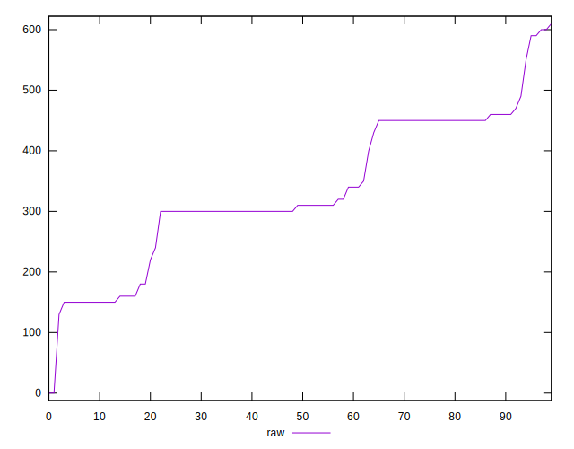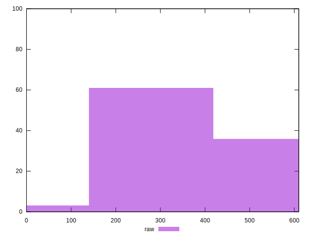
## Score


```yaml
p90min: 0.59
p90max: 0.88
p90range: 0.29000000000000004
p90mean: 0.7397872340425531
p90median: 0.74
p90stdev: 0.07614346374491301
p90skewness: 0.5258070794582761
p90eccentricity: 0.9999999999999992
p90discretization: 5.875
outlandishness: 1.0051778096648762
confidence: 0.034602352342763584
p90confidence: 0.0307855409160003

```

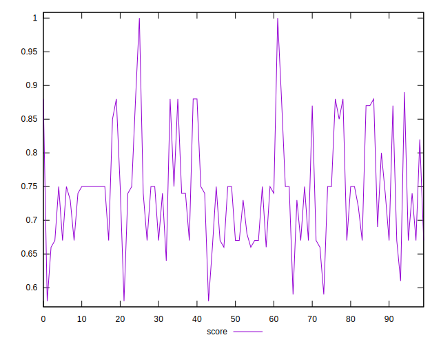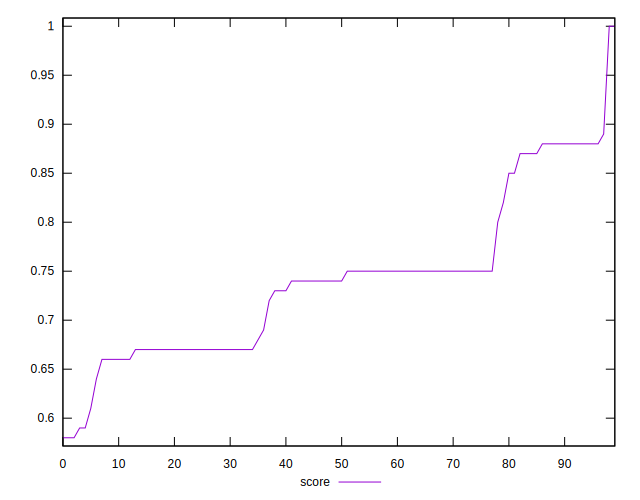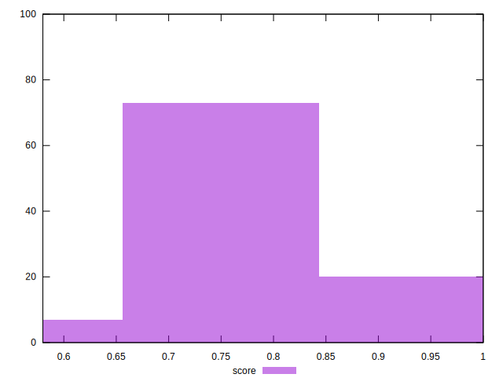
## Raw Estimate

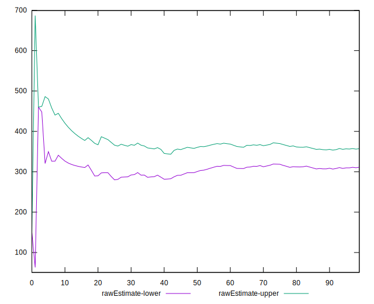
## Score Estimate

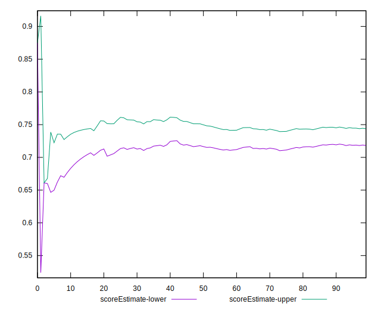
## P Score


```yaml
p90min: 0.5888888888888889
p90max: 0.875
p90range: 0.2861111111111111
p90mean: 0.7386229314420802
p90median: 0.7444444444444445
p90stdev: 0.07549098238085221
p90skewness: 0.4641060422087717
p90eccentricity: 0.9999999999999999
p90discretization: 5.222222222222222
outlandishness: 1.0055415628124222
confidence: 0.03438465176729107
p90confidence: 0.030521736372021126

```

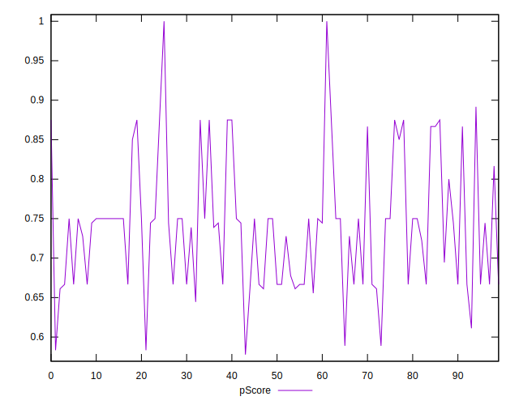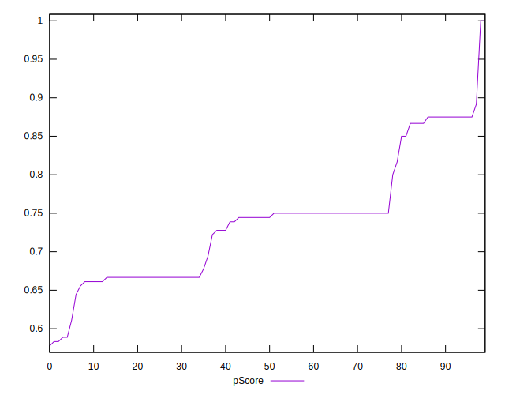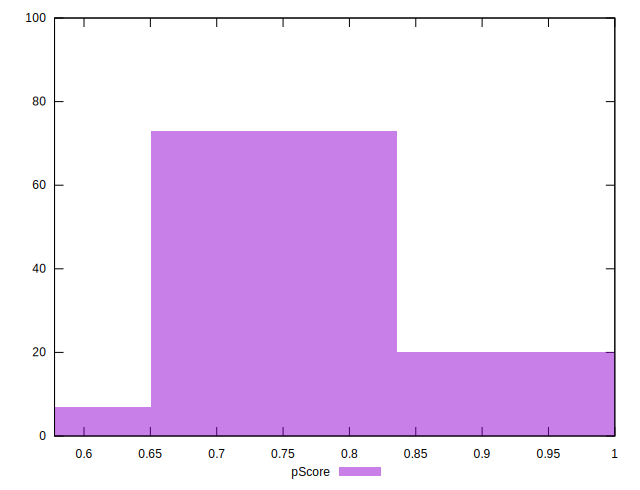
## Score Difference


```yaml
p90min: 0
p90max: 0
p90range: 0
p90mean: 0
p90median: 0
p90stdev: 0
p90skewness: .nan
p90eccentricity: .nan
p90discretization: 94
outlandishness: .inf
confidence: 6.092792000602806e-18
p90confidence: 0

```

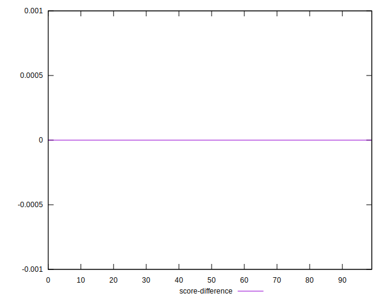
## P Score Difference


```yaml
p90min: -0.0050000000000000044
p90max: 0.004444444444444473
p90range: 0.009444444444444478
p90mean: -0.0010815602836879575
p90median: 0
p90stdev: 0.0025579275420143876
p90skewness: 0.4314942583478741
p90eccentricity: 1.0000000000000002
p90discretization: 7.230769230769231
outlandishness: 0.9128079548508452
confidence: 0.0010752909605211167
p90confidence: 0.0010341949148604229

```

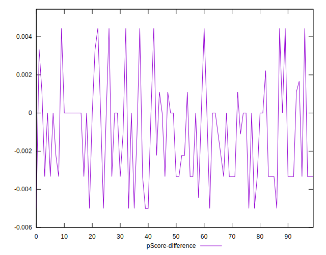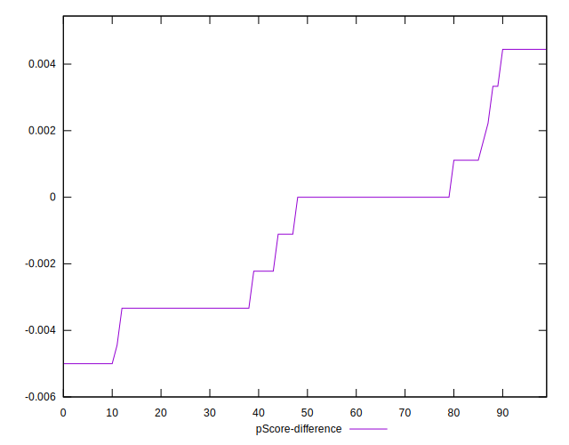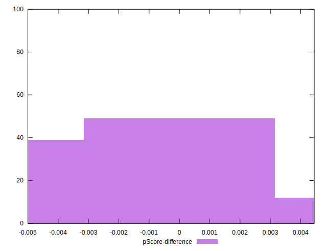