# //bootup-time/samples/pages+cached+noadtech+nomedia

[→ Parent](../..)


## Raw


```yaml
p90min: 247.50799999999995
p90max: 1537.932
p90range: 1290.424
p90mean: 625.0824255319153
p90median: 581.504
p90stdev: 232.641065644943
p90skewness: 1.2096843991932666
p90eccentricity: 1.0000000000000002
p90discretization: 1
outlandishness: 1.0985644151044796
confidence: 133.69997395070016
p90confidence: 94.05903925184624

```

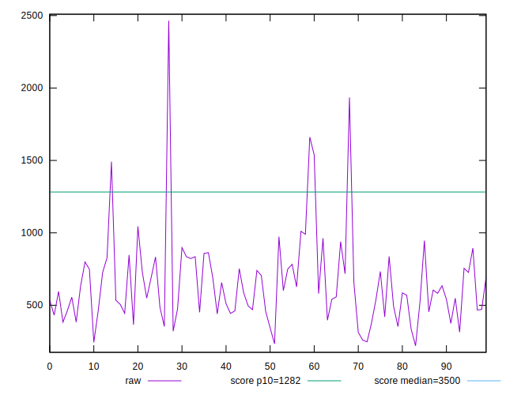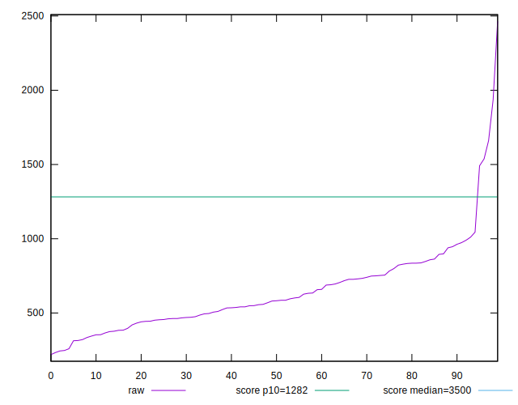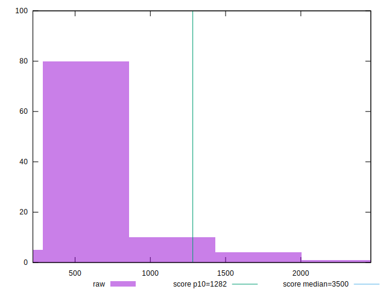
## Score


```yaml
p90min: 0.85
p90max: 1
p90range: 0.15000000000000002
p90mean: 0.9815957446808504
p90median: 0.99
p90stdev: 0.024202303015497542
p90skewness: -3.199000832272592
p90eccentricity: 1.0000000000000002
p90discretization: 10.444444444444445
outlandishness: 0.9876184930149904
confidence: 0.01809440618776312
p90confidence: 0.009785225849997064

```

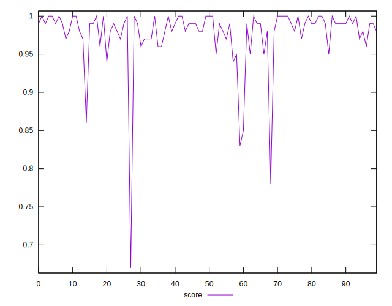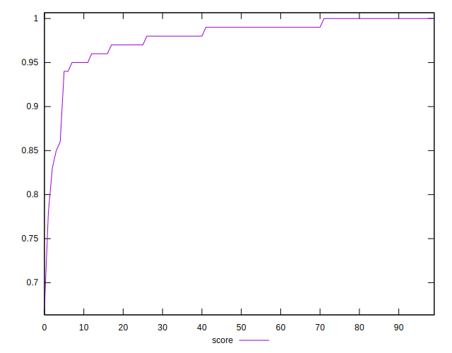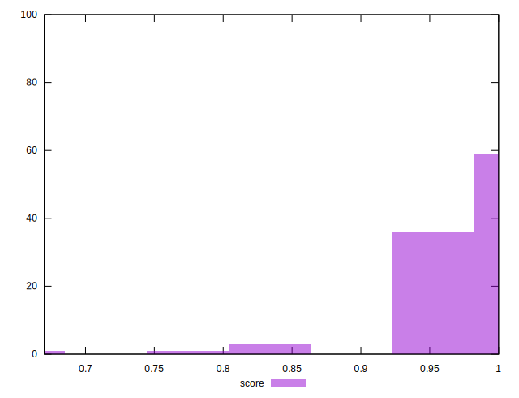
## Raw Estimate

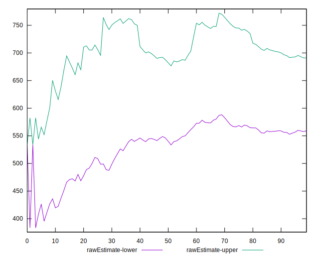
## Score Estimate

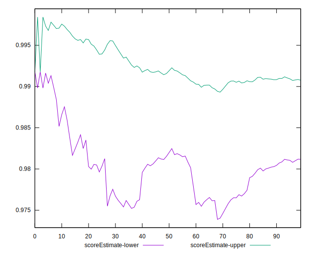
## P Score


```yaml
p90min: 0.852978875495751
p90max: 0.9996378486148725
p90range: 0.14665897311912146
p90mean: 0.9809090706103536
p90median: 0.9889983632587214
p90stdev: 0.02355008579524255
p90skewness: -3.2283584669275855
p90eccentricity: 1.0000000000000009
p90discretization: 1
outlandishness: 0.9876187676368259
confidence: 0.017954080853867717
p90confidence: 0.00952152810192054

```

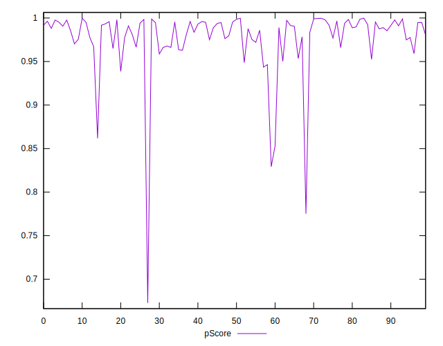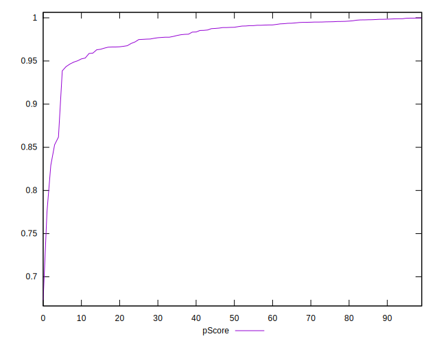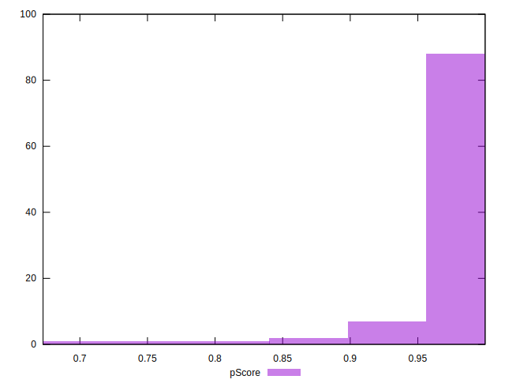
## Score Difference


```yaml
p90min: 0
p90max: 1.1102230246251565e-16
p90range: 1.1102230246251565e-16
p90mean: 5.9054416203465774e-18
p90median: 0
p90stdev: 2.491508549087333e-17
p90skewness: 3.9819818903757924
p90eccentricity: 0.9999999999999954
p90discretization: 47
outlandishness: 2.262016
confidence: 1.1806664533324076e-17
p90confidence: 1.0073410718148078e-17

```

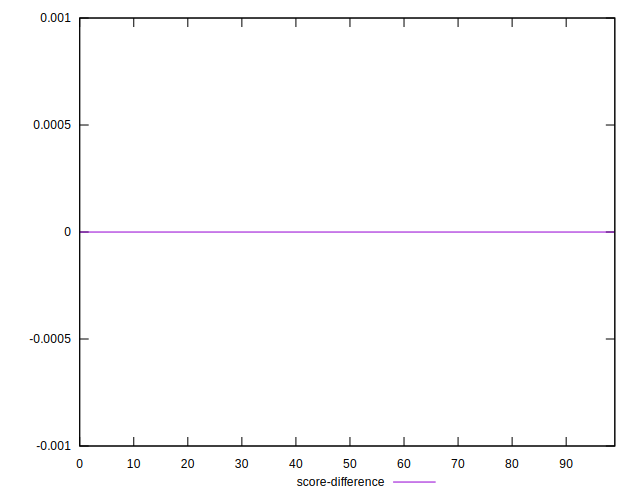
## P Score Difference


```yaml
p90min: -0.004838712627487696
p90max: 0.004808131035442864
p90range: 0.00964684366293056
p90mean: -0.0007241042463298604
p90median: -0.0011051215689672489
p90stdev: 0.0027214282642696297
p90skewness: 0.3096781165306346
p90eccentricity: 1.0000000000000007
p90discretization: 1
outlandishness: 0.8878013410811908
confidence: 0.001138057493243209
p90confidence: 0.001100299842679925

```

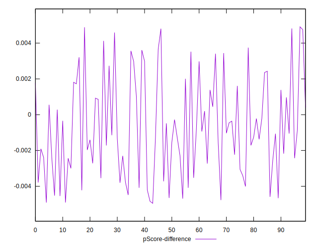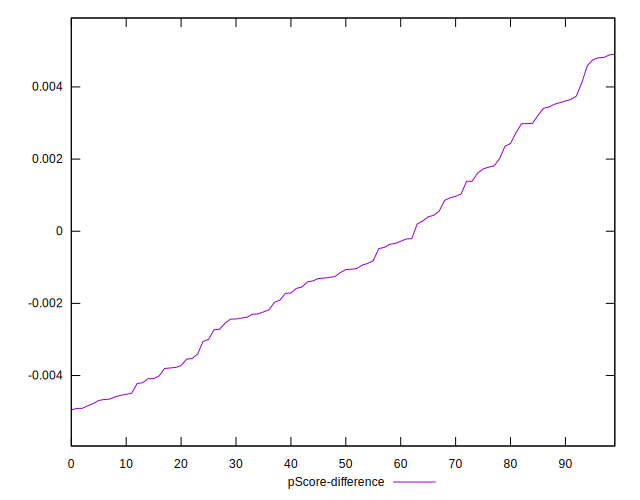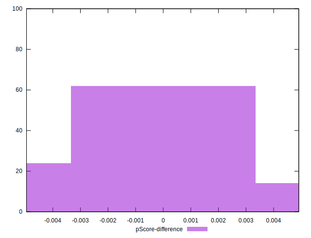