# //bootup-time/samples/pages

[→ Parent](../..)


## Raw


```yaml
p90min: 1295.1759999999992
p90max: 5592.66
p90range: 4297.484
p90mean: 2838.431829787234
p90median: 2546.5119999999993
p90stdev: 1123.9173185641737
p90skewness: 0.797506124006109
p90eccentricity: 0.9999999999999997
p90discretization: 1
outlandishness: 1.0382567813419215
confidence: 496.82564645716104
p90confidence: 454.41067289469464

```

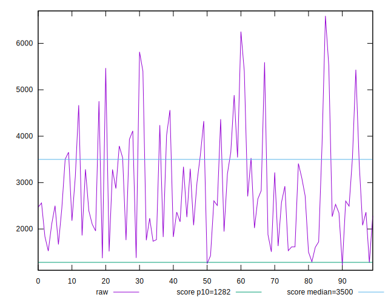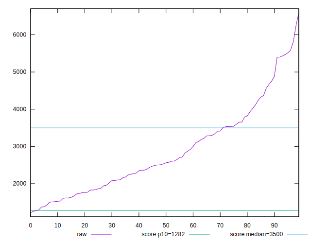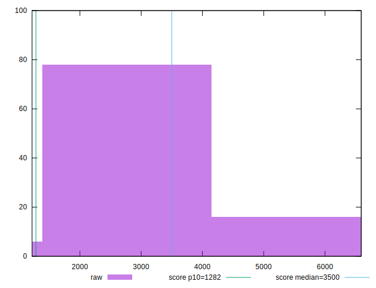
## Score


```yaml
p90min: 0.27
p90max: 0.9
p90range: 0.63
p90mean: 0.6280851063829788
p90median: 0.655
p90stdev: 0.1737464317450509
p90skewness: -0.3730827499980407
p90eccentricity: 0.9999999999999996
p90discretization: 1.8431372549019607
outlandishness: 0.9886165920422325
confidence: 0.0736745743052011
p90confidence: 0.07024736754050888

```

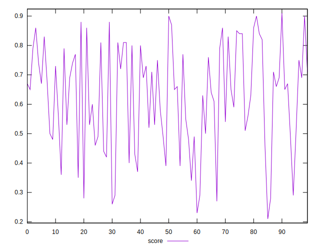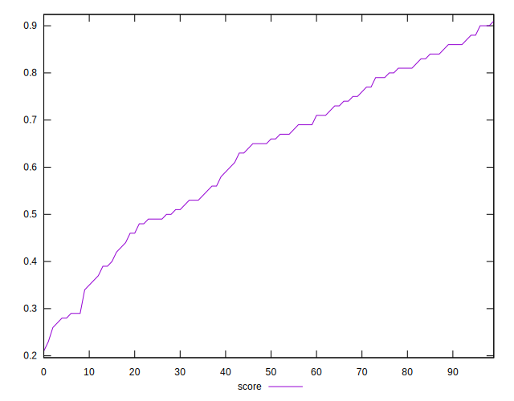
## Raw Estimate

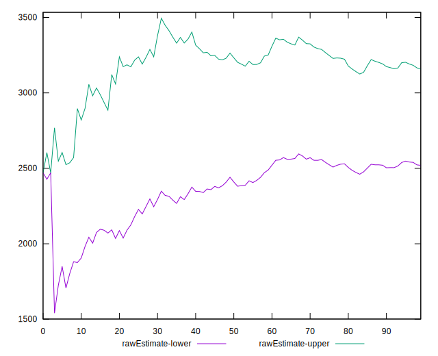
## Score Estimate

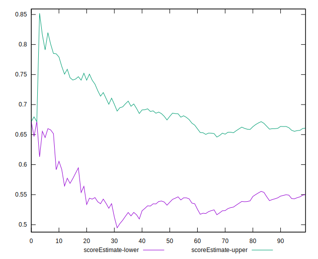
## P Score


```yaml
p90min: 0.27490106679644183
p90max: 0.8976909280446337
p90range: 0.6227898612481919
p90mean: 0.6279685326049521
p90median: 0.657566716465569
p90stdev: 0.17359224150453792
p90skewness: -0.3711180964017258
p90eccentricity: 1.0000000000000002
p90discretization: 1
outlandishness: 0.9887773050648215
confidence: 0.07368009165602844
p90confidence: 0.07018502693076119

```

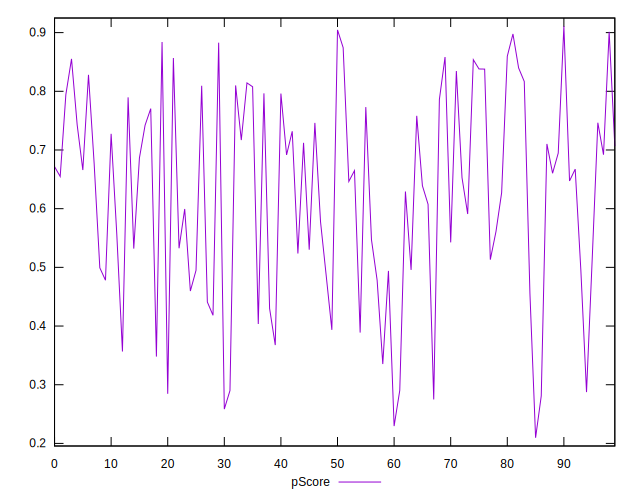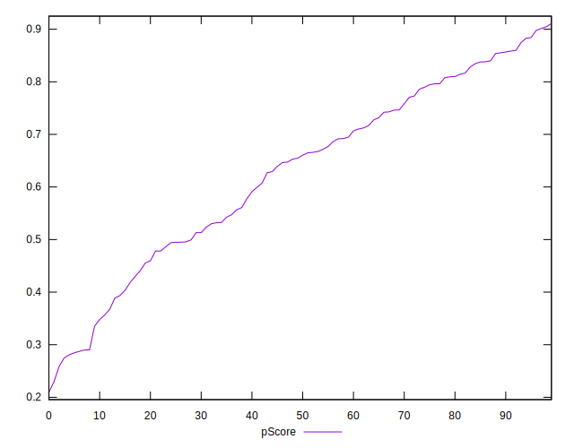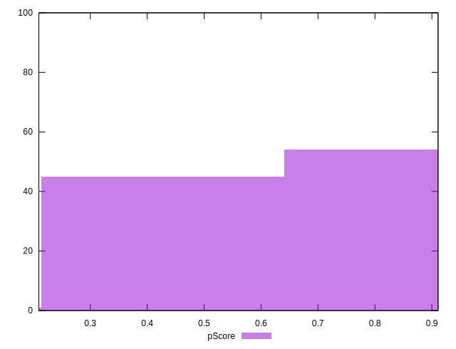
## Score Difference


```yaml
p90min: 0
p90max: 1.1102230246251565e-16
p90range: 1.1102230246251565e-16
p90mean: 5.3148974583119196e-18
p90median: 0
p90stdev: 2.30009180663327e-17
p90skewness: 4.229488855444214
p90eccentricity: 0.999999999999998
p90discretization: 31.333333333333332
outlandishness: 2.4544444444444444
confidence: 1.1254344734729739e-17
p90confidence: 9.299494262683345e-18

```

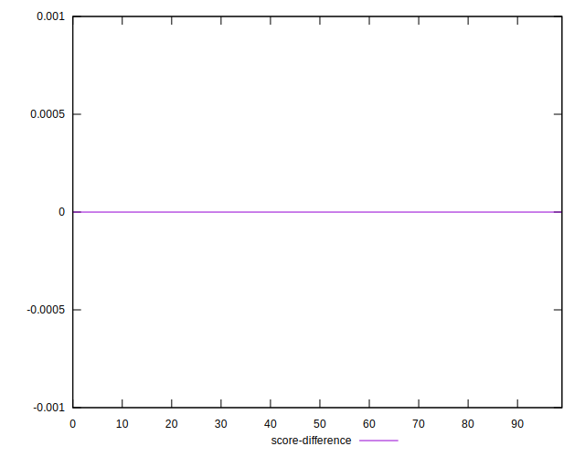
## P Score Difference


```yaml
p90min: -0.004352748749967272
p90max: 0.0048157120225674754
p90range: 0.009168460772534748
p90mean: -0.00007674365767587739
p90median: -0.00035821185742845874
p90stdev: 0.0027362707980426765
p90skewness: 0.26614691956811215
p90eccentricity: 1.0000000000000002
p90discretization: 1
outlandishness: 0.7208900667589587
confidence: 0.0011376383676111638
p90confidence: 0.0011063008230437553

```

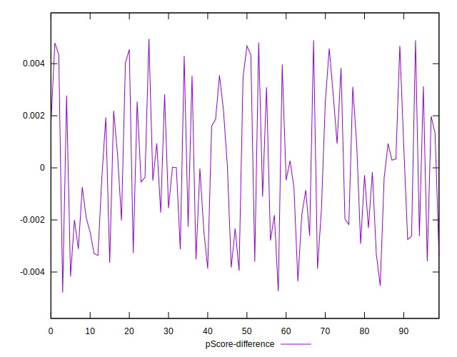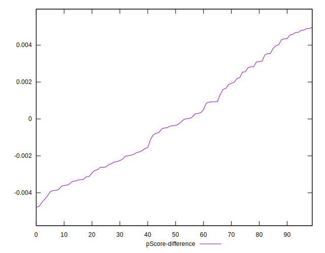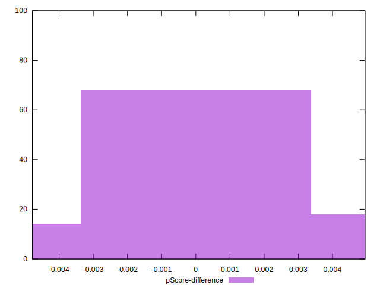