# //cumulative-layout-shift/samples/pages+cached+noadtech

[→ Parent](../..)


## Raw


```yaml
p90min: 0.9747424384223089
p90max: 1.6416703355577258
p90range: 0.6669278971354169
p90mean: 1.0750586895007048
p90median: 1.020477737850613
p90stdev: 0.18420354962605887
p90skewness: 2.7315359540166617
p90eccentricity: 1.0000000000000016
p90discretization: 7.230769230769231
outlandishness: 1.023785818242619
confidence: 0.08031345191846702
p90confidence: 0.07447528172455094

```

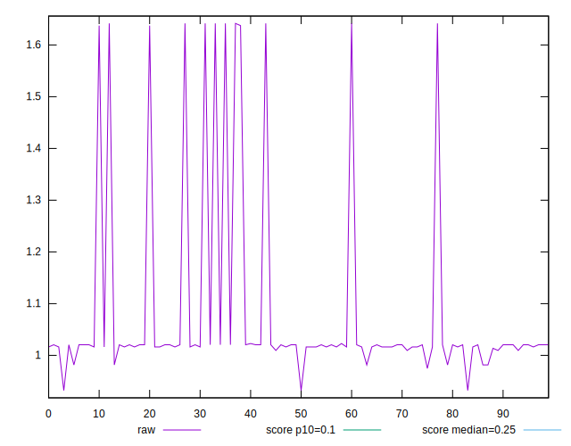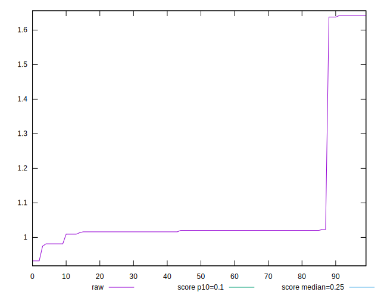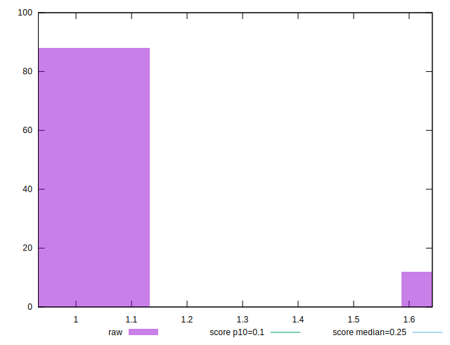
## Score


```yaml
p90min: 0
p90max: 0.03
p90range: 0.03
p90mean: 0.019361702127659586
p90median: 0.02
p90stdev: 0.007117331354756478
p90skewness: -1.5006339146795802
p90eccentricity: 1.0000000000000007
p90discretization: 31.333333333333332
outlandishness: 0.9731497282936846
confidence: 0.003091280149445975
p90confidence: 0.0028776060985172313

```

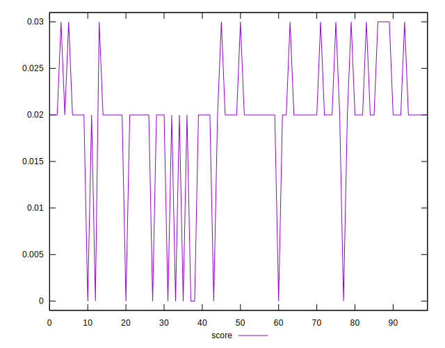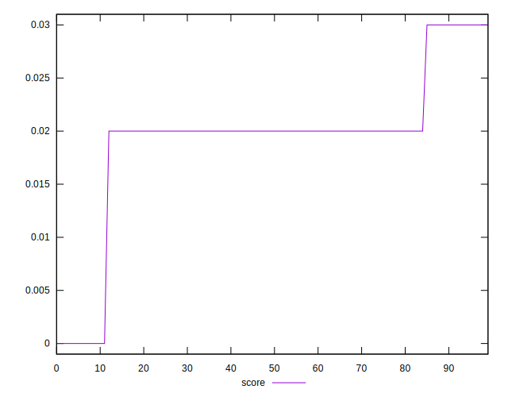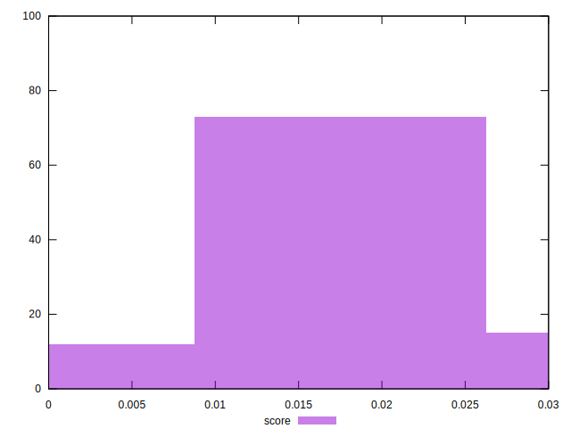
## Raw Estimate

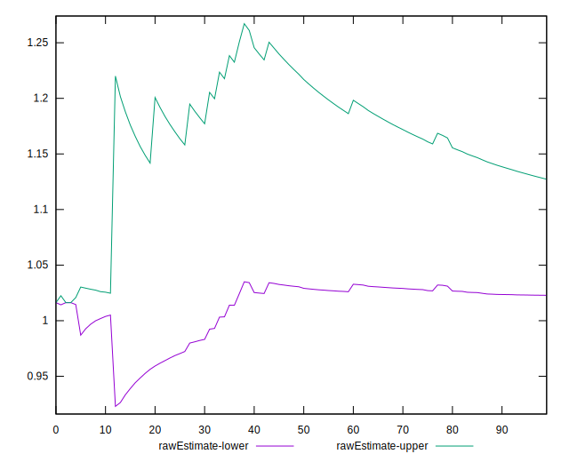
## Score Estimate

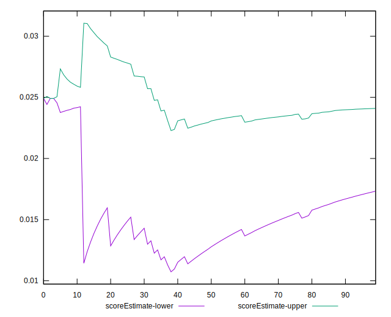
## P Score


```yaml
p90min: 0.004241318068433697
p90max: 0.02851153625904773
p90range: 0.024270218190614035
p90mean: 0.023026645270743624
p90median: 0.024576314396556442
p90stdev: 0.006169903610668713
p90skewness: -2.6380515762837966
p90eccentricity: 0.9999999999999988
p90discretization: 10.444444444444445
outlandishness: 0.9767567439818964
confidence: 0.0027491661189655075
p90confidence: 0.00249455187237538

```

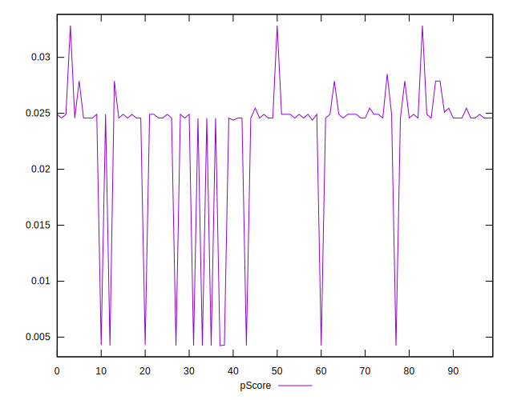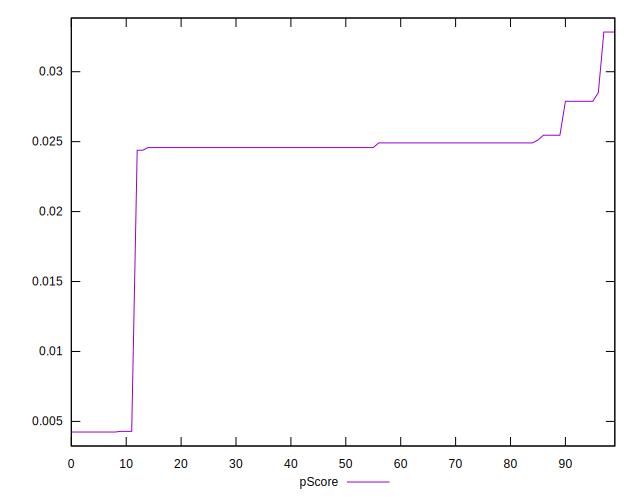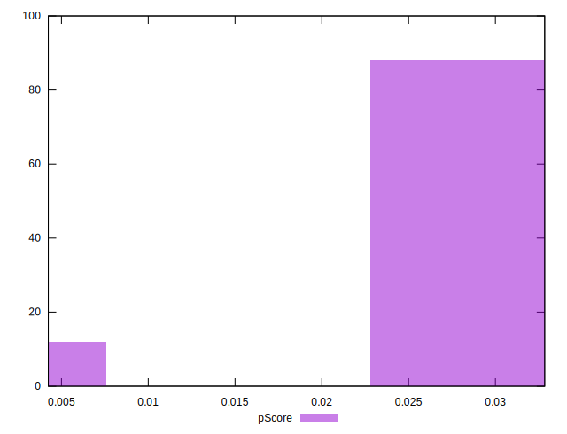
## Score Difference


```yaml
p90min: 0
p90max: 0
p90range: 0
p90mean: 0
p90median: 0
p90stdev: 0
p90skewness: .nan
p90eccentricity: .nan
p90discretization: 94
outlandishness: .nan
confidence: 0
p90confidence: 0

```


## P Score Difference


```yaml
p90min: -0.004539673714349407
p90max: 0.004911334870355184
p90range: 0.00945100858470459
p90mean: 0.003882712457838849
p90median: 0.004576314396556442
p90stdev: 0.0021624637436925905
p90skewness: -2.7389201956753397
p90eccentricity: 0.9999999999999997
p90discretization: 10.444444444444445
outlandishness: 0.8873395815766283
confidence: 0.0010042832971849237
p90confidence: 0.0008743050655515131

```

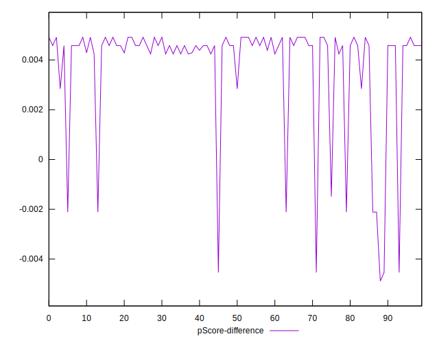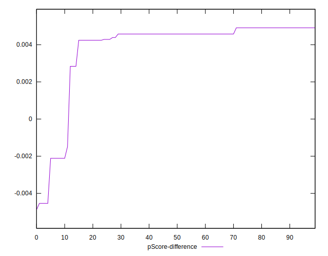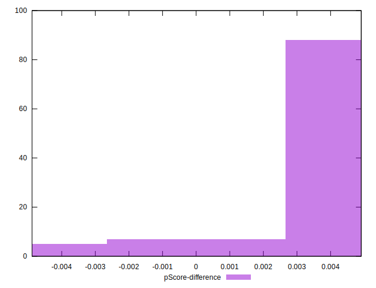