# //estimated-input-latency/samples/pages+cached+noadtech+nomedia

[→ Parent](../..)


## Raw


```yaml
p90min: 12.8
p90max: 304.8
p90range: 292
p90mean: 47.26869858156031
p90median: 31.833333333333336
p90stdev: 44.07961989156599
p90skewness: 2.601492271578361
p90eccentricity: 0.9999999999999988
p90discretization: 1.4242424242424243
outlandishness: 1.7433995696675122
confidence: 45.78737043069527
p90confidence: 17.821817855300875

```

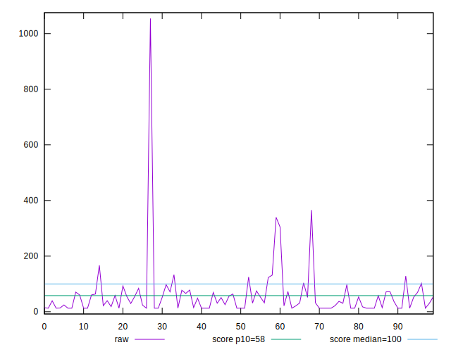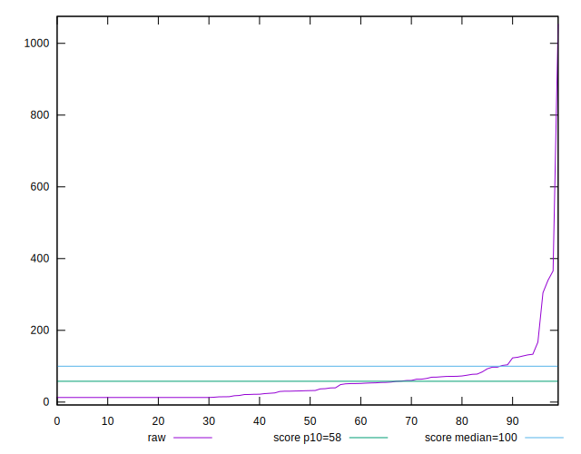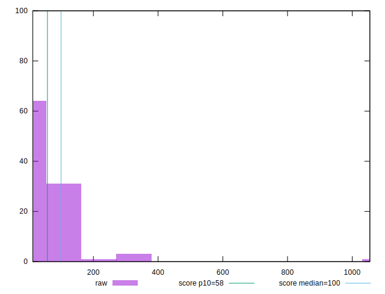
## Score


```yaml
p90min: 0
p90max: 1
p90range: 1
p90mean: 0.8697872340425534
p90median: 1
p90stdev: 0.22616590936839834
p90skewness: -2.08493357403841
p90eccentricity: 0.9999999999999988
p90discretization: 2.8484848484848486
outlandishness: 0.9496330866724626
confidence: 0.10429825649594279
p90confidence: 0.09144107076597763

```

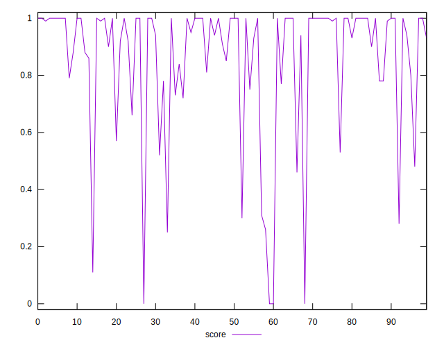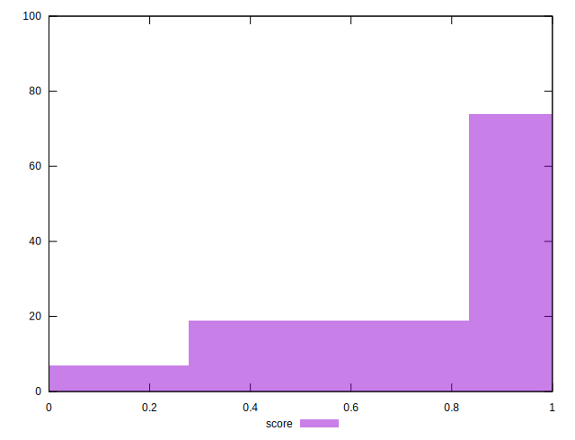
## Raw Estimate

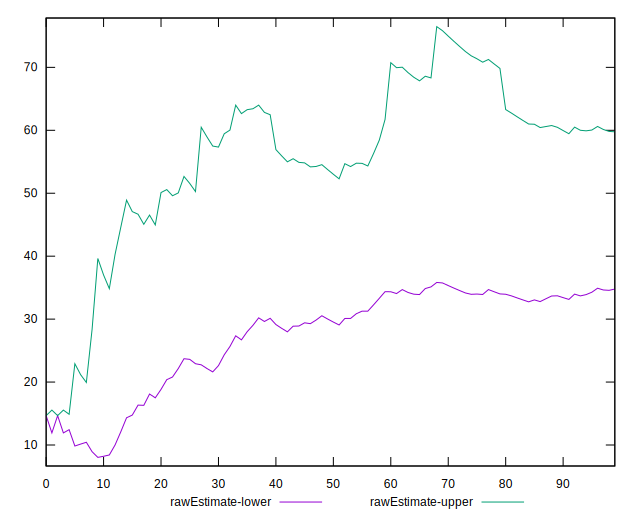
## Score Estimate

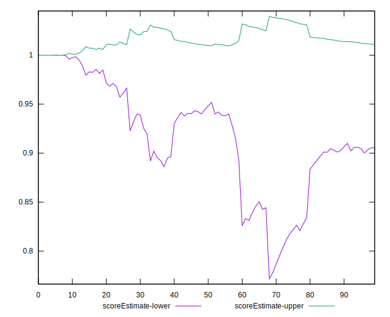
## P Score


```yaml
p90min: 0.004370899660539385
p90max: 0.9999993380488856
p90range: 0.9956284383883462
p90mean: 0.8697978425256403
p90median: 0.9964572320915901
p90stdev: 0.22567430298419452
p90skewness: -2.085749449261791
p90eccentricity: 0.9999999999999999
p90discretization: 1.4242424242424243
outlandishness: 0.9497029474103703
confidence: 0.10410521584539988
p90confidence: 0.09124230953669898

```

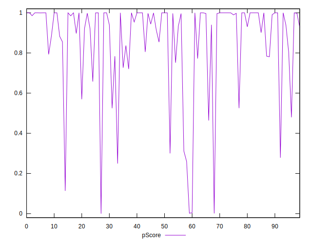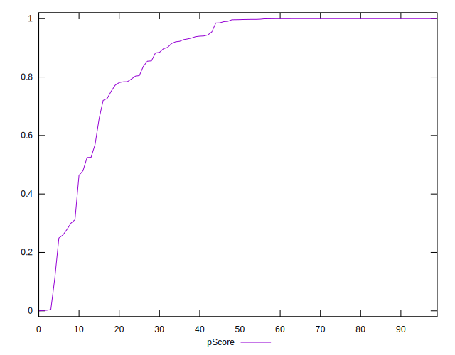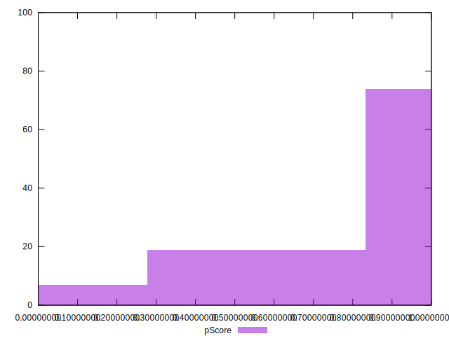
## Score Difference


```yaml
p90min: 0
p90max: 1.1102230246251565e-16
p90range: 1.1102230246251565e-16
p90mean: 3.543264972207946e-18
p90median: 0
p90stdev: 1.9514781802162972e-17
p90skewness: 5.326002287485487
p90eccentricity: 1.0000000000000036
p90discretization: 47
outlandishness: 3.5344000000000007
confidence: 1.0335413782903695e-17
p90confidence: 7.890015558655783e-18

```

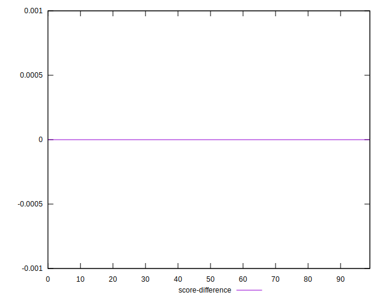
## P Score Difference


```yaml
p90min: -0.0046224127612272126
p90max: 0.004370899660539385
p90range: 0.008993312421766597
p90mean: 0.00004983911379182757
p90median: -6.619511143668433e-7
p90stdev: 0.0019320050749079415
p90skewness: 0.1097449257169337
p90eccentricity: 0.9999999999999999
p90discretization: 1.492063492063492
outlandishness: 0.6938549957490278
confidence: 0.0008638738292487837
p90confidence: 0.0007811283905175938

```

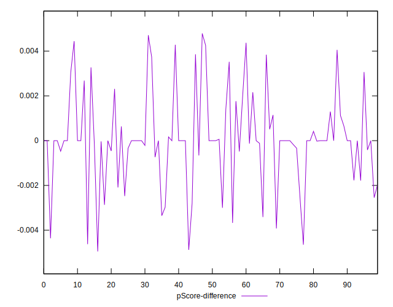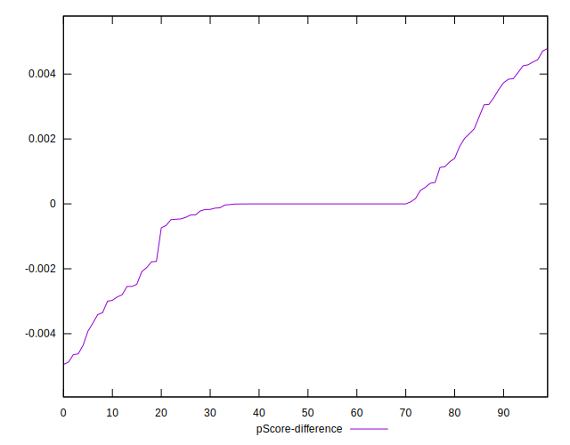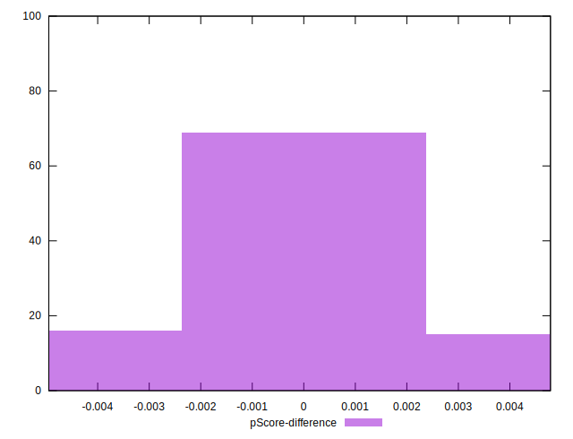