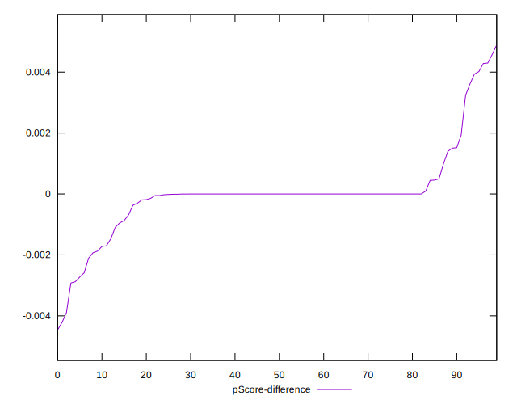

# //estimated-input-latency/samples/pages+cached+noadtech

[→ Parent](../..)


## Raw


```yaml
p90min: 12.8
p90max: 197.99999999999983
p90range: 185.19999999999982
p90mean: 39.10270992907804
p90median: 12.8
p90stdev: 43.0736522939589
p90skewness: 1.808473489490303
p90eccentricity: 1.0000000000000002
p90discretization: 2.1363636363636362
outlandishness: 1.3307729672507305
confidence: 22.46038792696294
p90confidence: 17.415095398596602

```


## Score


```yaml
p90min: 0.05
p90max: 1
p90range: 0.95
p90mean: 0.8789361702127658
p90median: 1
p90stdev: 0.24435093391366766
p90skewness: -2.078334654270587
p90eccentricity: 1.000000000000003
p90discretization: 3.1333333333333333
outlandishness: 0.9498203410093818
confidence: 0.10985904275106004
p90confidence: 0.09879345256820762

```


## Raw Estimate


## Score Estimate


## P Score


```yaml
p90min: 0.05401766622752269
p90max: 0.9999993380488856
p90range: 0.945981671821363
p90mean: 0.878991111089595
p90median: 0.9999993380488856
p90stdev: 0.24359696009675
p90skewness: -2.071558214613148
p90eccentricity: 0.9999999999999999
p90discretization: 2.1363636363636362
outlandishness: 0.9497502593179702
confidence: 0.10965392738042508
p90confidence: 0.09848861364115183

```


## Score Difference


```yaml
p90min: 0
p90max: 5.551115123125783e-17
p90range: 5.551115123125783e-17
p90mean: 5.905441620346577e-19
p90median: 0
p90stdev: 5.695001657605475e-18
p90skewness: 9.539955591519895
p90eccentricity: 1.0000000000000016
p90discretization: 47
outlandishness: 43.29640000000001
confidence: 7.696388387997903e-18
p90confidence: 2.302544406624999e-18

```


## P Score Difference


```yaml
p90min: -0.0029217575574856935
p90max: 0.004283260782784515
p90range: 0.007205018340270208
p90mean: 0.000010622058959513696
p90median: -6.619511143668433e-7
p90stdev: 0.0012193340127579322
p90skewness: 1.0187233098229014
p90eccentricity: 0.9999999999999987
p90discretization: 2.292682926829268
outlandishness: 4.266486340354602
confidence: 0.0006270805710098334
p90confidence: 0.000492988567814371

```

