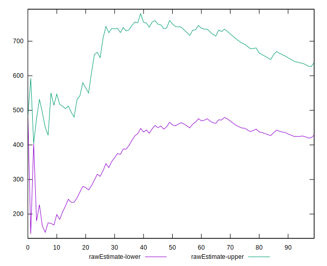

# //estimated-input-latency/samples/pages+cached

[→ Parent](../..)


## Raw


```yaml
p90min: 128
p90max: 1460.8000000000015
p90range: 1332.8000000000015
p90mean: 533.0510638297872
p90median: 406.99999999999966
p90stdev: 369.8197855700865
p90skewness: 0.8767900752334243
p90eccentricity: 1.0000000000000002
p90discretization: 1
outlandishness: 1.0954268894308576
confidence: 168.36425938402692
p90confidence: 149.52172622925852

```


## Score


```yaml
p90min: 0
p90max: 0.28
p90range: 0.28
p90mean: 0.029574468085106373
p90median: 0
p90stdev: 0.058399120031570204
p90skewness: 2.451545830090477
p90eccentricity: 1.0000000000000002
p90discretization: 5.529411764705882
outlandishness: 2.335839428601005
confidence: 0.043088835339142935
p90confidence: 0.023611330648330636

```


## Raw Estimate


## Score Estimate


## P Score


```yaml
p90min: 1.4122952807227307e-10
p90max: 0.2806960162551049
p90range: 0.28069601611387535
p90mean: 0.029834772126693703
p90median: 0.0004805306646178398
p90stdev: 0.05853765599815767
p90skewness: 2.4576018882880786
p90eccentricity: 1
p90discretization: 1.010752688172043
outlandishness: 2.324363123418217
confidence: 0.04317802981788258
p90confidence: 0.02366734208329771

```


## Score Difference


```yaml
p90min: 0
p90max: 0
p90range: 0
p90mean: 0
p90median: 0
p90stdev: 0
p90skewness: .nan
p90eccentricity: .nan
p90discretization: 94
outlandishness: .nan
confidence: 0
p90confidence: 0

```


## P Score Difference


```yaml
p90min: -0.0045929743384570815
p90max: 0.00441669651107407
p90range: 0.009009670849531151
p90mean: 0.00030720455728522724
p90median: 0.000003706369232303608
p90stdev: 0.0018396882014763175
p90skewness: -0.27552251139062534
p90eccentricity: 1
p90discretization: 1.010752688172043
outlandishness: 0.864791256879566
confidence: 0.0008388928975825517
p90confidence: 0.0007438037831975551

```

