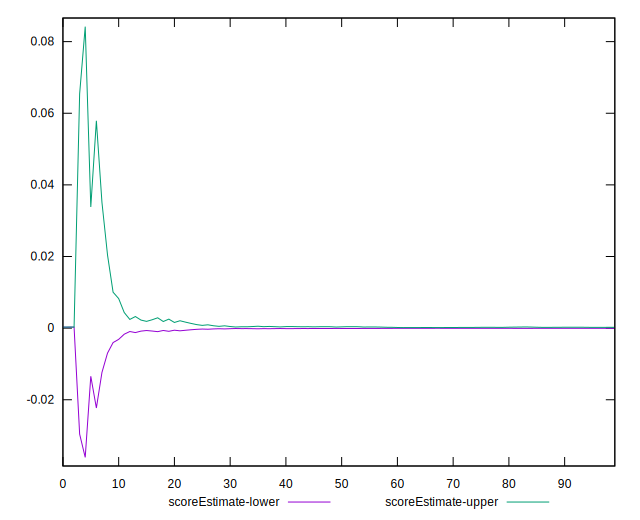
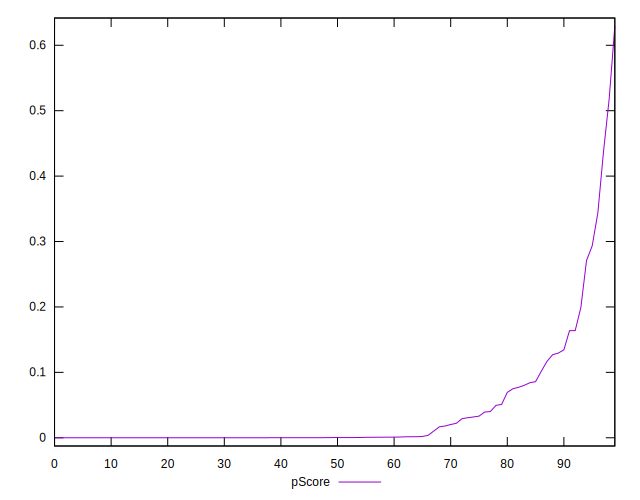
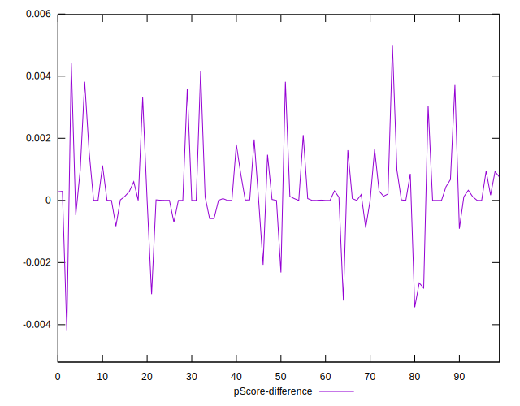

# //estimated-input-latency/samples/pages

[→ Parent](../..)


## Raw


```yaml
p90min: 118.66666666666691
p90max: 1355.2000000000016
p90range: 1236.5333333333347
p90mean: 496.8382978723406
p90median: 432.40000000000003
p90stdev: 297.88778798512806
p90skewness: 0.7854355198531028
p90eccentricity: 1.0000000000000002
p90discretization: 1
outlandishness: 1.104410408309408
confidence: 143.70762739242258
p90confidence: 120.438921929207

```


## Score


```yaml
p90min: 0
p90max: 0.34
p90range: 0.34
p90mean: 0.03074468085106383
p90median: 0
p90stdev: 0.06528561409588539
p90skewness: 2.7783449251309507
p90eccentricity: 0.9999999999999983
p90discretization: 5.529411764705882
outlandishness: 2.123322929562625
confidence: 0.04203098780812441
p90confidence: 0.026395606991405873

```


## Raw Estimate


## Score Estimate


## P Score


```yaml
p90min: 4.348970628065274e-10
p90max: 0.34360228857572866
p90range: 0.3436022881408316
p90mean: 0.031137431084612328
p90median: 0.0002859791738751838
p90stdev: 0.0656834883566347
p90skewness: 2.7939259170886044
p90eccentricity: 1.0000000000000002
p90discretization: 1.010752688172043
outlandishness: 2.098870119930516
confidence: 0.04200365446313694
p90confidence: 0.02655647141405357

```


## Score Difference


```yaml
p90min: 0
p90max: 0
p90range: 0
p90mean: 0
p90median: 0
p90stdev: 0
p90skewness: .nan
p90eccentricity: .nan
p90discretization: 94
outlandishness: .nan
confidence: 0
p90confidence: 0

```


## P Score Difference


```yaml
p90min: -0.0030194106002047194
p90max: 0.0038199122525484352
p90range: 0.006839322852753155
p90mean: 0.0003015053879402376
p90median: 0.00001710682670780228
p90stdev: 0.0012000082498556286
p90skewness: 0.6272857107306173
p90eccentricity: 0.9999999999999997
p90discretization: 1.010752688172043
outlandishness: 1.0590799538931224
confidence: 0.0006019509084477699
p90confidence: 0.00048517497443024385

```

