# //first-contentful-paint/samples/pages+cached+noadtech+nomedia

[→ Parent](../..)


## Raw


```yaml
p90min: 2135.4675
p90max: 2966.6499999999996
p90range: 831.1824999999994
p90mean: 2379.0965851063834
p90median: 2355.5822500000004
p90stdev: 177.78136032539243
p90skewness: 0.7971620921451102
p90eccentricity: 1
p90discretization: 1
outlandishness: 1.0085928282183976
confidence: 87.22639771344276
p90confidence: 71.87872830076248

```

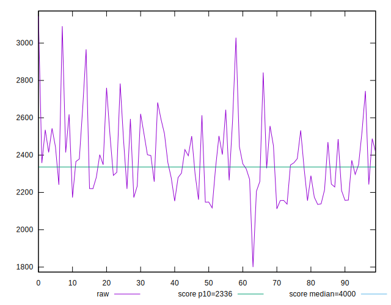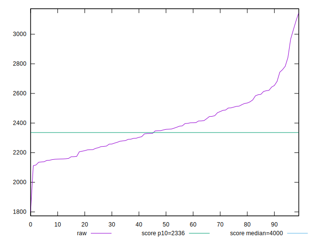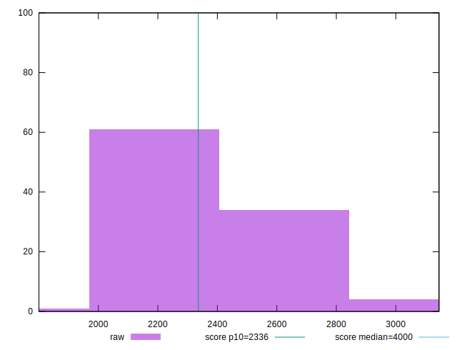
## Score


```yaml
p90min: 0.76
p90max: 0.93
p90range: 0.17000000000000004
p90mean: 0.8903191489361706
p90median: 0.9
p90stdev: 0.03480804894871468
p90skewness: -1.1482589747298384
p90eccentricity: 1.0000000000000016
p90discretization: 6.266666666666667
outlandishness: 0.9934532165567128
confidence: 0.017474439191958298
p90confidence: 0.014073231797107302

```

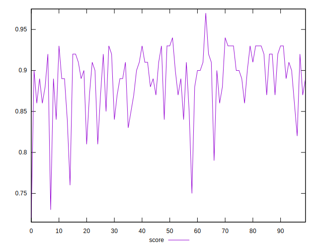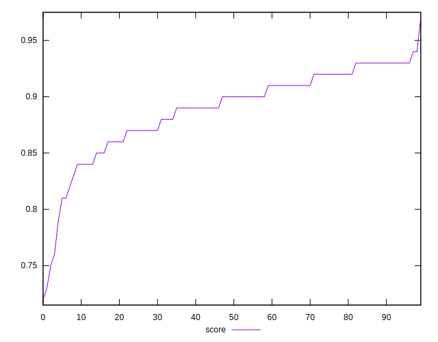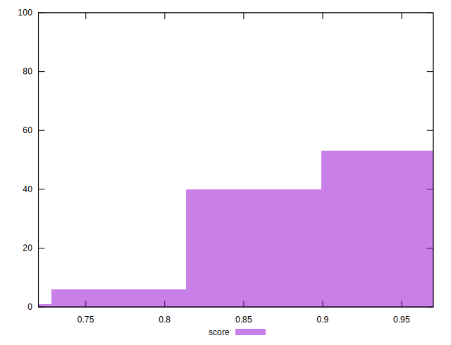
## Raw Estimate

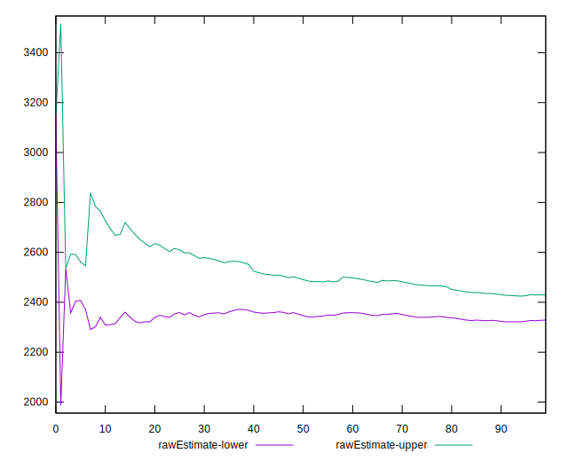
## Score Estimate

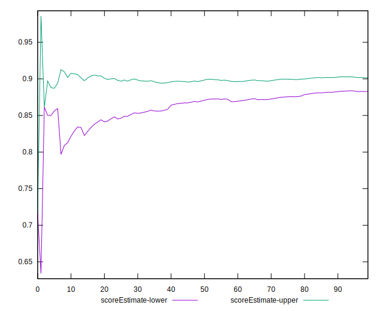
## P Score


```yaml
p90min: 0.7617984848886946
p90max: 0.9325963073300265
p90range: 0.1707978224413319
p90mean: 0.8898551561967719
p90median: 0.8964641900085265
p90stdev: 0.034598003950016394
p90skewness: -1.1265964519058942
p90eccentricity: 1
p90discretization: 1
outlandishness: 0.9931971382845737
confidence: 0.017463744848425822
p90confidence: 0.01398830856688376

```

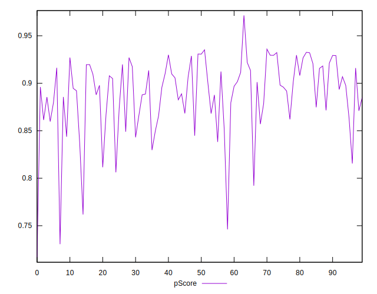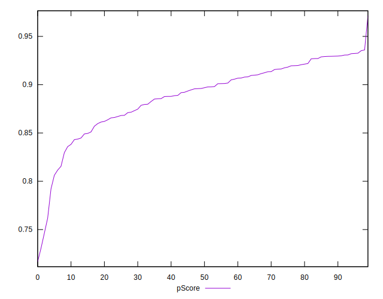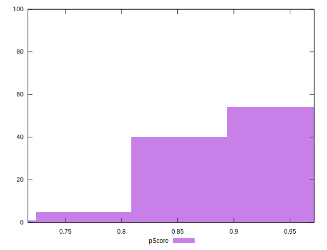
## Score Difference


```yaml
p90min: 0
p90max: 1.1102230246251565e-16
p90range: 1.1102230246251565e-16
p90mean: 1.1810883240693154e-18
p90median: 0
p90stdev: 1.139000331521095e-17
p90skewness: 9.539955591519908
p90eccentricity: 0.9999999999999996
p90discretization: 47
outlandishness: 14.137600000000003
confidence: 8.52813229165027e-18
p90confidence: 4.605088813249998e-18

```

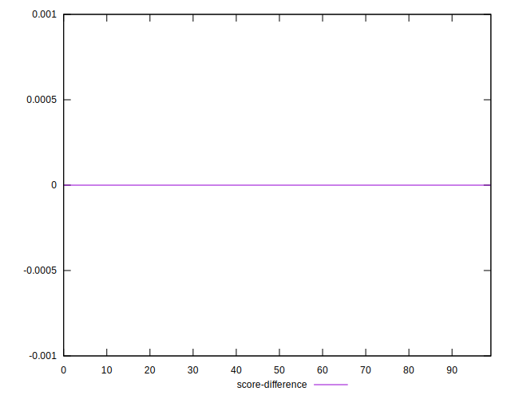
## P Score Difference


```yaml
p90min: -0.004496632843278836
p90max: 0.004631220076865561
p90range: 0.009127852920144397
p90mean: -0.0006168903972091521
p90median: -0.00047506887820969457
p90stdev: 0.002419949672356439
p90skewness: 0.0865688753330215
p90eccentricity: 0.9999999999999999
p90discretization: 1
outlandishness: 0.8742169552538811
confidence: 0.0010295684717081491
p90confidence: 0.0009784091238949954

```

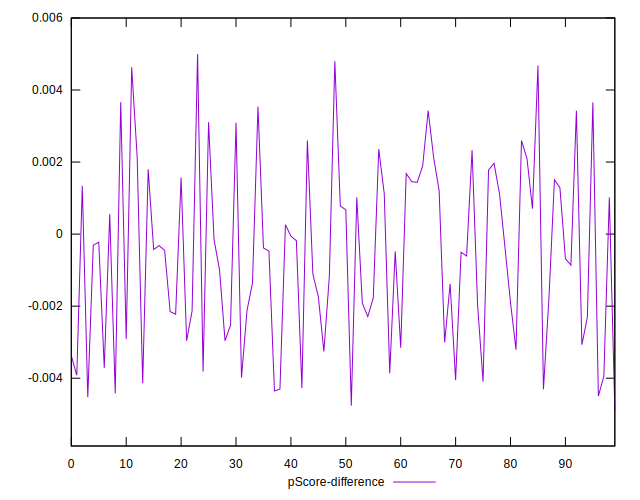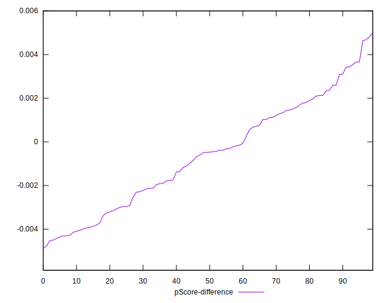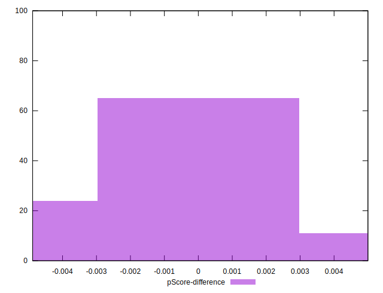