# //first-contentful-paint/samples/pages+cached+noadtech

[→ Parent](../..)


## Raw


```yaml
p90min: 2123.8900000000003
p90max: 3185.924
p90range: 1062.0339999999997
p90mean: 2369.308021276596
p90median: 2339.9445
p90stdev: 210.4125317268224
p90skewness: 1.4144512222419392
p90eccentricity: 1.0000000000000002
p90discretization: 1
outlandishness: 1.0254648626376994
confidence: 118.5913837614803
p90confidence: 85.0718273917249

```

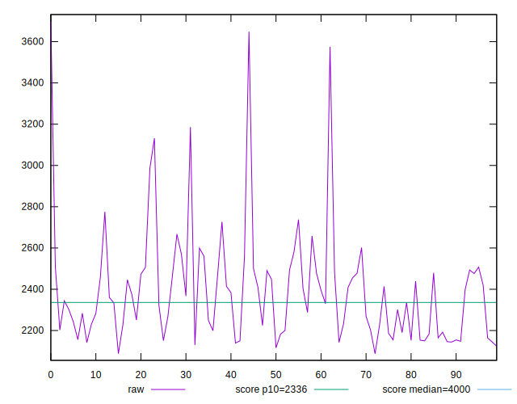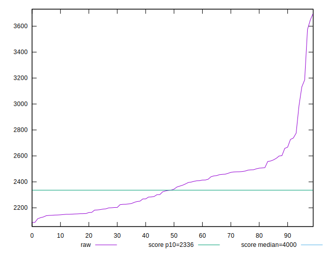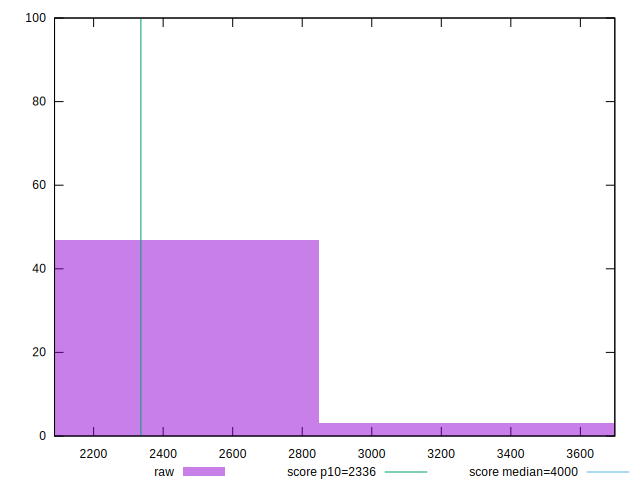
## Score


```yaml
p90min: 0.71
p90max: 0.93
p90range: 0.22000000000000008
p90mean: 0.8911702127659584
p90median: 0.9
p90stdev: 0.042070265007806563
p90skewness: -1.9643752998287427
p90eccentricity: 0.9999999999999999
p90discretization: 6.266666666666667
outlandishness: 0.9830827840499458
confidence: 0.026022653731817485
p90confidence: 0.017009416186840216

```

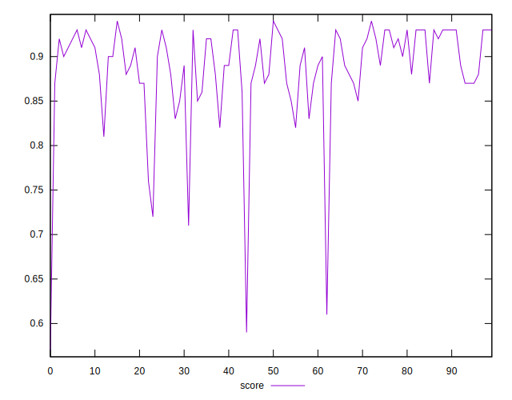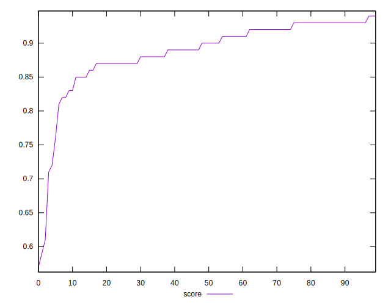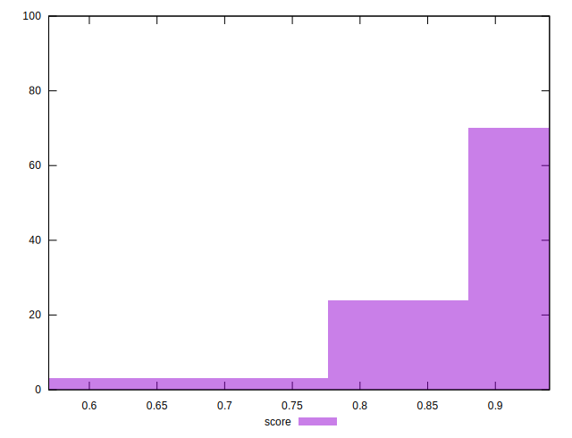
## Raw Estimate

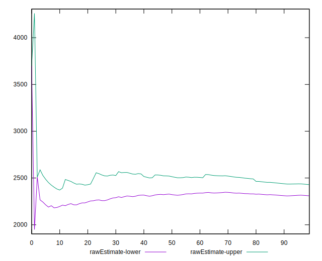
## Score Estimate

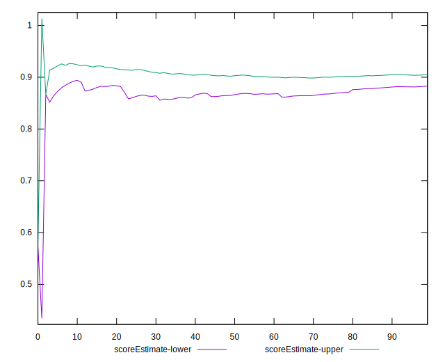
## P Score


```yaml
p90min: 0.7061564718048252
p90max: 0.9342692329713276
p90range: 0.22811276116650236
p90mean: 0.8908996401327228
p90median: 0.8992913810708262
p90stdev: 0.042453584603163626
p90skewness: -1.969160652913585
p90eccentricity: 1
p90discretization: 1
outlandishness: 0.9828984774171776
confidence: 0.02613914611378465
p90confidence: 0.01716439601710251

```

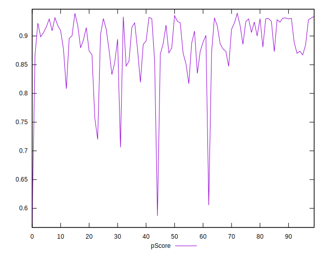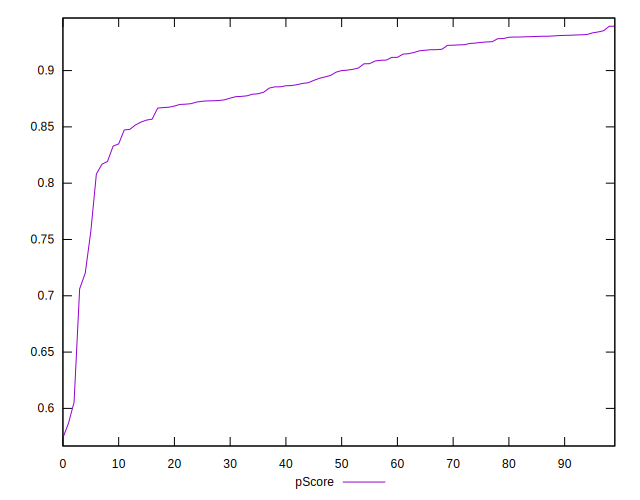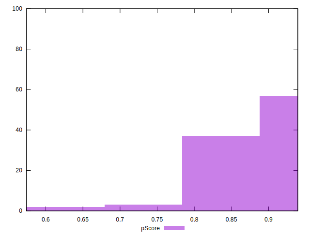
## Score Difference


```yaml
p90min: 0
p90max: 1.1102230246251565e-16
p90range: 1.1102230246251565e-16
p90mean: 5.9054416203465774e-18
p90median: 0
p90stdev: 2.4915085490873312e-17
p90skewness: 3.981981890375803
p90eccentricity: 0.9999999999999968
p90discretization: 47
outlandishness: 2.262016
confidence: 1.1806664533324076e-17
p90confidence: 1.007341071814807e-17

```

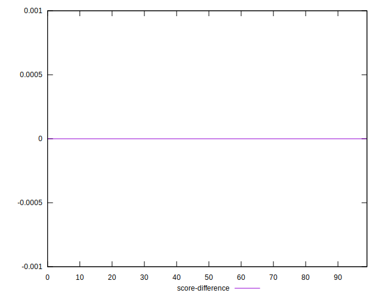
## P Score Difference


```yaml
p90min: -0.004580470665172198
p90max: 0.004391229265723218
p90range: 0.008971699930895416
p90mean: -0.0003668586661640631
p90median: -0.0004970698021541375
p90stdev: 0.0025882480321307647
p90skewness: 0.1148283895213796
p90eccentricity: 1.0000000000000002
p90discretization: 1
outlandishness: 0.9158337697207799
confidence: 0.0010846231408341508
p90confidence: 0.0010464537830962833

```

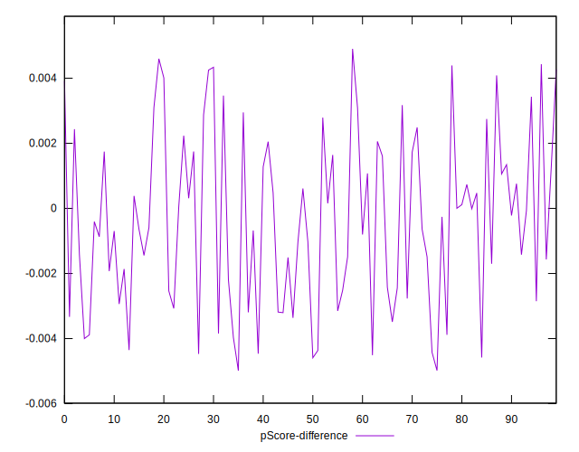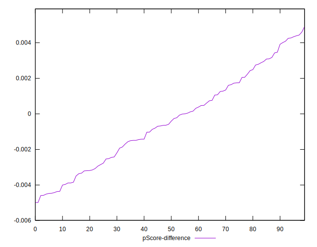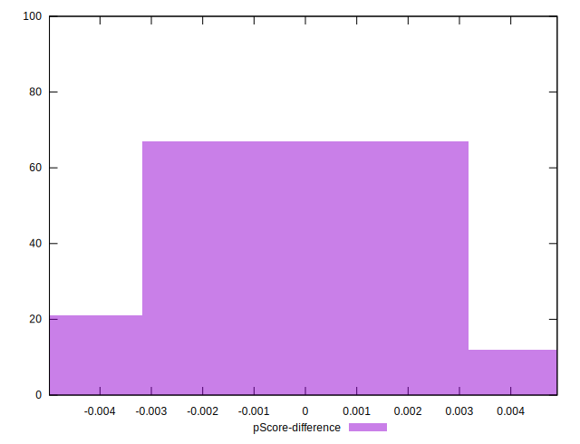