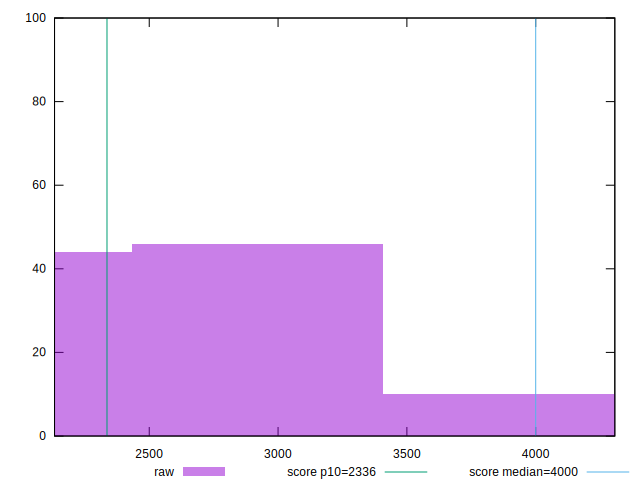

# //first-contentful-paint/samples/pages+cached

[→ Parent](../..)


## Raw


```yaml
p90min: 2156.0265
p90max: 3715.7509999999997
p90range: 1559.7244999999998
p90mean: 2608.8667819148936
p90median: 2470.1522499999996
p90stdev: 395.70388722458443
p90skewness: 1.1754365777136615
p90eccentricity: 0.9999999999999999
p90discretization: 1
outlandishness: 1.0206121013754395
confidence: 179.56040785708927
p90confidence: 159.98691958095569

```


## Score


```yaml
p90min: 0.57
p90max: 0.93
p90range: 0.3600000000000001
p90mean: 0.8384042553191494
p90median: 0.875
p90stdev: 0.09110787610451272
p90skewness: -1.3900163355133364
p90eccentricity: 1.0000000000000009
p90discretization: 3.2413793103448274
outlandishness: 0.9831247130143487
confidence: 0.04173445894452322
p90confidence: 0.03683579797448794

```


## Raw Estimate


## Score Estimate


## P Score


```yaml
p90min: 0.5697108670758679
p90max: 0.9295679336872088
p90range: 0.35985706661134087
p90mean: 0.8384946234238434
p90median: 0.8746174718107629
p90stdev: 0.09104117371010356
p90skewness: -1.3951047917876294
p90eccentricity: 0.9999999999999997
p90discretization: 1
outlandishness: 0.9832159552923121
confidence: 0.041721941875111856
p90confidence: 0.03680882954947436

```


## Score Difference


```yaml
p90min: 0
p90max: 1.1102230246251565e-16
p90range: 1.1102230246251565e-16
p90mean: 7.086529944415892e-18
p90median: 0
p90stdev: 2.7139343474843178e-17
p90skewness: 3.568591947091801
p90eccentricity: 0.9999999999999982
p90discretization: 47
outlandishness: 1.9881000000000004
confidence: 1.245461386168843e-17
p90confidence: 1.0972699794392902e-17

```


## P Score Difference


```yaml
p90min: -0.004430252344479801
p90max: 0.004603859666827859
p90range: 0.00903411201130766
p90mean: 0.00013300419314402894
p90median: 0.0004129634270614302
p90stdev: 0.0026032395742798015
p90skewness: -0.04538034294533405
p90eccentricity: 1
p90discretization: 1
outlandishness: 0.9287947785178825
confidence: 0.0010956650232658652
p90confidence: 0.0010525150089917752

```

