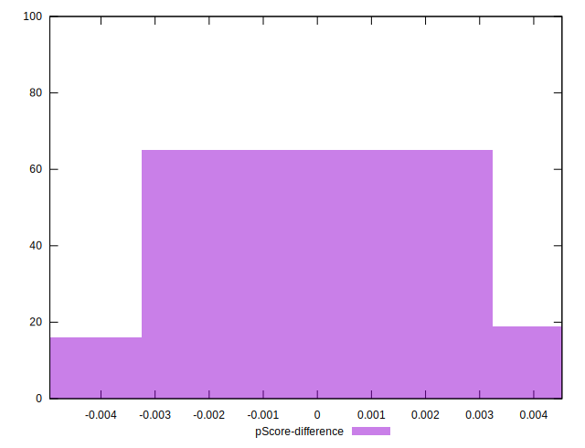

# //first-contentful-paint/samples/pages

[→ Parent](../..)


## Raw


```yaml
p90min: 2640.3745
p90max: 4122.410500000001
p90range: 1482.036000000001
p90mean: 3021.5481329787253
p90median: 2856.01625
p90stdev: 335.6555927467327
p90skewness: 1.2632810862440027
p90eccentricity: 1.0000000000000002
p90discretization: 1
outlandishness: 1.017134654395034
confidence: 155.96325987529045
p90confidence: 135.70881170846687

```


## Score


```yaml
p90min: 0.47
p90max: 0.84
p90range: 0.37
p90mean: 0.7462765957446807
p90median: 0.79
p90stdev: 0.084273920684634
p90skewness: -1.285312181952959
p90eccentricity: 0.9999999999999994
p90discretization: 3.357142857142857
outlandishness: 0.9829839144933797
confidence: 0.03881914385452574
p90confidence: 0.03407276351493652

```


## Raw Estimate


## Score Estimate


## P Score


```yaml
p90min: 0.4713710180700523
p90max: 0.8388433735221288
p90range: 0.3674723554520765
p90mean: 0.7463817750418568
p90median: 0.7889132383022157
p90stdev: 0.08433031934852314
p90skewness: -1.2859903996785078
p90eccentricity: 1.0000000000000002
p90discretization: 1
outlandishness: 0.9829003352192477
confidence: 0.038896241446431626
p90confidence: 0.03409556604176382

```


## Score Difference


```yaml
p90min: 0
p90max: 1.1102230246251565e-16
p90range: 1.1102230246251565e-16
p90mean: 2.1259589833247678e-17
p90median: 0
p90stdev: 4.292732090688907e-17
p90skewness: 1.5674046601478602
p90eccentricity: 0.9999999999999984
p90discretization: 31.333333333333332
outlandishness: 1.2026777777777777
confidence: 1.7456868423351272e-17
p90confidence: 1.7355932199519857e-17

```


## P Score Difference


```yaml
p90min: -0.004384976986503308
p90max: 0.004280100256024655
p90range: 0.008665077242527963
p90mean: 0.00008469719462992685
p90median: -0.00027475632771317704
p90stdev: 0.002633406532356657
p90skewness: 0.07266621565961388
p90eccentricity: 1.0000000000000002
p90discretization: 1
outlandishness: 0.7392040138370426
confidence: 0.0010953058370590041
p90confidence: 0.0010647118027349326

```

