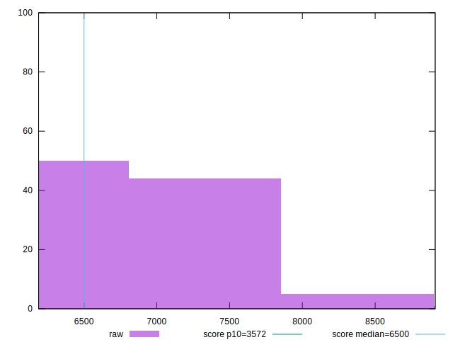

# //first-cpu-idle/samples/pages+cached+noadtech+nomedia

[→ Parent](../..)


## Raw


```yaml
p90min: 6287.774
p90max: 8254.230000000001
p90range: 1966.456000000001
p90mean: 6890.069308510633
p90median: 6819.102000000001
p90stdev: 425.6025460559898
p90skewness: 0.9490104141287107
p90eccentricity: 1
p90discretization: 1
outlandishness: 1.0085628899724877
confidence: 202.55319415203857
p90confidence: 172.07523733691352

```


## Score


```yaml
p90min: 0.3
p90max: 0.53
p90range: 0.23000000000000004
p90mean: 0.4519148936170213
p90median: 0.46
p90stdev: 0.05066108909600087
p90skewness: -0.7324829349768343
p90eccentricity: 1.0000000000000007
p90discretization: 4.2727272727272725
outlandishness: 0.9884609760082066
confidence: 0.023265061453160426
p90confidence: 0.020482769689056428

```


## Raw Estimate


## Score Estimate


## P Score


```yaml
p90min: 0.30451808431961863
p90max: 0.5283245577759934
p90range: 0.22380647345637478
p90mean: 0.4524256249821655
p90median: 0.4591453081990847
p90stdev: 0.05034143384052651
p90skewness: -0.7440413021302533
p90eccentricity: 1.0000000000000004
p90discretization: 1
outlandishness: 0.9884880960224252
confidence: 0.02319216715031689
p90confidence: 0.020353529968896236

```


## Score Difference


```yaml
p90min: 0
p90max: 5.551115123125783e-17
p90range: 5.551115123125783e-17
p90mean: 6.495985782381235e-18
p90median: 0
p90stdev: 1.7843817357195922e-17
p90skewness: 2.3828522123573848
p90eccentricity: 1.0000000000000016
p90discretization: 47
outlandishness: 1.4312859504132236
confidence: 7.550427891356825e-18
p90confidence: 7.214428426685423e-18

```


## P Score Difference


```yaml
p90min: -0.004323282153985086
p90max: 0.0046013486238137835
p90range: 0.00892463077779887
p90mean: 0.0005482913432357954
p90median: 0.0008115559581377829
p90stdev: 0.0026594304461860017
p90skewness: -0.16244042154318164
p90eccentricity: 1.0000000000000004
p90discretization: 1
outlandishness: 0.8786448914288163
confidence: 0.0011142216930776624
p90confidence: 0.0010752335235049743

```

