# //first-cpu-idle/samples/pages+cached

[→ Parent](../..)


## Raw


```yaml
p90min: 4578.951
p90max: 16987.649999999994
p90range: 12408.698999999993
p90mean: 8676.538106382977
p90median: 7148.906499999999
p90stdev: 4144.515256964472
p90skewness: 0.9425692424791678
p90eccentricity: 1.0000000000000002
p90discretization: 1
outlandishness: 1.0308042089657443
confidence: 1703.5851379811784
p90confidence: 1675.6677165056255

```

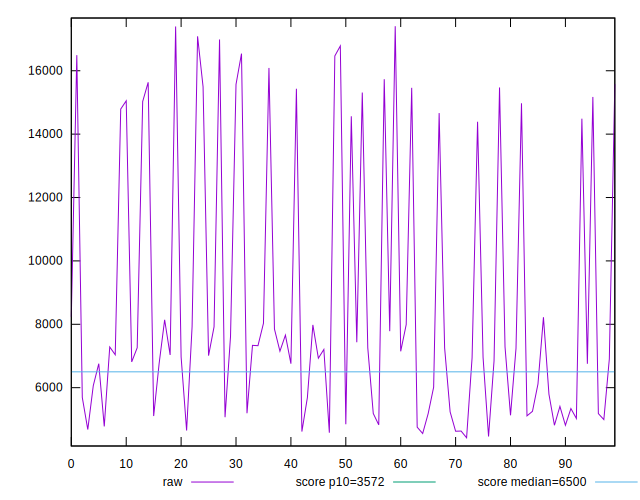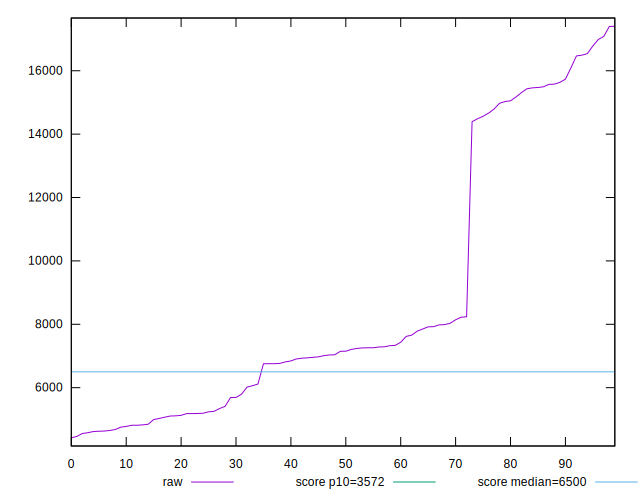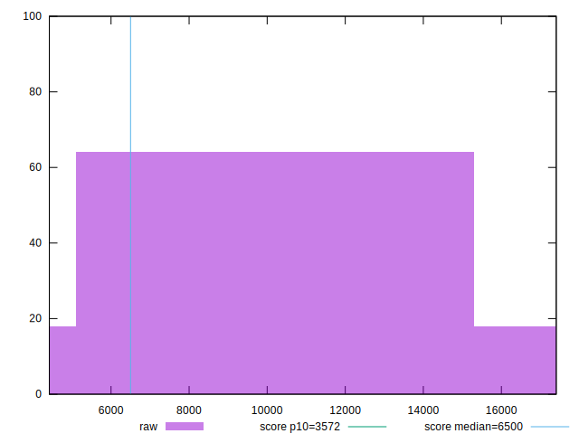
## Score


```yaml
p90min: 0.02
p90max: 0.77
p90range: 0.75
p90mean: 0.4059574468085106
p90median: 0.42
p90stdev: 0.257666777839115
p90skewness: -0.2506460563463334
p90eccentricity: 1.0000000000000002
p90discretization: 2.8484848484848486
outlandishness: 0.9997170011569958
confidence: 0.10467322668723841
p90confidence: 0.1041771774191187

```

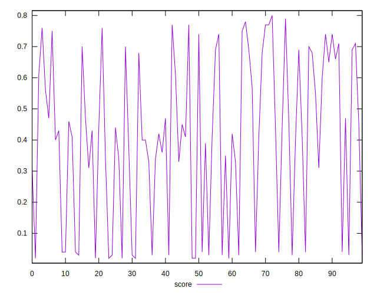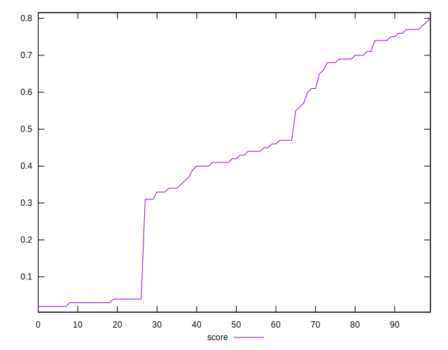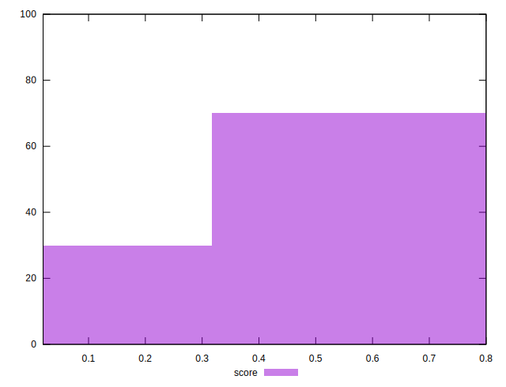
## Raw Estimate

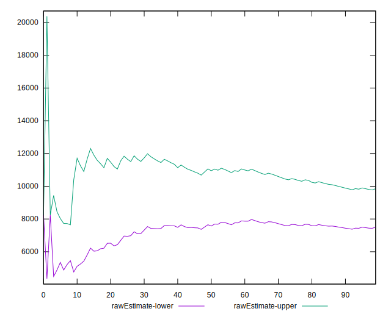
## Score Estimate

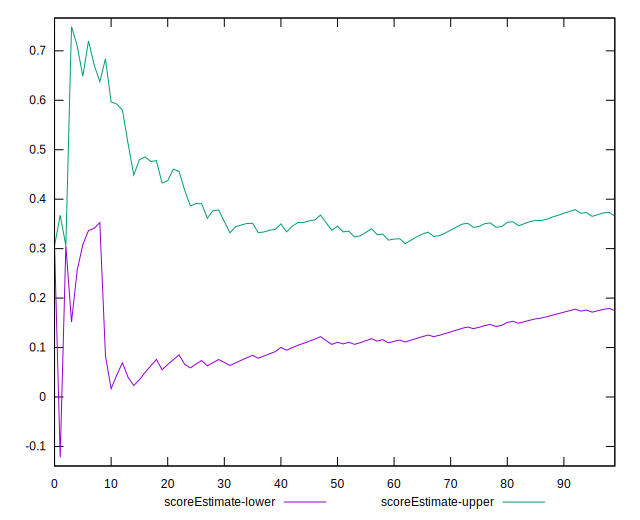
## P Score


```yaml
p90min: 0.01986804057960173
p90max: 0.7733533245860293
p90range: 0.7534852840064277
p90mean: 0.40554875335149543
p90median: 0.41929502505202376
p90stdev: 0.25702512123453536
p90skewness: -0.24676325103605903
p90eccentricity: 1
p90discretization: 1
outlandishness: 0.9991828907257265
confidence: 0.10443448959005272
p90confidence: 0.1039177494303883

```

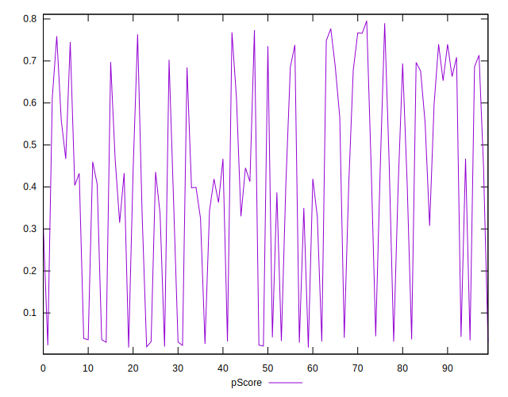
## Score Difference


```yaml
p90min: 0
p90max: 1.1102230246251565e-16
p90range: 1.1102230246251565e-16
p90mean: 1.1810883240693155e-17
p90median: 0
p90stdev: 2.905093158055323e-17
p90skewness: 2.424226965839359
p90eccentricity: 0.9999999999999984
p90discretization: 31.333333333333332
outlandishness: 1.4932839999999998
confidence: 1.2917434578470937e-17
p90confidence: 1.174557340623733e-17

```

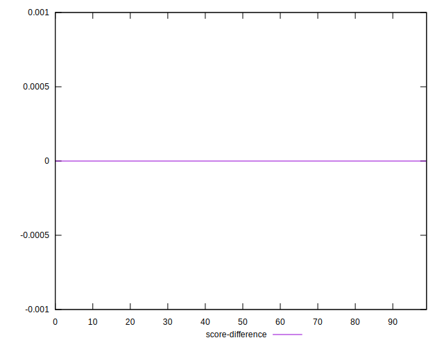
## P Score Difference


```yaml
p90min: -0.004530381418711038
p90max: 0.0044238863896170835
p90range: 0.008954267808328122
p90mean: -0.0005470236782480034
p90median: -0.0007511987750495105
p90stdev: 0.002736184164368913
p90skewness: 0.16857717024121427
p90eccentricity: 0.9999999999999996
p90discretization: 1
outlandishness: 0.8931354155112956
confidence: 0.0011376913636347917
p90confidence: 0.0011062657962091832

```

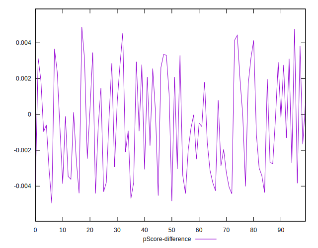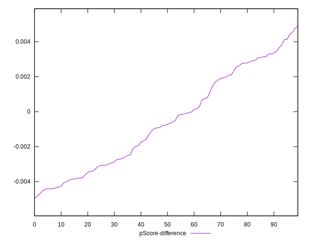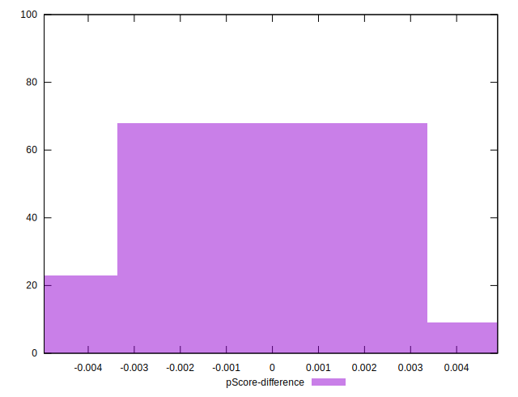