# //first-cpu-idle/samples/pages

[→ Parent](../..)


## Raw


```yaml
p90min: 6961.9450000000015
p90max: 17338.613000000005
p90range: 10376.668000000003
p90mean: 9129.344797872338
p90median: 7526.4115
p90stdev: 3345.794499394349
p90skewness: 1.4170470514238067
p90eccentricity: 0.9999999999999999
p90discretization: 1
outlandishness: 1.042857181201647
confidence: 1410.288071709206
p90confidence: 1352.7371673384746

```

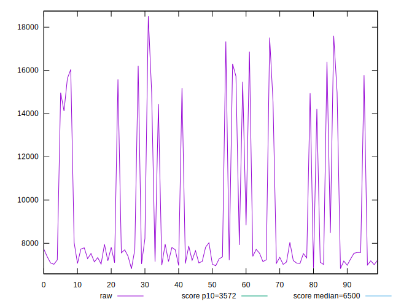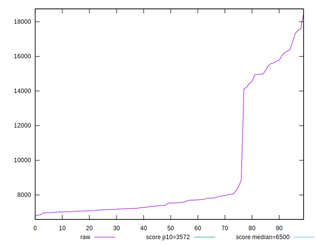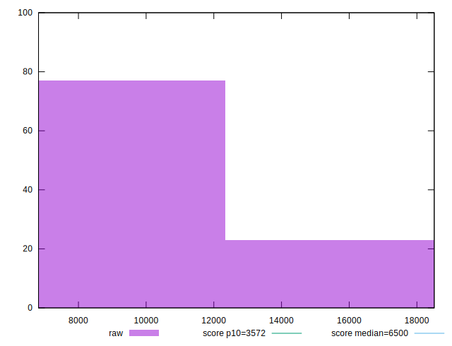
## Score


```yaml
p90min: 0.02
p90max: 0.44
p90range: 0.42
p90mean: 0.31521276595744685
p90median: 0.38
p90stdev: 0.15114969839993736
p90skewness: -1.2158816718867533
p90eccentricity: 1.0000000000000004
p90discretization: 4.7
outlandishness: 0.9703214080647483
confidence: 0.06164234739600364
p90confidence: 0.06111128908084706

```

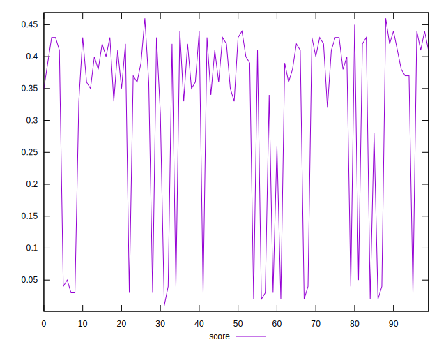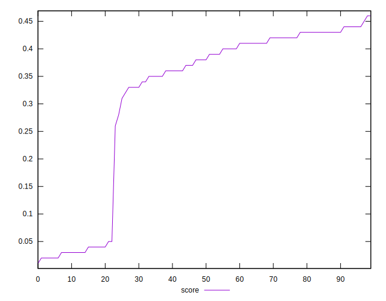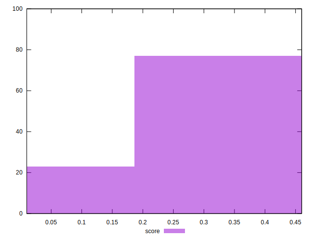
## Raw Estimate

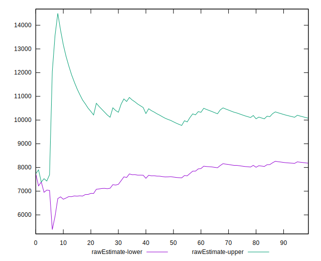
## Score Estimate

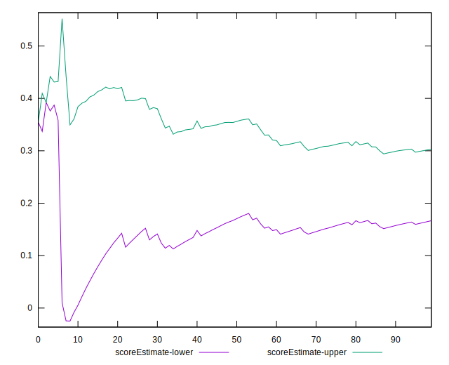
## P Score


```yaml
p90min: 0.017853129210816443
p90max: 0.4415780737957962
p90range: 0.4237249445849798
p90mean: 0.3149292963187685
p90median: 0.3768166403286149
p90stdev: 0.15125099710799944
p90skewness: -1.211836333854015
p90eccentricity: 0.9999999999999999
p90discretization: 1
outlandishness: 0.9702154242539586
confidence: 0.06170734529804638
p90confidence: 0.061152245131024005

```

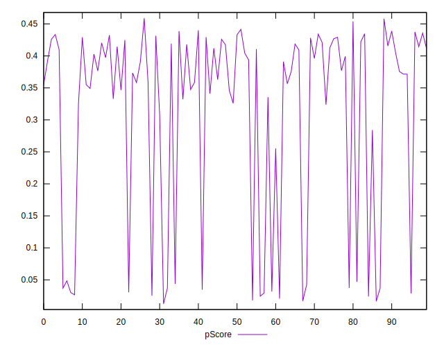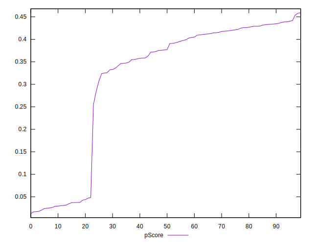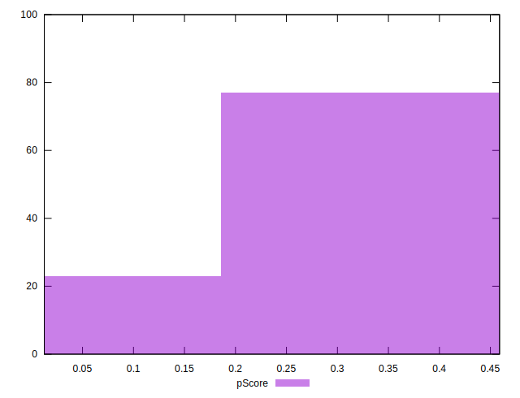
## Score Difference


```yaml
p90min: 0
p90max: 5.551115123125783e-17
p90range: 5.551115123125783e-17
p90mean: 6.495985782381235e-18
p90median: 0
p90stdev: 1.784381735719592e-17
p90skewness: 2.3828522123573848
p90eccentricity: 1.0000000000000016
p90discretization: 47
outlandishness: 1.4312859504132236
confidence: 7.550427891356823e-18
p90confidence: 7.214428426685421e-18

```

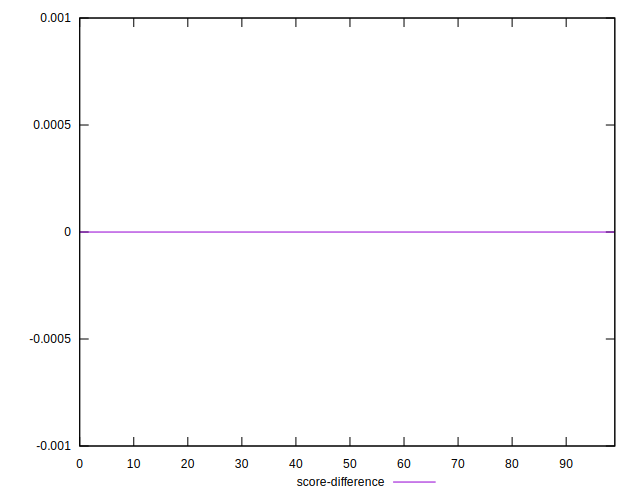
## P Score Difference


```yaml
p90min: -0.004818486733993238
p90max: 0.004634386706360821
p90range: 0.00945287344035406
p90mean: -0.00030964964216349946
p90median: -0.0007862701388055837
p90stdev: 0.0028104779860235337
p90skewness: 0.17814560581292568
p90eccentricity: 0.9999999999999996
p90discretization: 1
outlandishness: 0.9148554952431983
confidence: 0.0011653232239918628
p90confidence: 0.0011363035088881937

```

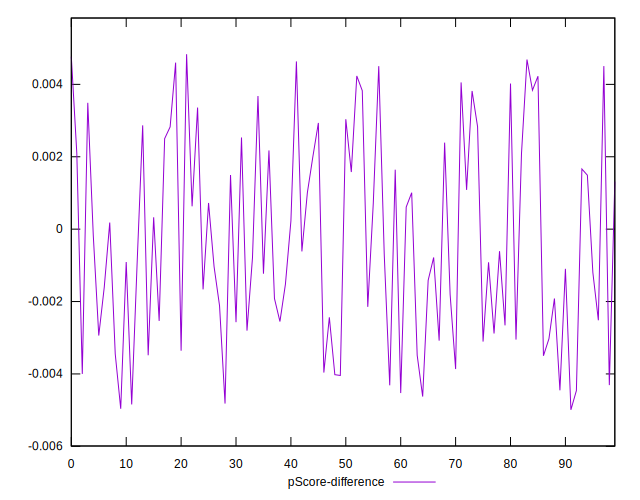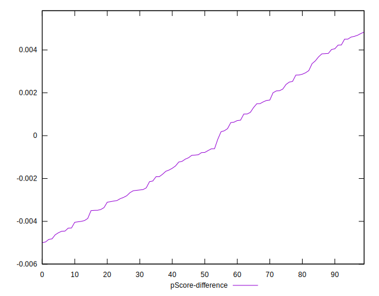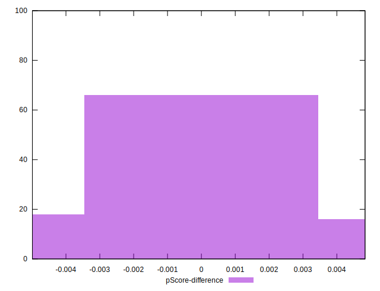