# //first-meaningful-paint/samples/pages+cached+noadtech+nomedia

[→ Parent](../..)


## Raw


```yaml
p90min: 2135.4675
p90max: 3042.35
p90range: 906.8824999999997
p90mean: 2384.712627659575
p90median: 2358.168
p90stdev: 183.77251278219376
p90skewness: 0.8461823883321726
p90eccentricity: 1.0000000000000002
p90discretization: 1
outlandishness: 1.009556380684191
confidence: 90.78713382273109
p90confidence: 74.30100934790192

```

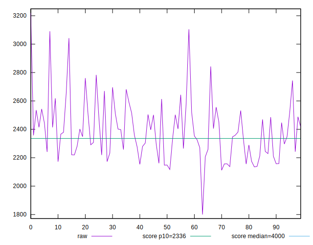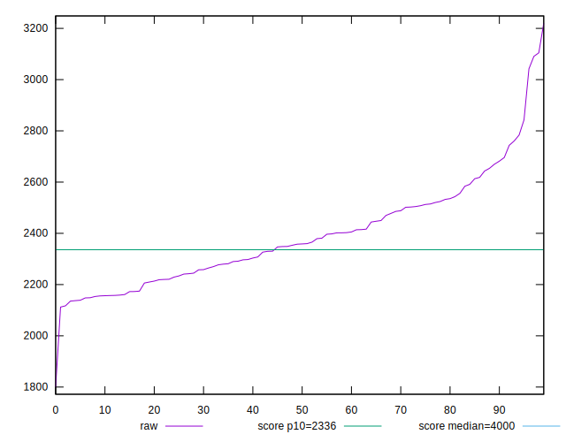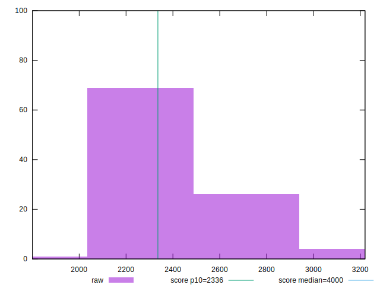
## Score


```yaml
p90min: 0.74
p90max: 0.93
p90range: 0.19000000000000006
p90mean: 0.8892553191489365
p90median: 0.9
p90stdev: 0.03626848352548767
p90skewness: -1.2538076636537885
p90eccentricity: 1.0000000000000007
p90discretization: 6.266666666666667
outlandishness: 0.992691950973082
confidence: 0.018419490846483935
p90confidence: 0.014663699661414176

```

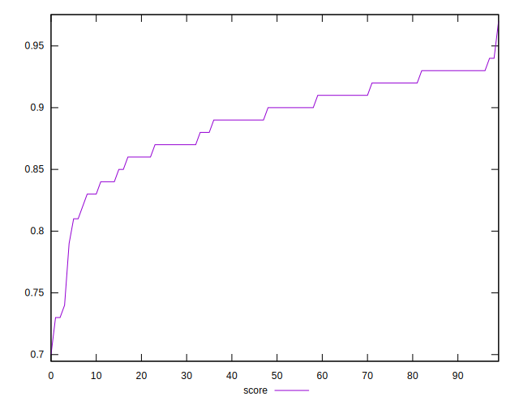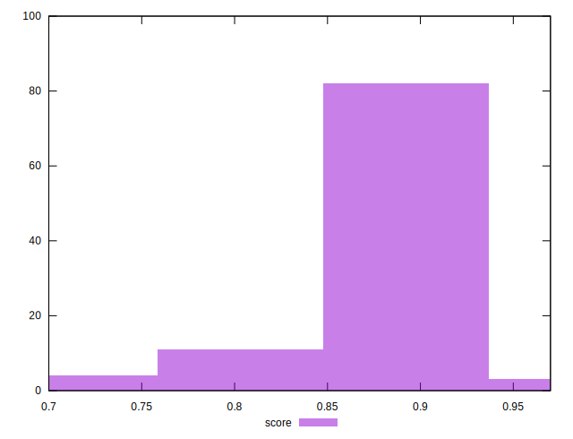
## Raw Estimate

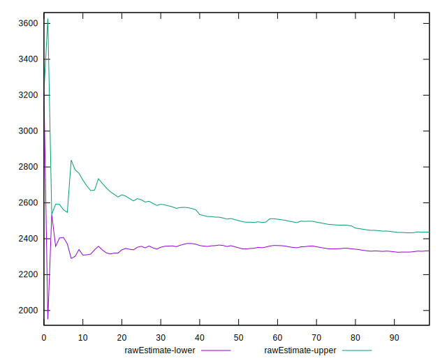
## Score Estimate

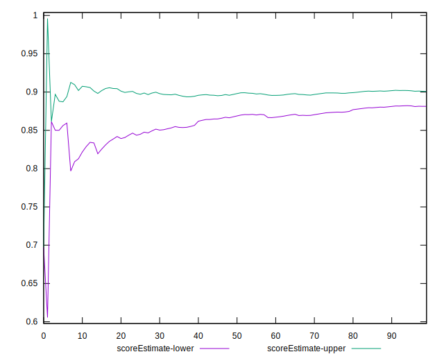
## P Score


```yaml
p90min: 0.742819672743178
p90max: 0.9325963073300265
p90range: 0.18977663458684857
p90mean: 0.8886787177615556
p90median: 0.895993217126971
p90stdev: 0.03603347546688618
p90skewness: -1.2137774526687817
p90eccentricity: 1
p90discretization: 1
outlandishness: 0.9924841068013032
confidence: 0.018383922892251464
p90confidence: 0.014568683623952267

```

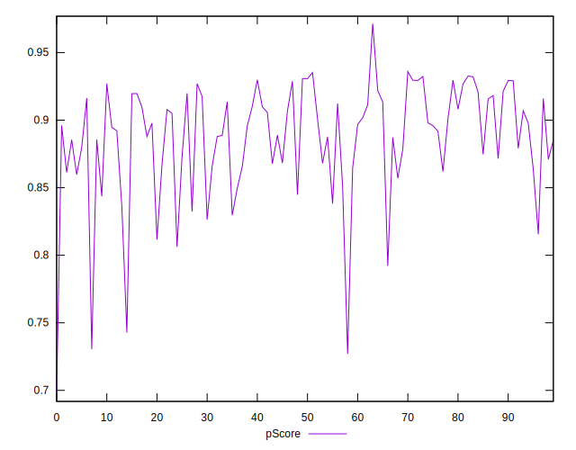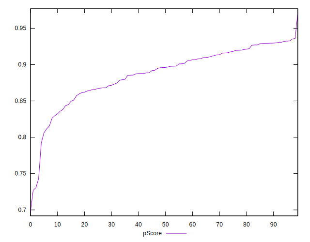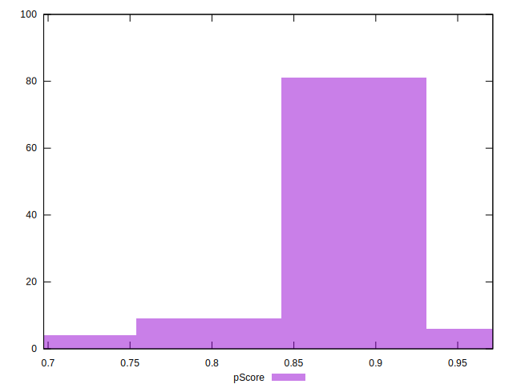
## Score Difference


```yaml
p90min: 0
p90max: 1.1102230246251565e-16
p90range: 1.1102230246251565e-16
p90mean: 4.724353296277262e-18
p90median: 0
p90stdev: 2.240957533134066e-17
p90skewness: 4.532597979574665
p90eccentricity: 1.0000000000000004
p90discretization: 47
outlandishness: 2.706025000000001
confidence: 1.1103983576888548e-17
p90confidence: 9.060408659427041e-18

```

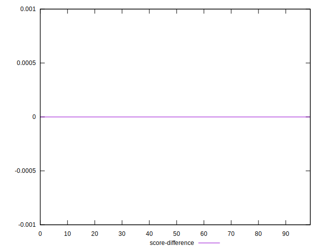
## P Score Difference


```yaml
p90min: -0.004496632843278836
p90max: 0.00463122007686545
p90range: 0.009127852920144286
p90mean: -0.0007130587605497843
p90median: -0.0006460436655476576
p90stdev: 0.002428323201846355
p90skewness: 0.2174844817683478
p90eccentricity: 1.0000000000000002
p90discretization: 1
outlandishness: 0.8754794998935876
confidence: 0.0010329904270870076
p90confidence: 0.000981794623083563

```

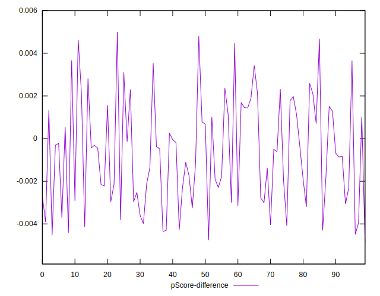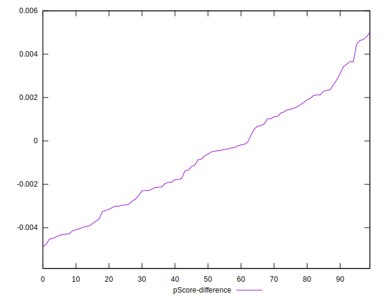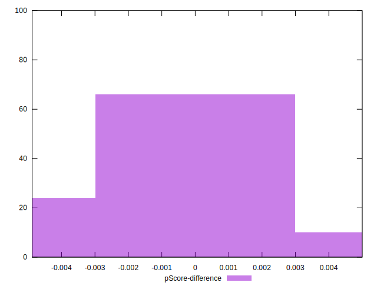