# //first-meaningful-paint/samples/pages+cached

[→ Parent](../..)


## Raw


```yaml
p90min: 2156.0265
p90max: 3715.7509999999997
p90range: 1559.7244999999998
p90mean: 2616.0754202127664
p90median: 2485.142
p90stdev: 395.8055236407365
p90skewness: 1.1327730907578524
p90eccentricity: 0.9999999999999996
p90discretization: 1
outlandishness: 1.020220999786816
confidence: 179.4388626330468
p90confidence: 160.02801216978887

```

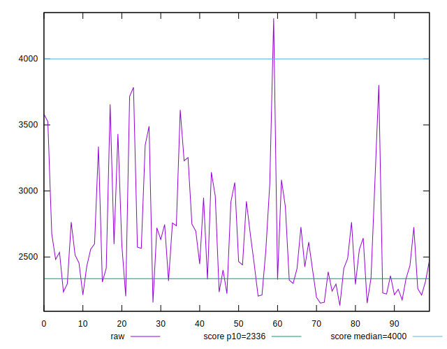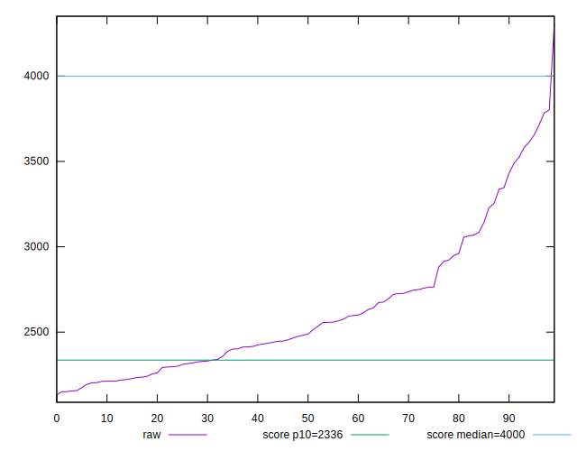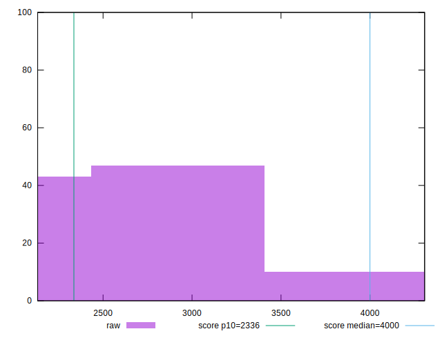
## Score


```yaml
p90min: 0.57
p90max: 0.93
p90range: 0.3600000000000001
p90mean: 0.8370212765957451
p90median: 0.87
p90stdev: 0.09116071600778021
p90skewness: -1.354144811469457
p90eccentricity: 1.0000000000000013
p90discretization: 3.2413793103448274
outlandishness: 0.9832935479127
confidence: 0.04171731659787416
p90confidence: 0.03685716165987909

```

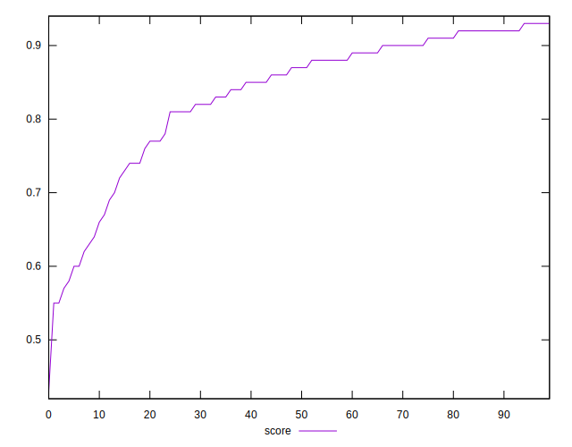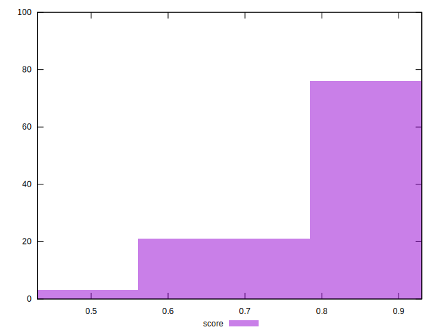
## Raw Estimate

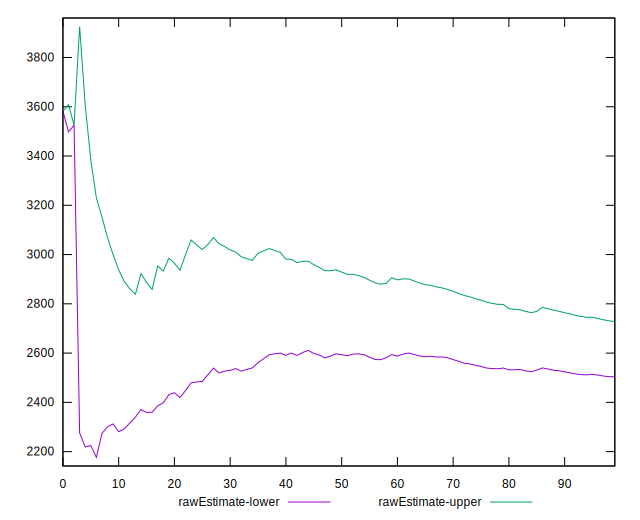
## Score Estimate

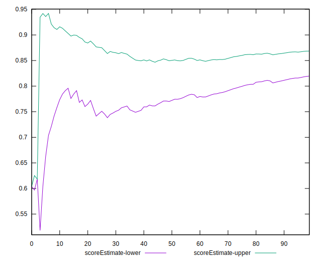
## P Score


```yaml
p90min: 0.5697108670758679
p90max: 0.9295679336872088
p90range: 0.35985706661134087
p90mean: 0.8369446872616355
p90median: 0.8716199443704502
p90stdev: 0.09103815343623649
p90skewness: -1.3566800781730406
p90eccentricity: 0.9999999999999994
p90discretization: 1
outlandishness: 0.9834053685273216
confidence: 0.041683304558906314
p90confidence: 0.036807608423455936

```

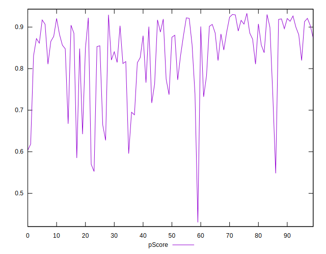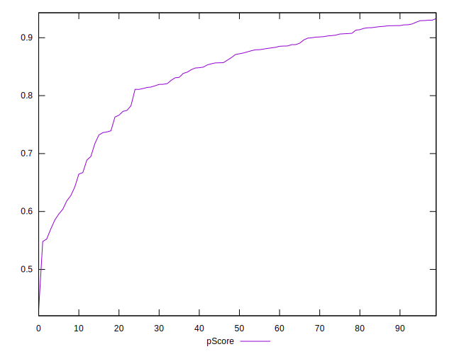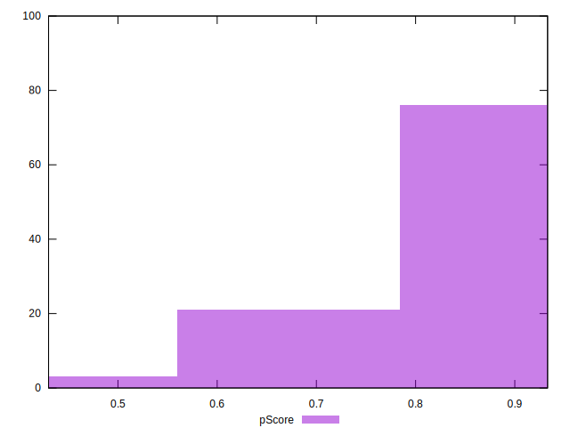
## Score Difference


```yaml
p90min: 0
p90max: 1.1102230246251565e-16
p90range: 1.1102230246251565e-16
p90mean: 8.267618268485208e-18
p90median: 0
p90stdev: 2.914680950318569e-17
p90skewness: 3.2417635938924283
p90eccentricity: 0.9999999999999979
p90discretization: 47
outlandishness: 1.8032653061224493
confidence: 1.3055982858434593e-17
p90confidence: 1.1784337780288283e-17

```

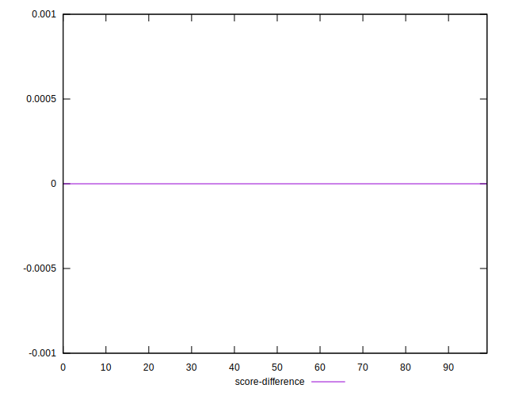
## P Score Difference


```yaml
p90min: -0.004401666981330821
p90max: 0.004844848630078058
p90range: 0.009246515611408879
p90mean: -0.00003848623822107536
p90median: -0.000035116756437497676
p90stdev: 0.002587485494000563
p90skewness: 0.05669695942269029
p90eccentricity: 0.9999999999999991
p90discretization: 1
outlandishness: 0.5583705436764761
confidence: 0.0010874954834547885
p90confidence: 0.0010461454815343006

```

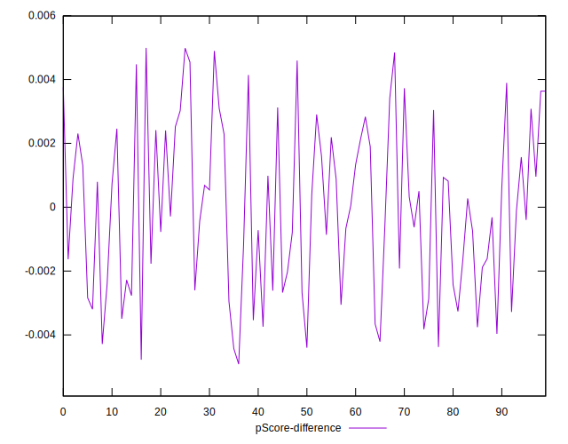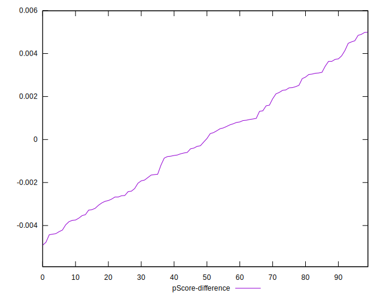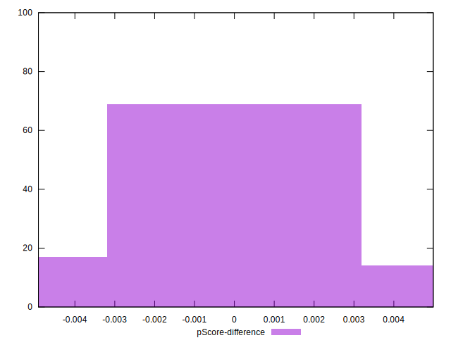