# //interactive/samples/pages+cached+noadtech+nomedia+nocss

[→ Parent](../..)


## Raw


```yaml
p90min: 4454.8145
p90max: 6387.279500000001
p90range: 1932.4650000000001
p90mean: 4984.935829787234
p90median: 4890.7155
p90stdev: 410.3874187183773
p90skewness: 0.9492019049351674
p90eccentricity: 0.9999999999999996
p90discretization: 1
outlandishness: 1.0211443861647314
confidence: 223.73819247635276
p90confidence: 165.92361378110283

```

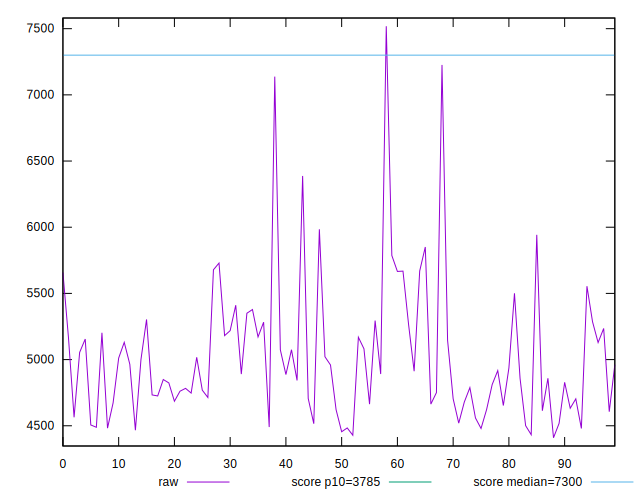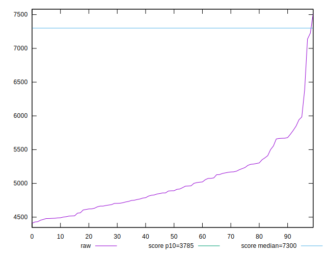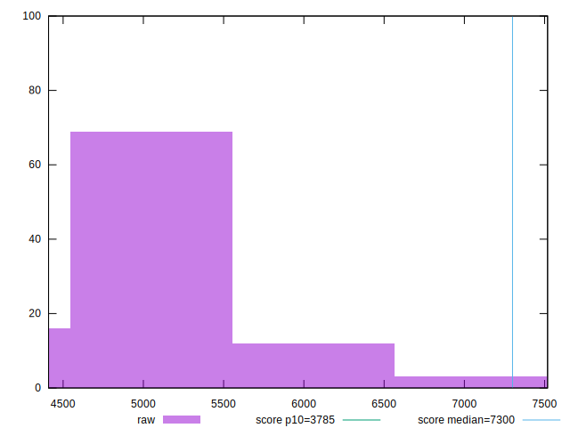
## Score


```yaml
p90min: 0.6
p90max: 0.83
p90range: 0.22999999999999998
p90mean: 0.7707446808510635
p90median: 0.78
p90stdev: 0.049060088248398984
p90skewness: -0.9719584085899898
p90eccentricity: 1.0000000000000013
p90discretization: 4.7
outlandishness: 0.9843762069536073
confidence: 0.02632753312322091
p90confidence: 0.019835469518085524

```

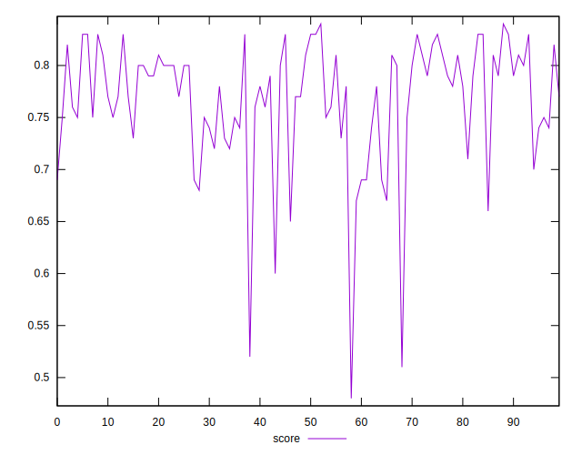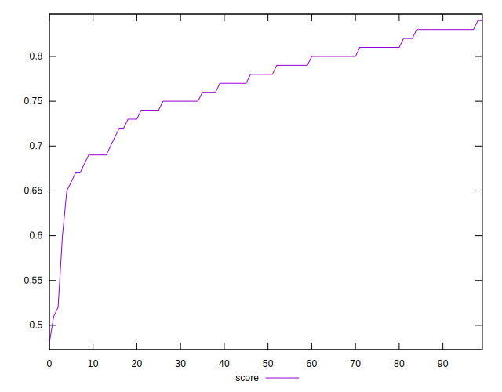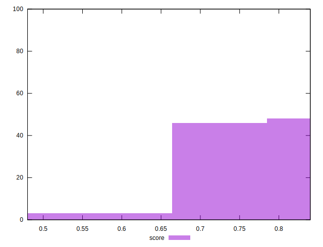
## Raw Estimate

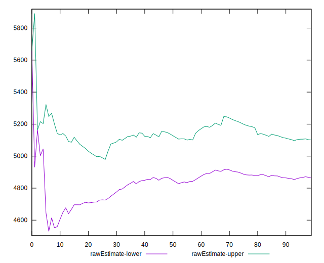
## Score Estimate

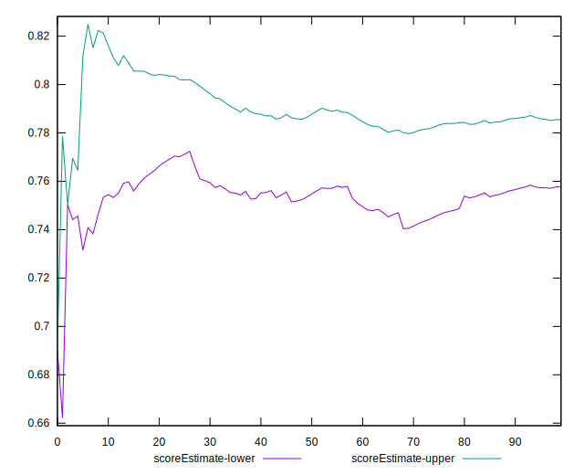
## P Score


```yaml
p90min: 0.6028006840115505
p90max: 0.8323859986656551
p90range: 0.2295853146541046
p90mean: 0.7709192352500375
p90median: 0.7827439260894917
p90stdev: 0.048722498476108086
p90skewness: -0.9973392880382038
p90eccentricity: 0.9999999999999994
p90discretization: 1
outlandishness: 0.9840947323114944
confidence: 0.026346312444975907
p90confidence: 0.01969897869882753

```

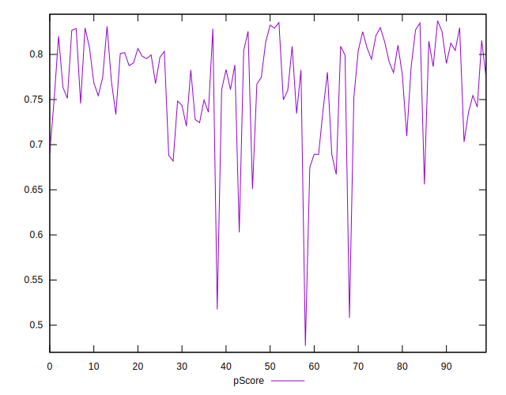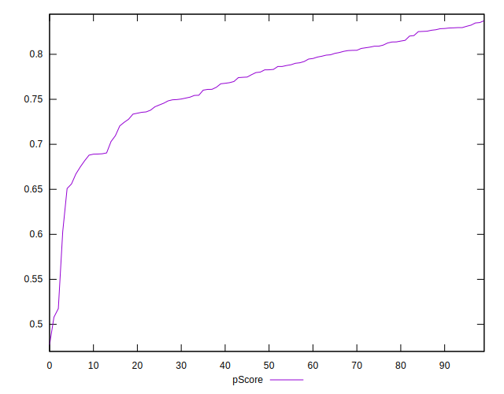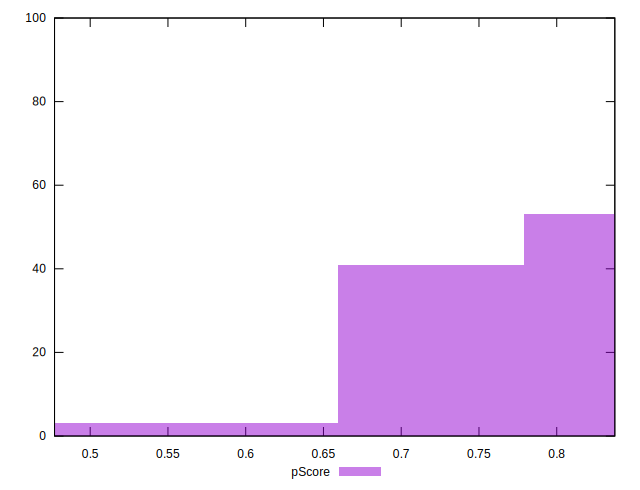
## Score Difference


```yaml
p90min: 0
p90max: 1.1102230246251565e-16
p90range: 1.1102230246251565e-16
p90mean: 2.362176648138631e-17
p90median: 0
p90stdev: 4.5437375048458033e-17
p90skewness: 1.4036631612571033
p90eccentricity: 1.0000000000000022
p90discretization: 47
outlandishness: 1.168561
confidence: 1.8314606713280816e-17
p90confidence: 1.8370771434250753e-17

```

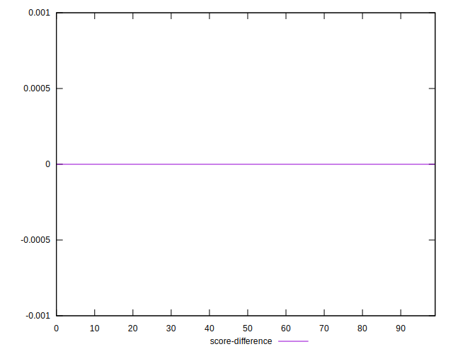
## P Score Difference


```yaml
p90min: -0.004568186703545751
p90max: 0.004703428020431222
p90range: 0.009271614723976973
p90mean: 0.00006559269112669926
p90median: -0.00029573590952747253
p90stdev: 0.002688224440463337
p90skewness: 0.1529816070867711
p90eccentricity: 1.0000000000000007
p90discretization: 1
outlandishness: 0.9467641318502446
confidence: 0.001119244280656718
p90confidence: 0.0010868752146674572

```

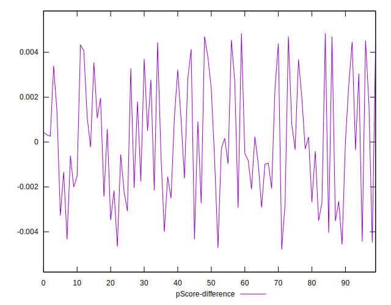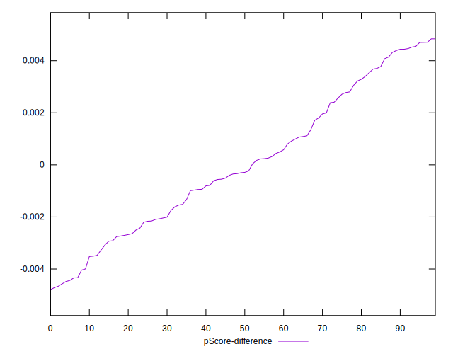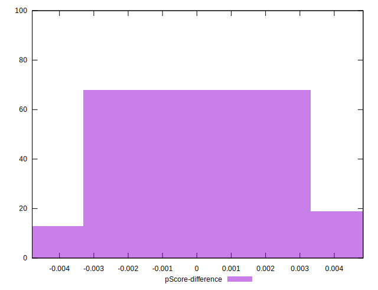