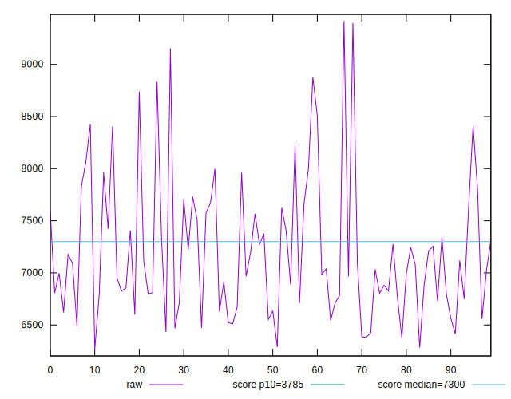
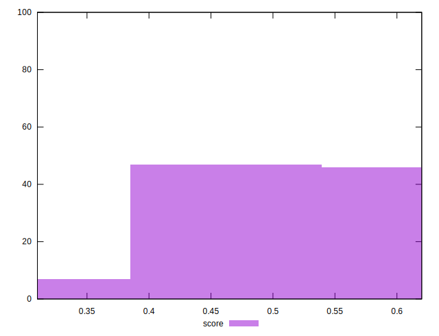
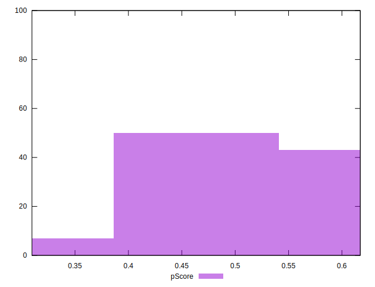

# //interactive/samples/pages+cached+noadtech+nomedia

[→ Parent](../..)


## Raw


```yaml
p90min: 6375.132
p90max: 8878.2845
p90range: 2503.1525
p90mean: 7175.448398936171
p90median: 7028.292000000001
p90stdev: 604.028486601474
p90skewness: 0.9432056813700369
p90eccentricity: 1
p90discretization: 1
outlandishness: 1.0104834039451969
confidence: 278.3921884804704
p90confidence: 244.2145756725144

```


## Score


```yaml
p90min: 0.35
p90max: 0.6
p90range: 0.25
p90mean: 0.5159574468085107
p90median: 0.53
p90stdev: 0.0625915355050942
p90skewness: -0.7858332121588796
p90eccentricity: 1.0000000000000004
p90discretization: 4.086956521739131
outlandishness: 0.9885689378254867
confidence: 0.028193521581704344
p90confidence: 0.02530636488698081

```


## Raw Estimate


## Score Estimate


## P Score


```yaml
p90min: 0.351267584141783
p90max: 0.6042322770237593
p90range: 0.25296469288197626
p90mean: 0.5160349098294945
p90median: 0.5294979607365237
p90stdev: 0.06278142994261876
p90skewness: -0.7654514568908427
p90eccentricity: 1.0000000000000002
p90discretization: 1
outlandishness: 0.9884398381248338
confidence: 0.028233120183557205
p90confidence: 0.02538314104987928

```


## Score Difference


```yaml
p90min: 0
p90max: 1.1102230246251565e-16
p90range: 1.1102230246251565e-16
p90mean: 6.495985782381235e-18
p90median: 0
p90stdev: 2.120209808077343e-17
p90skewness: 3.4434988719337816
p90eccentricity: 1
p90discretization: 31.333333333333332
outlandishness: 2.11041652892562
confidence: 1.0684566981967868e-17
p90confidence: 8.572213895566428e-18

```


## P Score Difference


```yaml
p90min: -0.004832096319414059
p90max: 0.004565428326900767
p90range: 0.009397524646314825
p90mean: 0.00005128361798364719
p90median: -0.00024724942355963675
p90stdev: 0.0028518825612515457
p90skewness: -0.152541730590339
p90eccentricity: 0.9999999999999996
p90discretization: 1
outlandishness: 0.7200102955554104
confidence: 0.0011786685768623332
p90confidence: 0.0011530437802404637

```

