# //interactive/samples/pages

[→ Parent](../..)


## Raw


```yaml
p90min: 14874.982
p90max: 18661.157499999998
p90range: 3786.1754999999976
p90mean: 16122.581632978723
p90median: 15962.988000000001
p90stdev: 921.4447418114902
p90skewness: 0.7751955670087829
p90eccentricity: 0.9999999999999996
p90discretization: 1
outlandishness: 1.0080690958846765
confidence: 431.00861526347325
p90confidence: 372.54904630952143

```

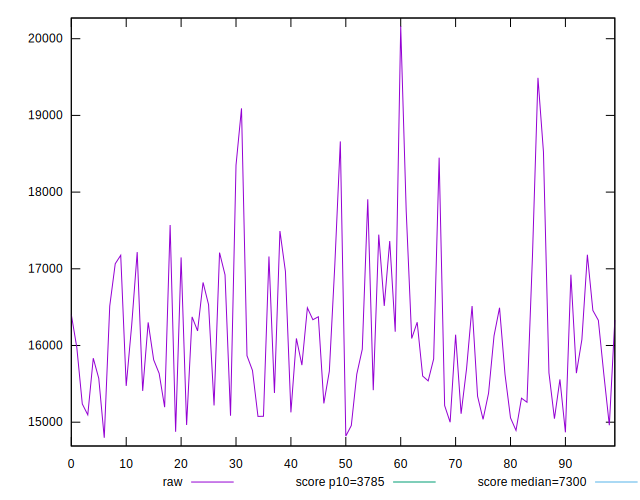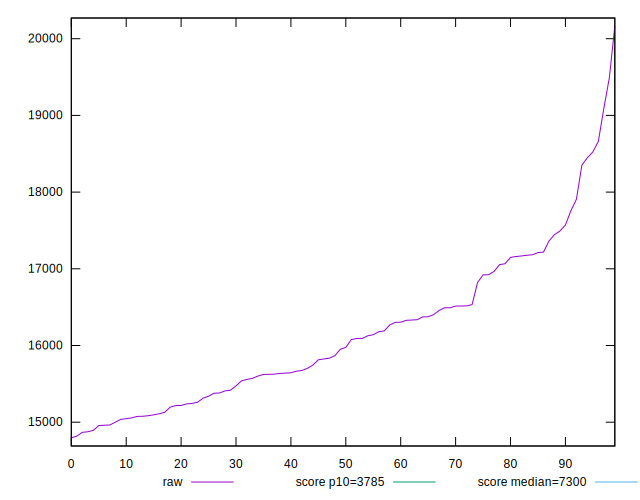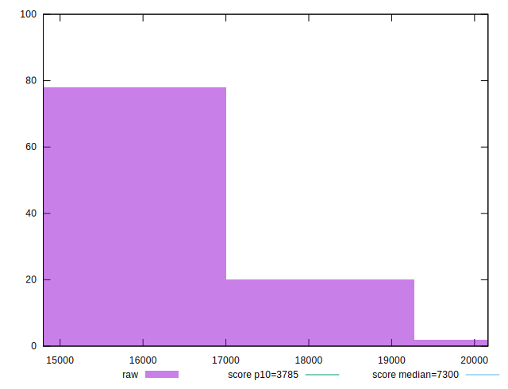
## Score


```yaml
p90min: 0.03
p90max: 0.08
p90range: 0.05
p90mean: 0.06340425531914892
p90median: 0.06
p90stdev: 0.01292804896252197
p90skewness: -0.47343080601008586
p90eccentricity: 0.9999999999999999
p90discretization: 15.666666666666666
outlandishness: 0.9810304220530613
confidence: 0.005628339543681783
p90confidence: 0.005226935586133808

```

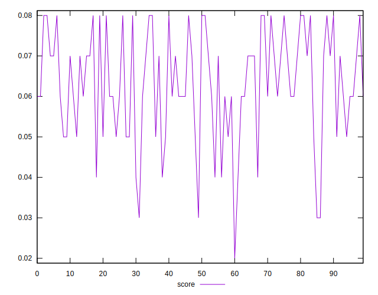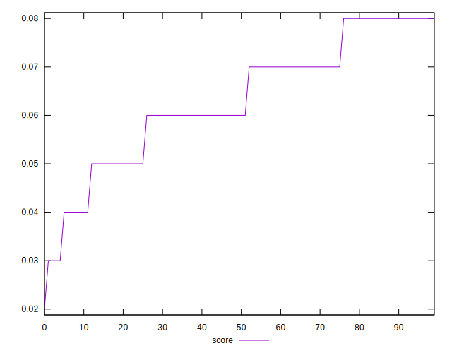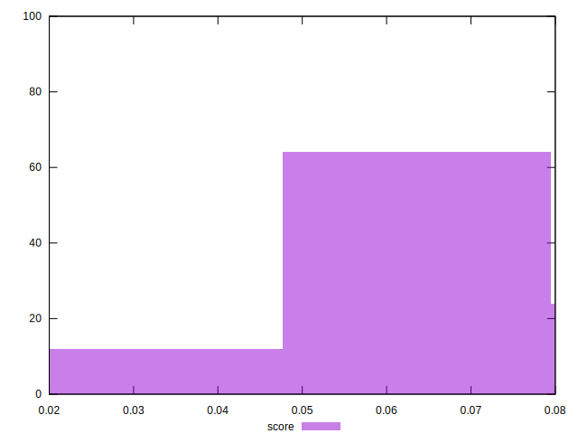
## Raw Estimate

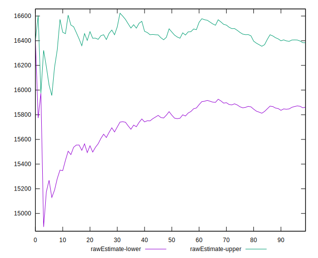
## Score Estimate

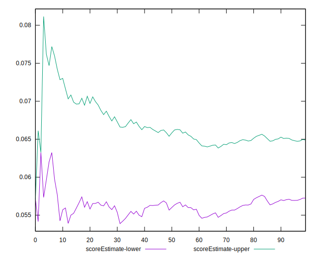
## P Score


```yaml
p90min: 0.03353058695099792
p90max: 0.08244378096103977
p90range: 0.04891319401004185
p90mean: 0.06252790927955881
p90median: 0.06343628824223113
p90stdev: 0.012692949678430104
p90skewness: -0.3549637277567294
p90eccentricity: 1
p90discretization: 1
outlandishness: 0.986218673755386
confidence: 0.00556970486660028
p90confidence: 0.005131882665321338

```

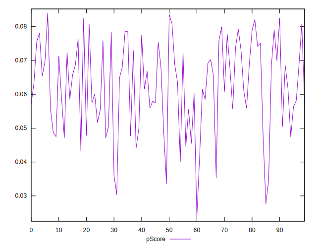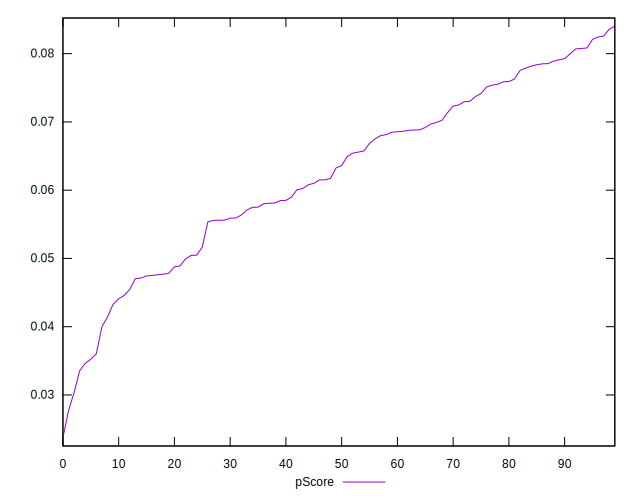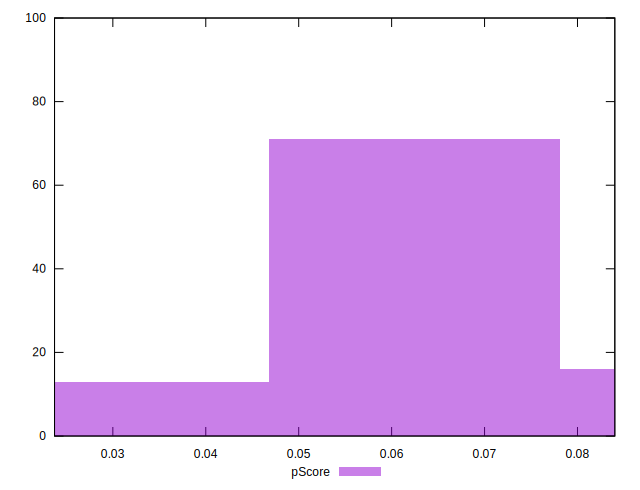
## Score Difference


```yaml
p90min: 0
p90max: 0
p90range: 0
p90mean: 0
p90median: 0
p90stdev: 0
p90skewness: .nan
p90eccentricity: .nan
p90discretization: 94
outlandishness: .nan
confidence: 0
p90confidence: 0

```


## P Score Difference


```yaml
p90min: -0.004606178163865868
p90max: 0.004167864660832521
p90range: 0.008774042824698389
p90mean: -0.0007475905541885183
p90median: -0.0012050005587853699
p90stdev: 0.0025009146512428113
p90skewness: 0.3060885251315416
p90eccentricity: 0.9999999999999997
p90discretization: 1
outlandishness: 0.8879032465687094
confidence: 0.0010558671464700724
p90confidence: 0.0010111440501470996

```

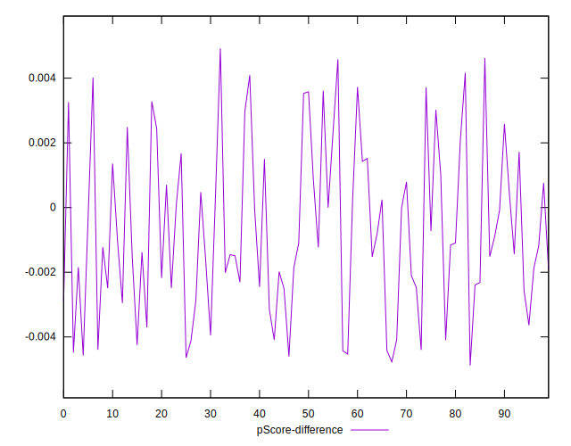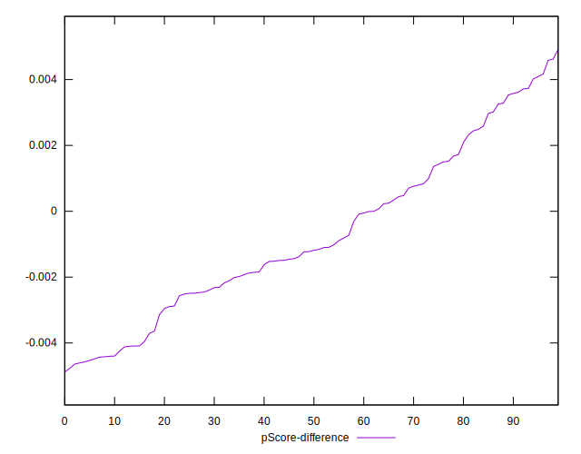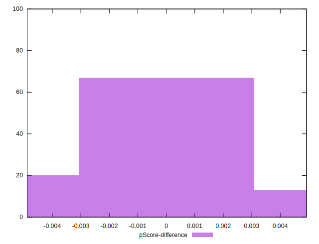