# //largest-contentful-paint/samples/pages+cached+noadtech+nomedia+nocss

[→ Parent](../..)


## Raw


```yaml
p90min: 4559.5615
p90max: 6231.762500000001
p90range: 1672.201000000001
p90mean: 5026.011776595746
p90median: 4938.0335000000005
p90stdev: 337.343294945993
p90skewness: 1.143045232653864
p90eccentricity: 0.9999999999999999
p90discretization: 1
outlandishness: 1.0165600207068062
confidence: 206.28539122514545
p90confidence: 136.3911660768393

```

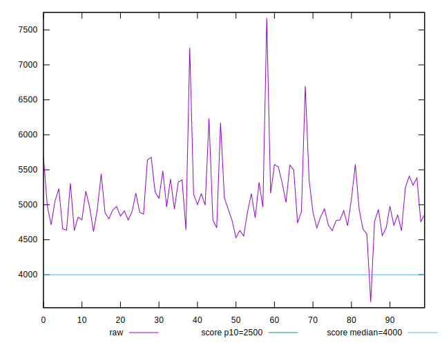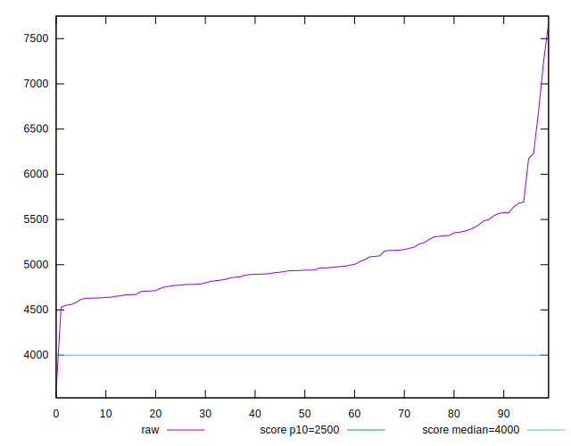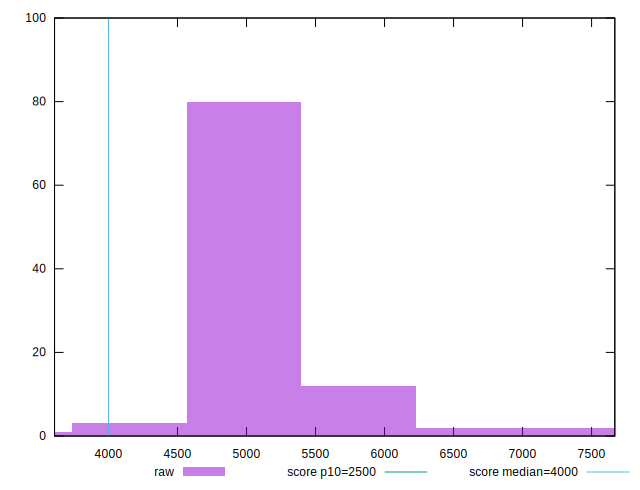
## Score


```yaml
p90min: 0.11
p90max: 0.36
p90range: 0.25
p90mean: 0.27180851063829786
p90median: 0.28
p90stdev: 0.05561958108354881
p90skewness: -0.6259064252580869
p90eccentricity: 1.0000000000000002
p90discretization: 4.2727272727272725
outlandishness: 0.9911274006456774
confidence: 0.029390677817816274
p90confidence: 0.02248753609258788

```

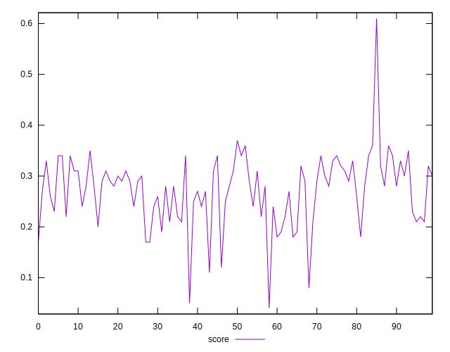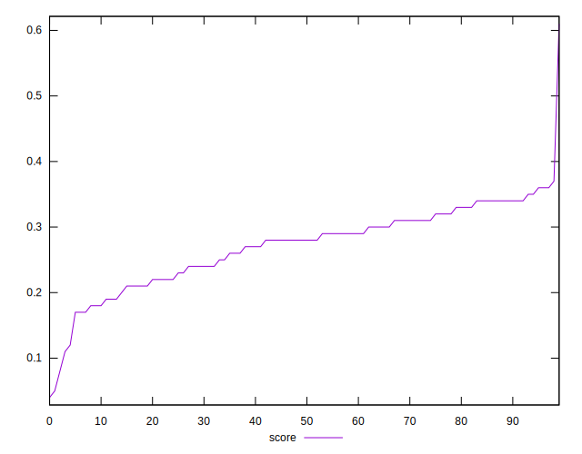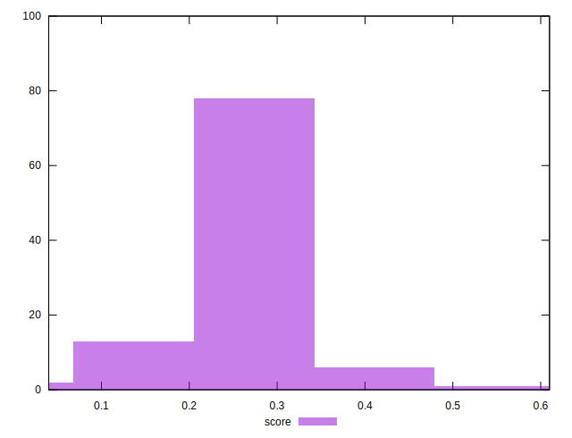
## Raw Estimate

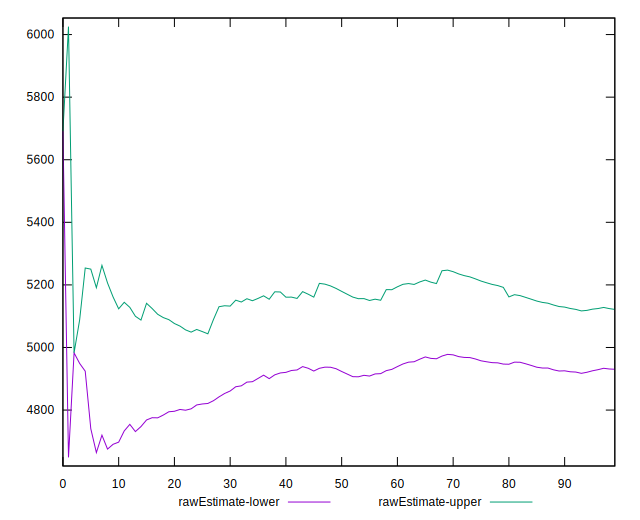
## Score Estimate

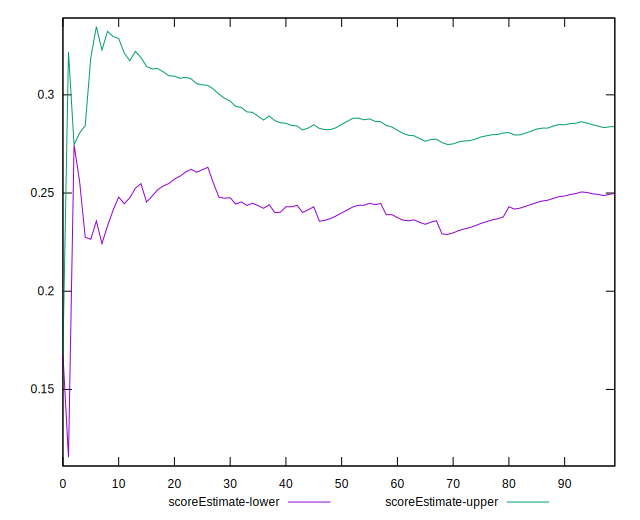
## P Score


```yaml
p90min: 0.11334762774201823
p90max: 0.36054203516593236
p90range: 0.24719440742391413
p90mean: 0.2720058914733006
p90median: 0.28283577070266114
p90stdev: 0.05511181074578149
p90skewness: -0.6271825666496805
p90eccentricity: 0.9999999999999997
p90discretization: 1
outlandishness: 0.9910743859110964
confidence: 0.029249672606013723
p90confidence: 0.022282239620107516

```

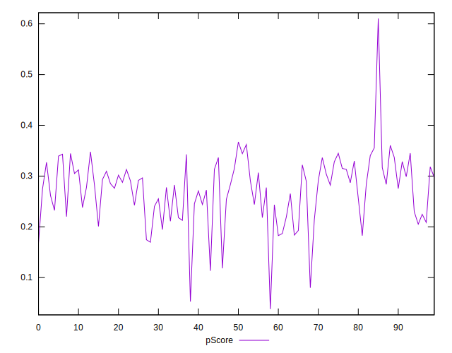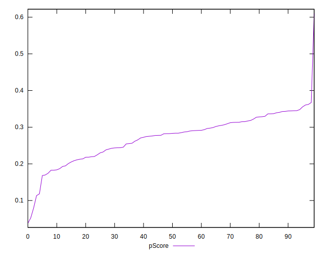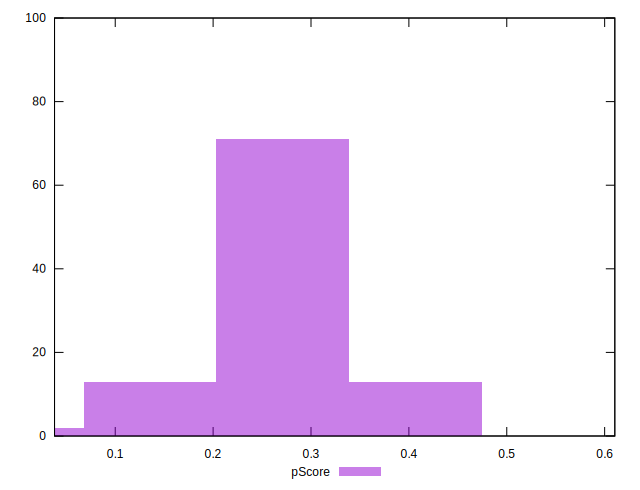
## Score Difference


```yaml
p90min: 0
p90max: 0
p90range: 0
p90mean: 0
p90median: 0
p90stdev: 0
p90skewness: .nan
p90eccentricity: .nan
p90discretization: 94
outlandishness: .inf
confidence: 3.046396000301403e-18
p90confidence: 0

```

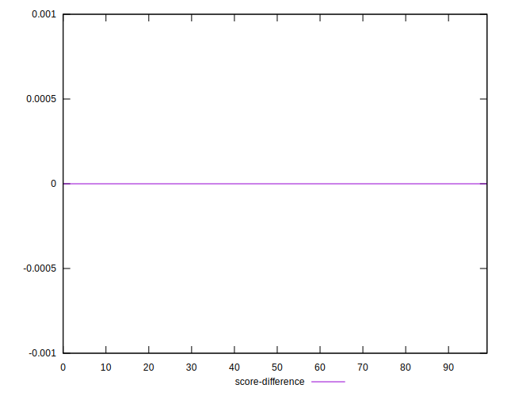
## P Score Difference


```yaml
p90min: -0.004909974178659848
p90max: 0.0045662881167199965
p90range: 0.009476262295379845
p90mean: 0.00020404340066550227
p90median: 0.00041307804582274565
p90stdev: 0.0028424566613877906
p90skewness: -0.16539853342941102
p90eccentricity: 0.9999999999999996
p90discretization: 1
outlandishness: 0.860351997532326
confidence: 0.0011786104939779819
p90confidence: 0.0011492327975026952

```

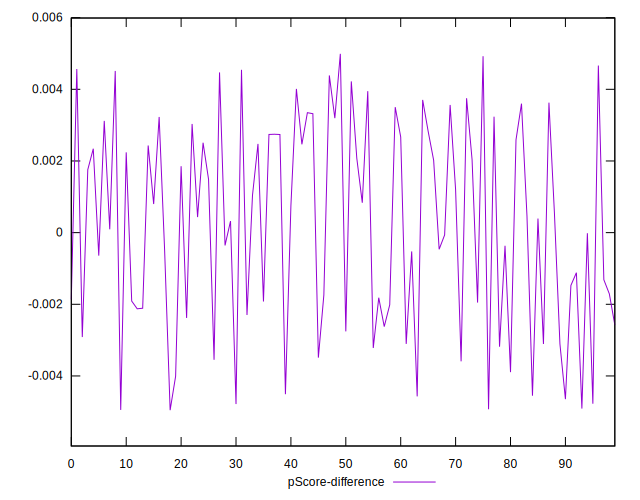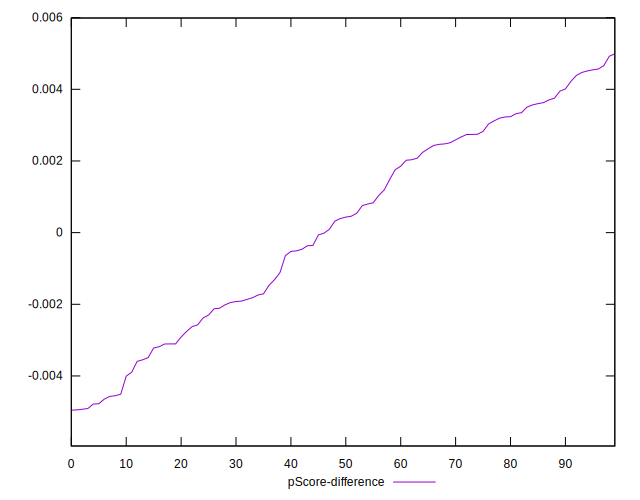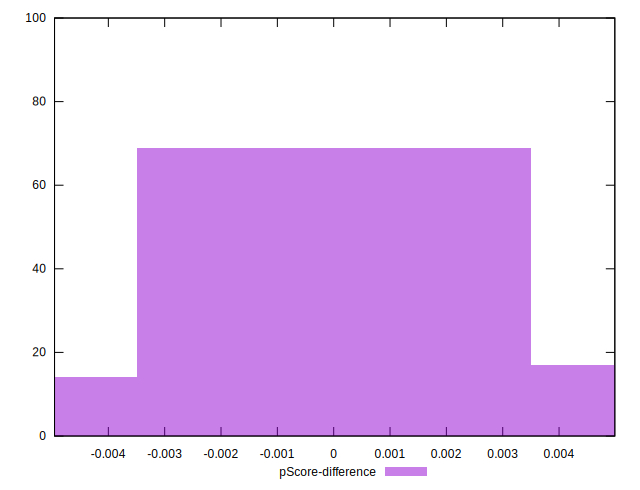