# //largest-contentful-paint/samples/pages

[→ Parent](../..)


## Raw


```yaml
p90min: 13930.275
p90max: 18343.446500000002
p90range: 4413.171500000002
p90mean: 15495.185377659578
p90median: 15407.884750000001
p90stdev: 998.578596397087
p90skewness: 0.5529657504021442
p90eccentricity: 1
p90discretization: 1
outlandishness: 1.0037248894775619
confidence: 464.14570264441556
p90confidence: 403.7350118483212

```

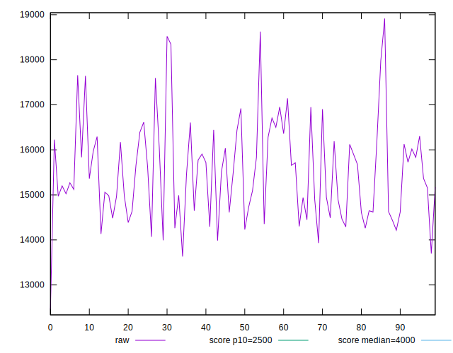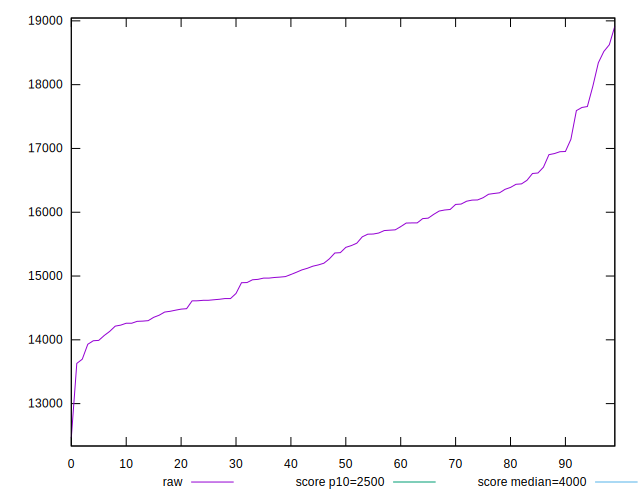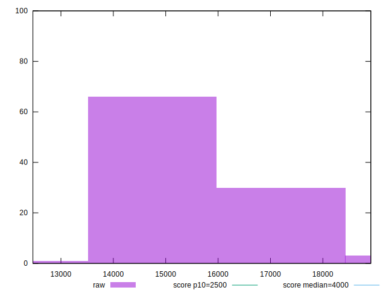
## Score


```yaml
p90min: 0
p90max: 0
p90range: 0
p90mean: 0
p90median: 0
p90stdev: 0
p90skewness: .nan
p90eccentricity: .nan
p90discretization: 94
outlandishness: .nan
confidence: 0
p90confidence: 0

```


## Raw Estimate

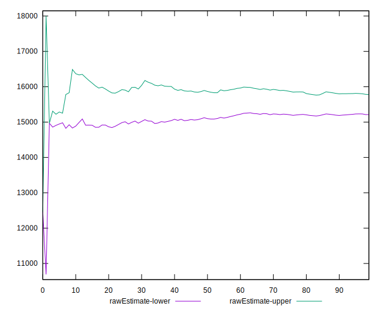
## Score Estimate

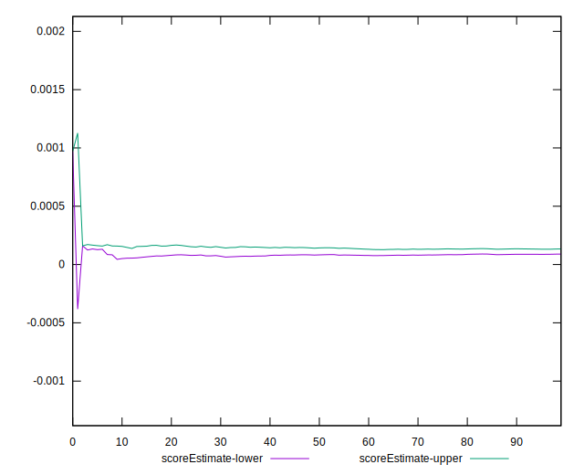
## P Score


```yaml
p90min: 0.00001643979519871941
p90max: 0.00033418763436993126
p90range: 0.00031774783917121185
p90mean: 0.00013761284586590955
p90median: 0.0001180022331074837
p90stdev: 0.00008176910926713886
p90skewness: 0.5636913397572824
p90eccentricity: 1.0000000000000002
p90discretization: 1
outlandishness: 1.1497126125640762
confidence: 0.00004803691023283018
p90confidence: 0.00003306004396439844

```

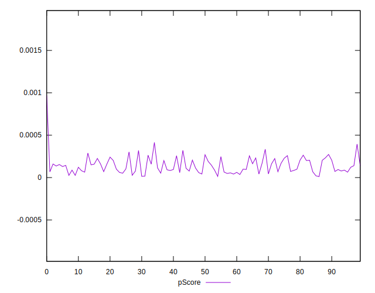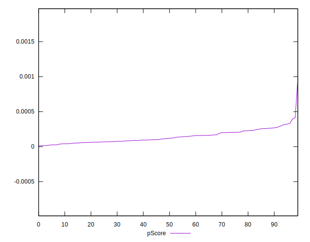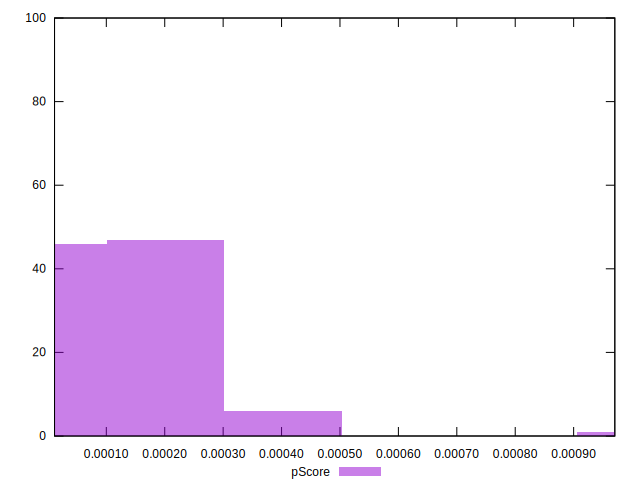
## Score Difference


```yaml
p90min: 0
p90max: 0
p90range: 0
p90mean: 0
p90median: 0
p90stdev: 0
p90skewness: .nan
p90eccentricity: .nan
p90discretization: 94
outlandishness: .nan
confidence: 0
p90confidence: 0

```


## P Score Difference


```yaml
p90min: 0.00001643979519871941
p90max: 0.00033418763436993126
p90range: 0.00031774783917121185
p90mean: 0.00013761284586590955
p90median: 0.0001180022331074837
p90stdev: 0.00008176910926713886
p90skewness: 0.5636913397572824
p90eccentricity: 1.0000000000000002
p90discretization: 1
outlandishness: 1.1497126125640762
confidence: 0.00004803691023283018
p90confidence: 0.00003306004396439844

```

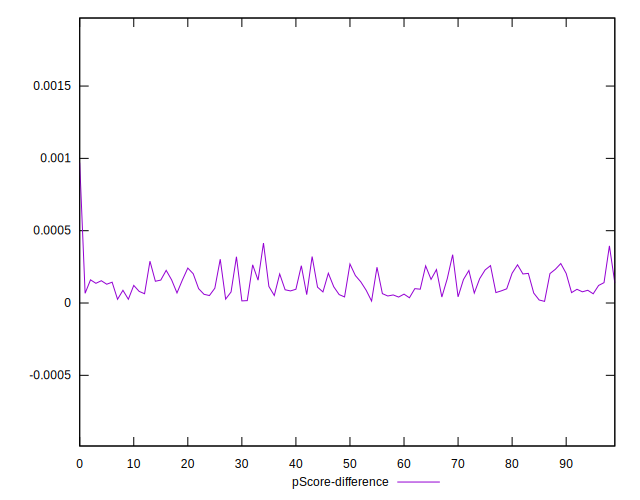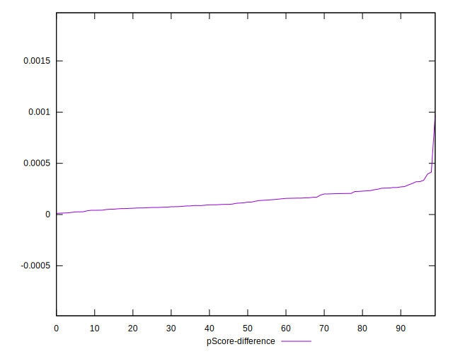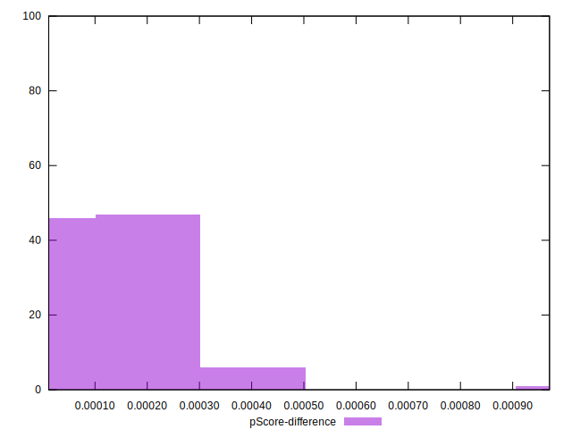