# //mainthread-work-breakdown/samples/pages+cached+noadtech+nomedia+nocss

[→ Parent](../..)


## Raw


```yaml
p90min: 724.9800000000002
p90max: 3197.859999999999
p90range: 2472.879999999999
p90mean: 1530.1779148936173
p90median: 1436.782000000001
p90stdev: 605.3430802377583
p90skewness: 0.8387389680188757
p90eccentricity: 1.0000000000000002
p90discretization: 1
outlandishness: 1.0810312385205356
confidence: 307.63335992938835
p90confidence: 244.74607863005417

```

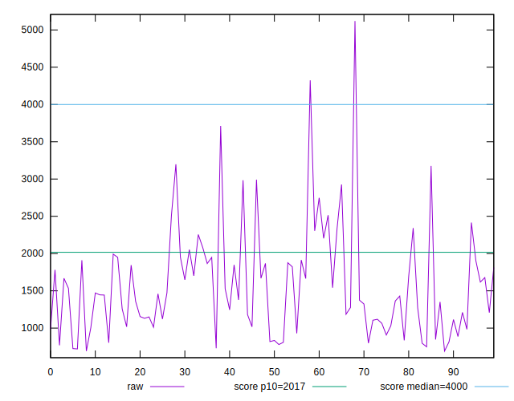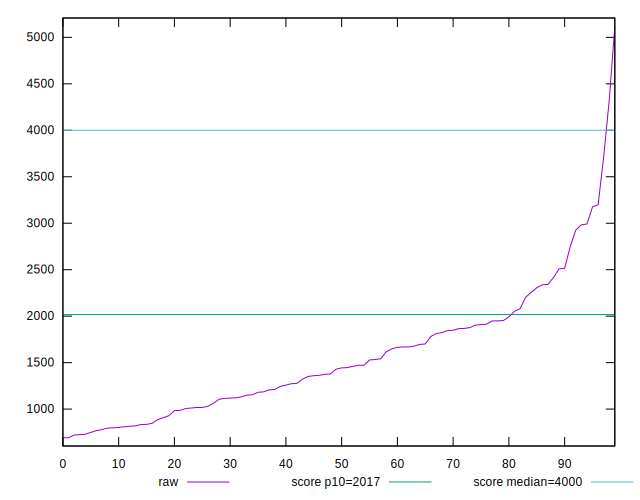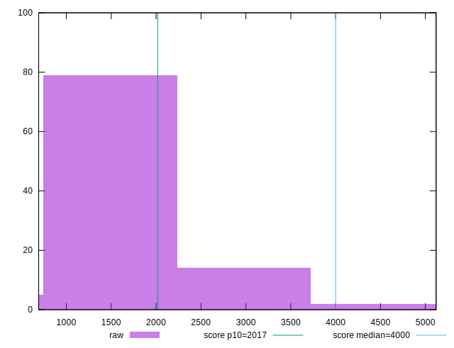
## Score


```yaml
p90min: 0.66
p90max: 1
p90range: 0.33999999999999997
p90mean: 0.9411702127659576
p90median: 0.97
p90stdev: 0.07797785259738438
p90skewness: -1.9519390703835506
p90eccentricity: 0.9999999999999999
p90discretization: 4.2727272727272725
outlandishness: 0.9719994117701842
confidence: 0.045489054041679675
p90confidence: 0.031527202120996176

```

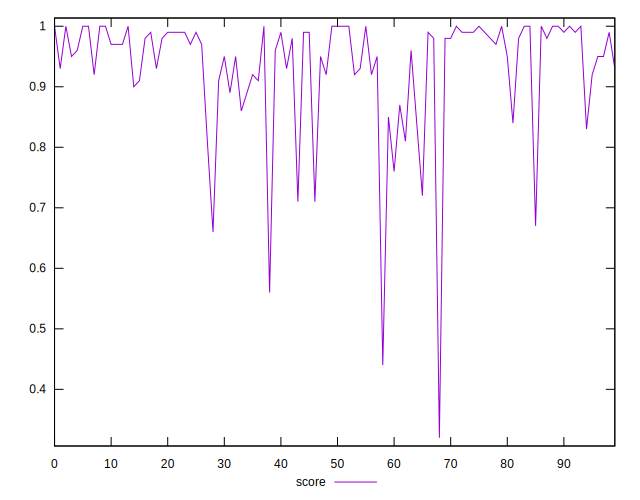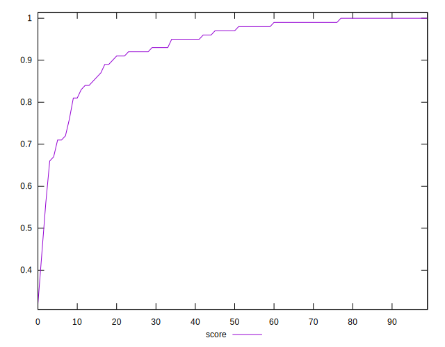
## Raw Estimate

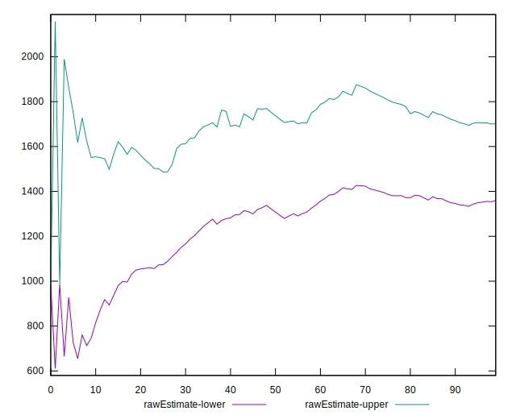
## Score Estimate

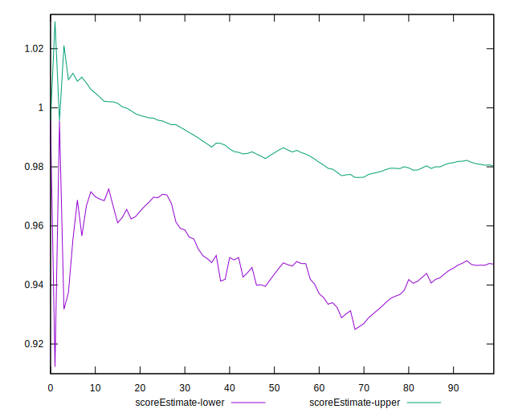
## P Score


```yaml
p90min: 0.6623625773365192
p90max: 0.9993050384127513
p90range: 0.33694246107623216
p90mean: 0.9409781927260285
p90median: 0.9723432272403482
p90stdev: 0.07810798831423782
p90skewness: -1.963968499751761
p90eccentricity: 1.0000000000000002
p90discretization: 1
outlandishness: 0.9719746502940568
confidence: 0.04548923401440085
p90confidence: 0.03157981725352083

```

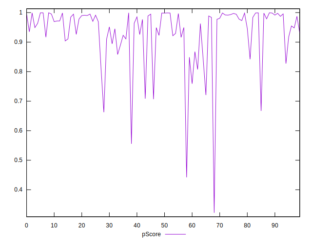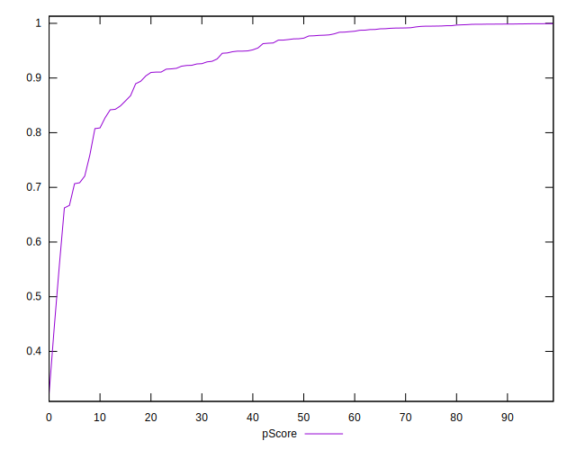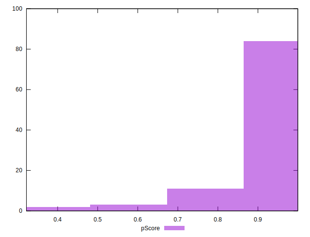
## Score Difference


```yaml
p90min: 0
p90max: 1.1102230246251565e-16
p90range: 1.1102230246251565e-16
p90mean: 7.086529944415892e-18
p90median: 0
p90stdev: 2.713934347484319e-17
p90skewness: 3.5685919470917984
p90eccentricity: 0.9999999999999991
p90discretization: 47
outlandishness: 1.9881000000000004
confidence: 1.2454613861688433e-17
p90confidence: 1.0972699794392905e-17

```

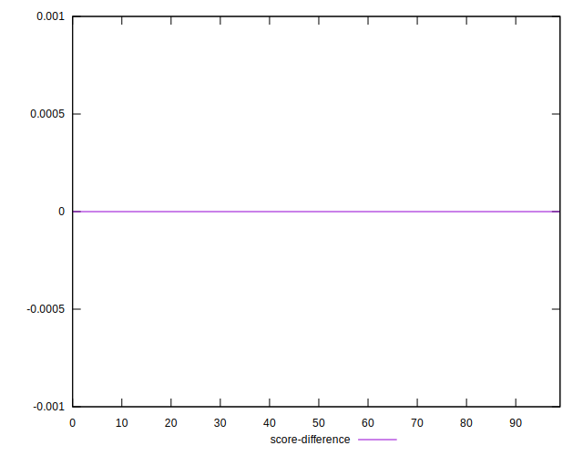
## P Score Difference


```yaml
p90min: -0.004437039647942065
p90max: 0.004812918215078232
p90range: 0.009249957863020297
p90mean: -0.00022116071889758253
p90median: -0.0007153443485171107
p90stdev: 0.002430581427053192
p90skewness: 0.37136077868818557
p90eccentricity: 0.9999999999999996
p90discretization: 1
outlandishness: 0.8270556369563274
confidence: 0.0010335012595247563
p90confidence: 0.000982707645437465

```

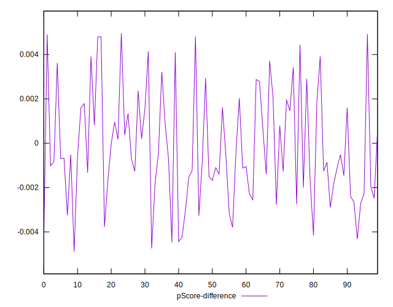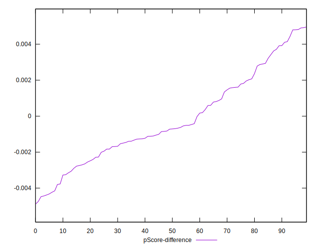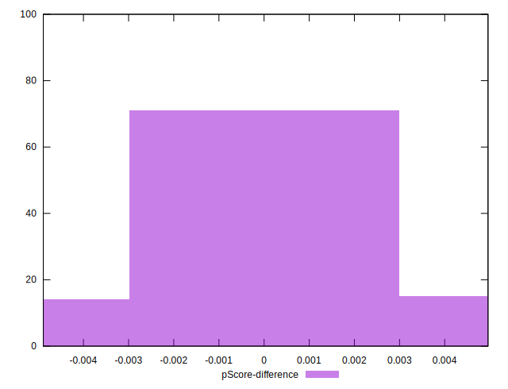