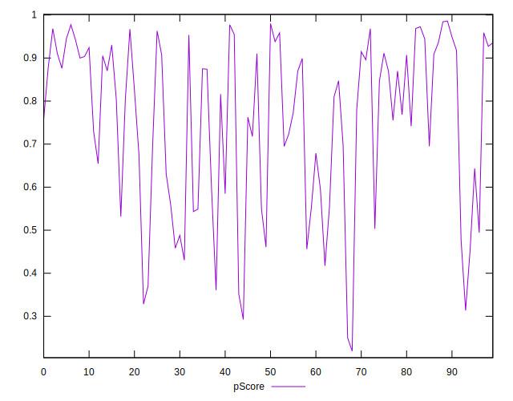

# //mainthread-work-breakdown/samples/pages+cached+noadtech

[→ Parent](../..)


## Raw


```yaml
p90min: 1371.8360000000007
p90max: 5184.199999999997
p90range: 3812.3639999999964
p90mean: 2719.5618297872343
p90median: 2488.055999999999
p90stdev: 1008.9985894088211
p90skewness: 0.6496261263148664
p90eccentricity: 0.9999999999999992
p90discretization: 1
outlandishness: 1.0346255134778326
confidence: 445.0094817343851
p90confidence: 407.94791608763757

```


## Score


```yaml
p90min: 0.31
p90max: 0.98
p90range: 0.6699999999999999
p90mean: 0.7558510638297871
p90median: 0.815
p90stdev: 0.19238928606470082
p90skewness: -0.6788082457784638
p90eccentricity: 1.0000000000000002
p90discretization: 1.9583333333333333
outlandishness: 0.9782866523332282
confidence: 0.08211125430403166
p90confidence: 0.07778485436106292

```


## Raw Estimate


## Score Estimate


## P Score


```yaml
p90min: 0.31370239098153796
p90max: 0.9774133797491595
p90range: 0.6637109887676216
p90mean: 0.7557155285107805
p90median: 0.8129084859085814
p90stdev: 0.1917433313883412
p90skewness: -0.6845670880356473
p90eccentricity: 1
p90discretization: 1
outlandishness: 0.9783441707180458
confidence: 0.0818828281320124
p90confidence: 0.07752368862022442

```


## Score Difference


```yaml
p90min: 0
p90max: 1.1102230246251565e-16
p90range: 1.1102230246251565e-16
p90mean: 1.3582515726797127e-17
p90median: 0
p90stdev: 3.59262529282725e-17
p90skewness: 2.3045082104447245
p90eccentricity: 1.0000000000000022
p90discretization: 31.333333333333332
outlandishness: 1.4047402646502833
confidence: 1.5168120506640882e-17
p90confidence: 1.452533251162742e-17

```


## P Score Difference


```yaml
p90min: -0.004925632381533984
p90max: 0.0048057184863218305
p90range: 0.009731350867855815
p90mean: -0.00011622589731867174
p90median: -0.0004933335179340692
p90stdev: 0.002837829667661668
p90skewness: 0.19214658066378845
p90eccentricity: 1.0000000000000009
p90discretization: 1
outlandishness: 0.9299712790891655
confidence: 0.0011770109077520166
p90confidence: 0.0011473620590614967

```

