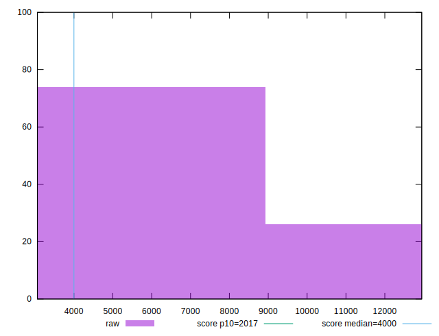

# //mainthread-work-breakdown/samples/pages+cached

[→ Parent](../..)


## Raw


```yaml
p90min: 3450.447999999996
p90max: 12375.363999999994
p90range: 8924.915999999997
p90mean: 6787.726170212755
p90median: 6463.571999999989
p90stdev: 2416.7416711197857
p90skewness: 0.41307937844326503
p90eccentricity: 0.9999999999999999
p90discretization: 1
outlandishness: 1.0189398866778032
confidence: 1032.0232318765884
p90confidence: 977.1120978802551

```


## Score


```yaml
p90min: 0.02
p90max: 0.61
p90range: 0.59
p90mean: 0.2392553191489361
p90median: 0.185
p90stdev: 0.1792195810071754
p90skewness: 0.39969106295502227
p90eccentricity: 0.9999999999999999
p90discretization: 2.088888888888889
outlandishness: 1.0580349738167314
confidence: 0.07613928071128481
p90confidence: 0.07246021487186984

```


## Raw Estimate


## Score Estimate


## P Score


```yaml
p90min: 0.017258734007075005
p90max: 0.6089661302887696
p90range: 0.5917073962816946
p90mean: 0.23933246435093697
p90median: 0.18461275690162074
p90stdev: 0.17965313604989502
p90skewness: 0.40182966617635923
p90eccentricity: 0.9999999999999997
p90discretization: 1
outlandishness: 1.0579040965138538
confidence: 0.0763178797779354
p90confidence: 0.07263550538074003

```


## Score Difference


```yaml
p90min: 0
p90max: 1.1102230246251565e-16
p90range: 1.1102230246251565e-16
p90mean: 3.543264972207946e-18
p90median: 0
p90stdev: 1.5801884812776703e-17
p90skewness: 4.850394434305288
p90eccentricity: 0.9999999999999987
p90discretization: 31.333333333333332
outlandishness: 3.5344000000000007
confidence: 9.374482588239114e-18
p90confidence: 6.3888552940456556e-18

```


## P Score Difference


```yaml
p90min: -0.004802215344947645
p90max: 0.004595792307263813
p90range: 0.009398007652211458
p90mean: 0.00006999205556582624
p90median: 0.0003399608043943986
p90stdev: 0.002639551410027246
p90skewness: -0.1477695832819829
p90eccentricity: 0.9999999999999999
p90discretization: 1
outlandishness: 0.8393961691559292
confidence: 0.001106895522762434
p90confidence: 0.0010671962363770044

```

