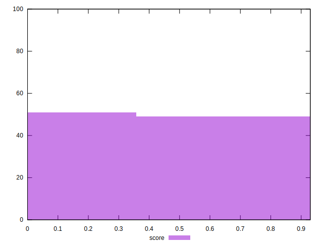

# //max-potential-fid/samples/pages+cached+noadtech+nomedia+nocss

[→ Parent](../..)


## Raw


```yaml
p90min: 124
p90max: 791
p90range: 667
p90mean: 320.70212765957444
p90median: 308
p90stdev: 155.15783520422136
p90skewness: 0.9230639686896098
p90eccentricity: 0.9999999999999992
p90discretization: 1.1325301204819278
outlandishness: 1.169714073666101
confidence: 97.86202627827163
p90confidence: 62.73181766618417

```


## Score


```yaml
p90min: 0.01
p90max: 0.92
p90range: 0.91
p90mean: 0.423936170212766
p90median: 0.34
p90stdev: 0.2913038118861051
p90skewness: 0.3611926947727012
p90eccentricity: 0.9999999999999996
p90discretization: 1.709090909090909
outlandishness: 1.0111829100910092
confidence: 0.11937149987987991
p90confidence: 0.11777695653365484

```


## Raw Estimate


## Score Estimate


## P Score


```yaml
p90min: 0.01199318092705376
p90max: 0.9153034349328991
p90range: 0.9033102540058453
p90mean: 0.4236322195839973
p90median: 0.3413116586107554
p90stdev: 0.29081755426013384
p90skewness: 0.36186581087121794
p90eccentricity: 1.0000000000000007
p90discretization: 1.1325301204819278
outlandishness: 1.0119019663807831
confidence: 0.1192223712909631
p90confidence: 0.11758035785920781

```


## Score Difference


```yaml
p90min: 0
p90max: 1.1102230246251565e-16
p90range: 1.1102230246251565e-16
p90mean: 2.9527208101732887e-18
p90median: 0
p90stdev: 1.6920919490504974e-17
p90skewness: 5.856608956366592
p90eccentricity: 0.9999999999999976
p90discretization: 31.333333333333332
outlandishness: 4.276624
confidence: 9.680130628467232e-18
p90confidence: 6.841291867893117e-18

```


## P Score Difference


```yaml
p90min: -0.004696565067100922
p90max: 0.004762069299912528
p90range: 0.00945863436701345
p90mean: -0.00017037519519920707
p90median: 0.0000988169557368801
p90stdev: 0.0026835187208051805
p90skewness: 0.04883091057277906
p90eccentricity: 0.9999999999999999
p90discretization: 1.1325301204819278
outlandishness: 0.8192335993133275
confidence: 0.0011203537465255824
p90confidence: 0.0010849726465683655

```

