# //max-potential-fid/samples/pages+cached+noadtech+nomedia

[→ Parent](../..)


## Raw


```yaml
p90min: 124
p90max: 854.0000000000005
p90range: 730.0000000000005
p90mean: 284.531914893617
p90median: 261
p90stdev: 119.012577748281
p90skewness: 1.5849374686958289
p90eccentricity: 1
p90discretization: 1.175
outlandishness: 1.165227663302513
confidence: 82.52471626820297
p90confidence: 48.11793949987135

```

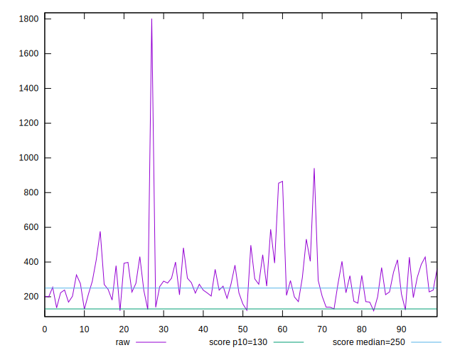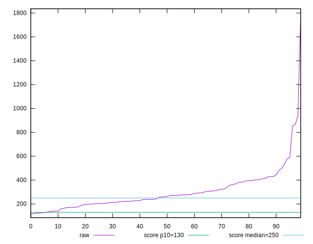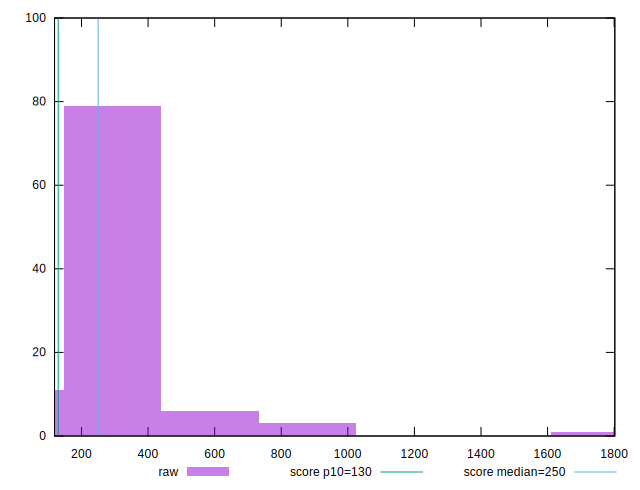
## Score


```yaml
p90min: 0.01
p90max: 0.92
p90range: 0.91
p90mean: 0.4703191489361704
p90median: 0.47
p90stdev: 0.24375367810715204
p90skewness: 0.034492464611877535
p90eccentricity: 0.9999999999999994
p90discretization: 1.6785714285714286
outlandishness: 0.998643301456349
confidence: 0.10270061662328737
p90confidence: 0.09855197625278281

```

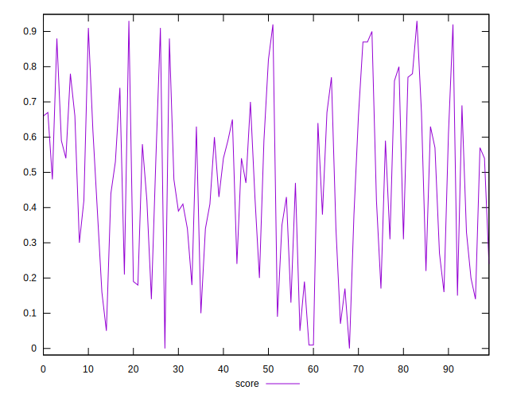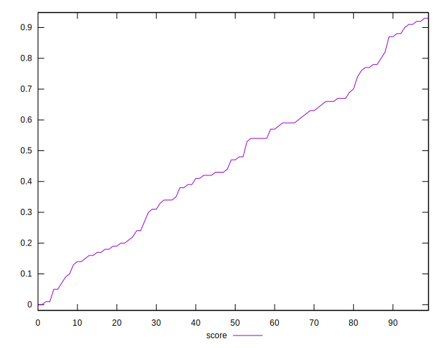
## Raw Estimate

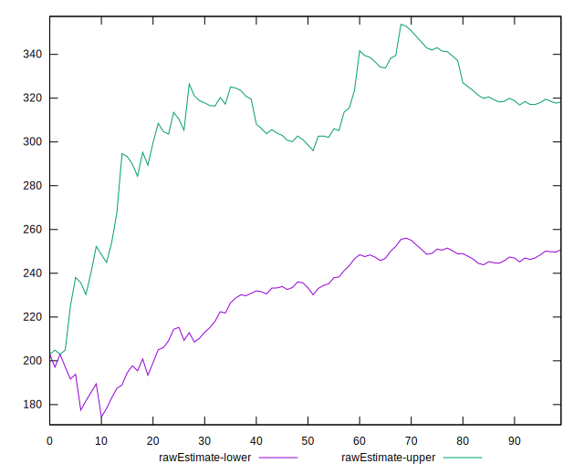
## Score Estimate

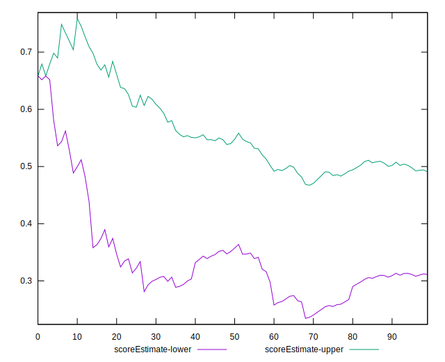
## P Score


```yaml
p90min: 0.008030402194012576
p90max: 0.9153034349328991
p90range: 0.9072730327388865
p90mean: 0.470118774918955
p90median: 0.46637426772665647
p90stdev: 0.24333358470997563
p90skewness: 0.03142955074522975
p90eccentricity: 1.0000000000000004
p90discretization: 1.175
outlandishness: 0.9985520184209182
confidence: 0.10250221061221498
p90confidence: 0.09838212841777175

```

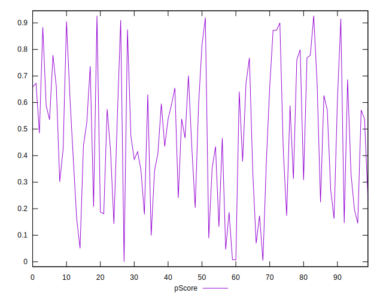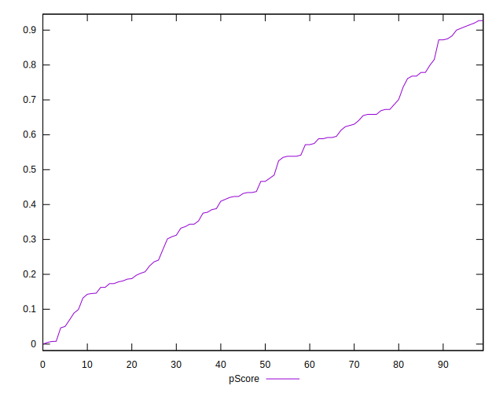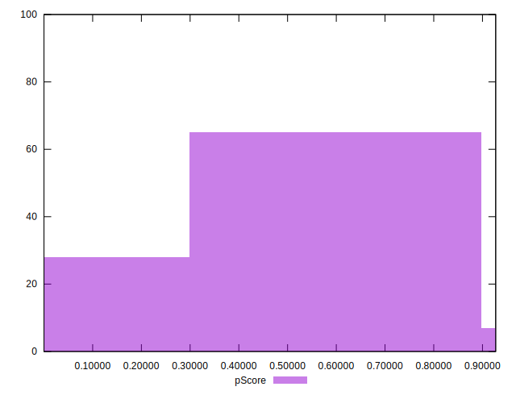
## Score Difference


```yaml
p90min: 0
p90max: 1.1102230246251565e-16
p90range: 1.1102230246251565e-16
p90mean: 5.3148974583119196e-18
p90median: 0
p90stdev: 1.9947809071283488e-17
p90skewness: 3.996213222313678
p90eccentricity: 1
p90discretization: 31.333333333333332
outlandishness: 2.4544444444444444
confidence: 1.0378844884740376e-17
p90confidence: 8.0650926835409e-18

```

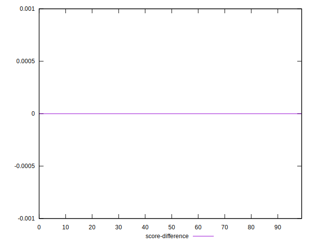
## P Score Difference


```yaml
p90min: -0.0047708728240448695
p90max: 0.0046932031073328995
p90range: 0.009464075931377769
p90mean: -0.00023407768177816603
p90median: -0.0005805332363617854
p90stdev: 0.0027260916499537435
p90skewness: 0.033492536792821916
p90eccentricity: 0.9999999999999999
p90discretization: 1.1898734177215189
outlandishness: 0.8971203658258214
confidence: 0.0011389725800509515
p90confidence: 0.0011021852947427093

```

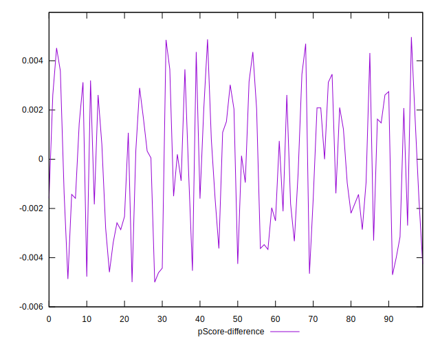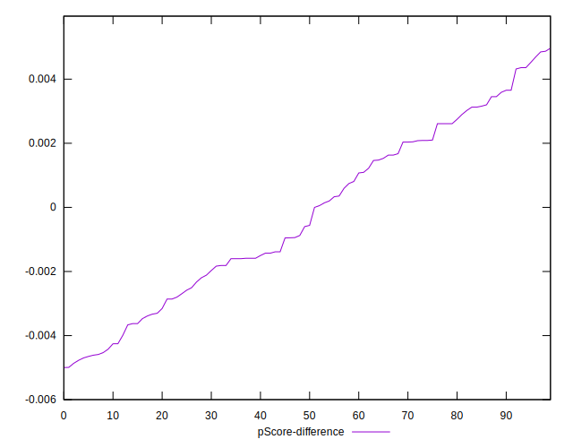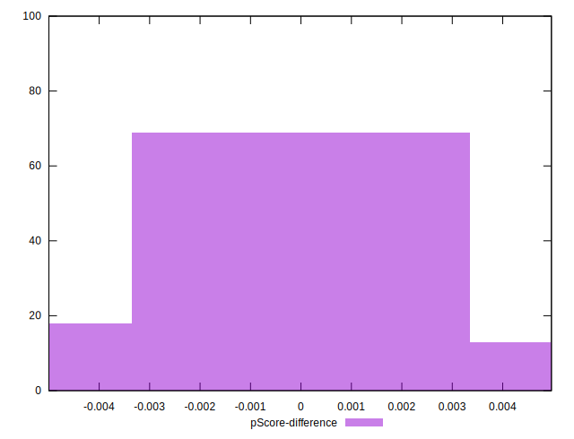