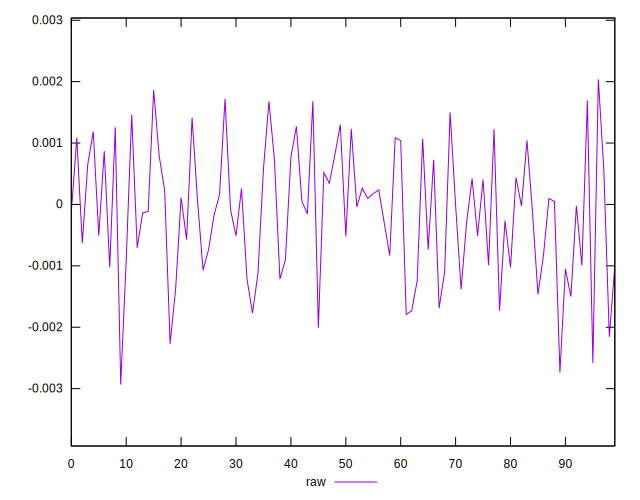
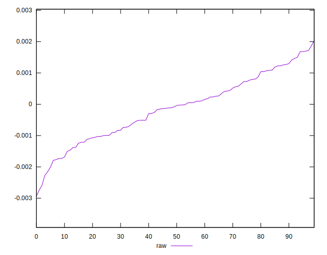
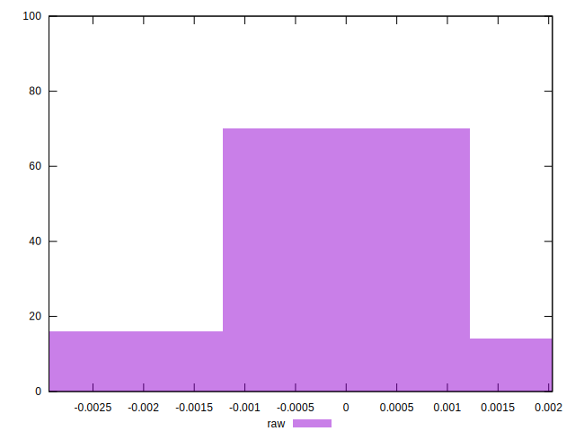

# //meta/pScore-difference/samples/pages+cached+noadtech+nomedia+nocss

[→ Parent](../..)


## Raw


```yaml
p90min: -0.002270353200103525
p90max: 0.0016934960180191604
p90range: 0.003963849218122685
p90mean: -0.00012825917465315588
p90median: -0.0000624288481633685
p90stdev: 0.0009925431300928295
p90skewness: -0.08051141497811323
p90eccentricity: 1.0000000000000002
p90discretization: 1
outlandishness: 1.3120328755394757
confidence: 0.0004388777497261933
p90confidence: 0.0004012948142828503

```

