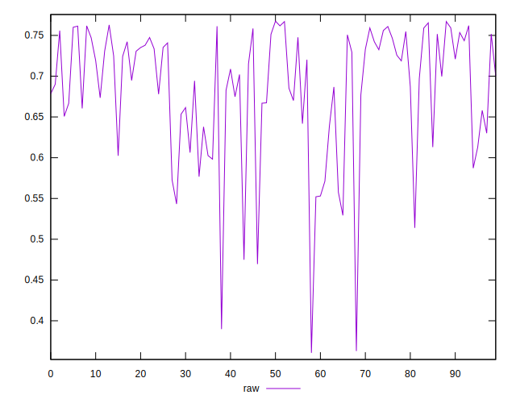
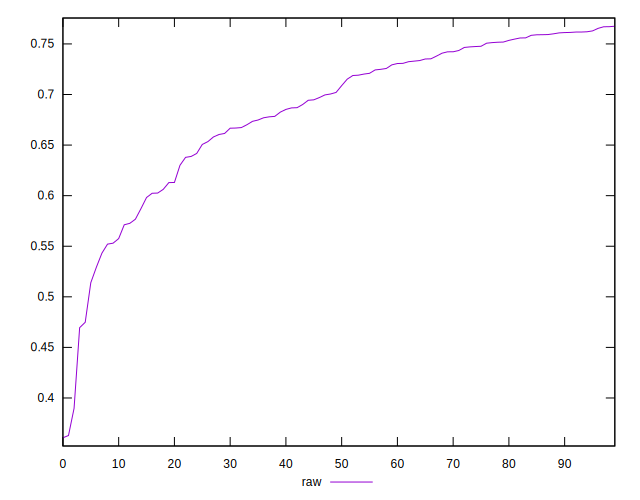
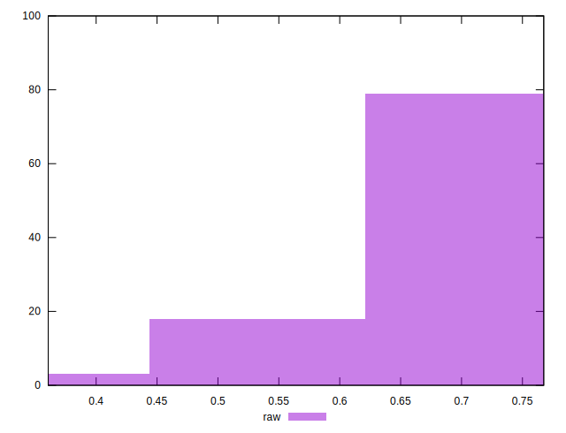

# //meta/pScore/samples/pages+cached+noadtech+nomedia+nocss

[→ Parent](../..)


## Raw


```yaml
p90min: 0.4695184868699364
p90max: 0.7653821217451581
p90range: 0.29586363487522166
p90mean: 0.6871645142206232
p90median: 0.705410252714076
p90stdev: 0.07209850996082254
p90skewness: -1.08184306238555
p90eccentricity: 0.9999999999999999
p90discretization: 1
outlandishness: 0.9794956252887919
confidence: 0.035126453062829494
p90confidence: 0.02915012686863544

```

