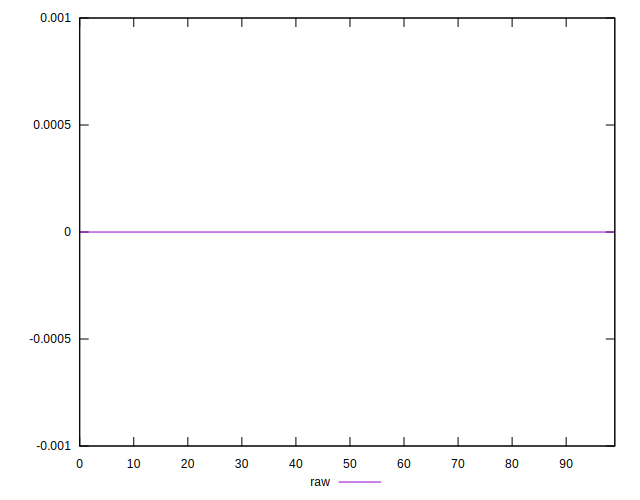

# //meta/score-difference/samples/pages+cached+noadtech+nomedia

[→ Parent](../..)


## Raw


```yaml
p90min: 0
p90max: 2.7755575615628914e-17
p90range: 2.7755575615628914e-17
p90mean: 6.40740415807604e-18
p90median: 0
p90stdev: 9.809123408018405e-18
p90skewness: 1.1673524043972752
p90eccentricity: 1
p90discretization: 18.8
outlandishness: 1.2587392299687823
confidence: 4.373957237673695e-18
p90confidence: 3.965923733641833e-18

```

