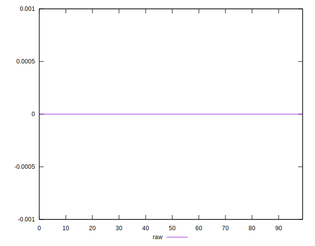

# //meta/score-difference/samples/pages+cached+noadtech

[→ Parent](../..)


## Raw


```yaml
p90min: 0
p90max: 2.7755575615628914e-17
p90range: 2.7755575615628914e-17
p90mean: 7.883764563162682e-18
p90median: 0
p90stdev: 9.642927974320918e-18
p90skewness: 0.7353194927376704
p90eccentricity: 1.0000000000000027
p90discretization: 18.8
outlandishness: 1.1080913408800799
confidence: 3.987169647879275e-18
p90confidence: 3.898729307849925e-18

```

