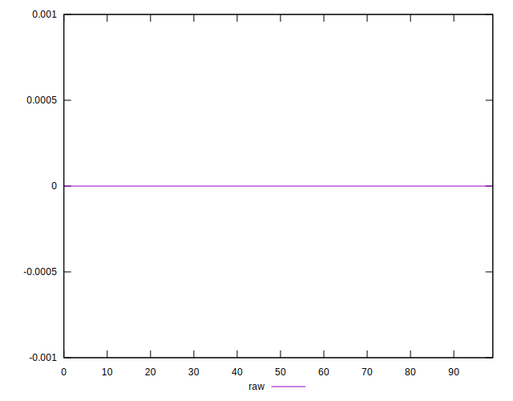

# //meta/score-difference/samples/pages

[→ Parent](../..)


## Raw


```yaml
p90min: 0
p90max: 2.4980018054066023e-17
p90range: 2.4980018054066023e-17
p90mean: 3.543264972207945e-18
p90median: 0
p90stdev: 6.7065123776211294e-18
p90skewness: 1.525268253116594
p90eccentricity: 1.0000000000000007
p90discretization: 23.5
outlandishness: 1.5318187777777783
confidence: 3.3540721426388636e-18
p90confidence: 2.7115080014824142e-18

```

