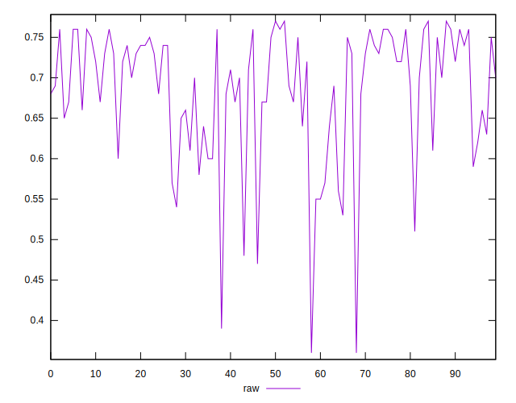

# //meta/score/samples/pages+cached+noadtech+nomedia+nocss

[→ Parent](../..)


## Raw


```yaml
p90min: 0.47
p90max: 0.77
p90range: 0.30000000000000004
p90mean: 0.6875531914893613
p90median: 0.705
p90stdev: 0.07222432799025673
p90skewness: -1.0801953921775178
p90eccentricity: 1.0000000000000002
p90discretization: 3.357142857142857
outlandishness: 0.9795884467767099
confidence: 0.0352548436592135
p90confidence: 0.02920099631825876

```

