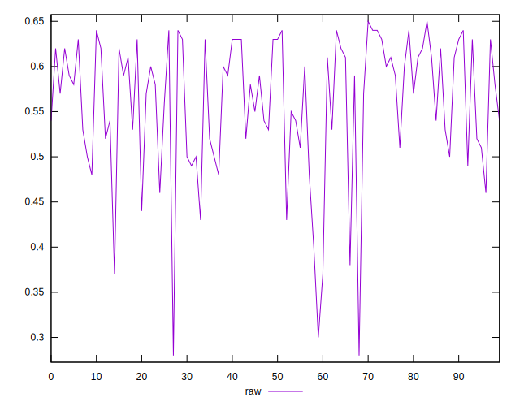

# //meta/score/samples/pages+cached+noadtech+nomedia

[→ Parent](../..)


## Raw


```yaml
p90min: 0.37
p90max: 0.64
p90range: 0.27
p90mean: 0.5625531914893618
p90median: 0.58
p90stdev: 0.06832239236388778
p90skewness: -0.9269319845613883
p90eccentricity: 1.0000000000000007
p90discretization: 4.086956521739131
outlandishness: 0.97965073228341
confidence: 0.03245207962946015
p90confidence: 0.02762340589920975

```

