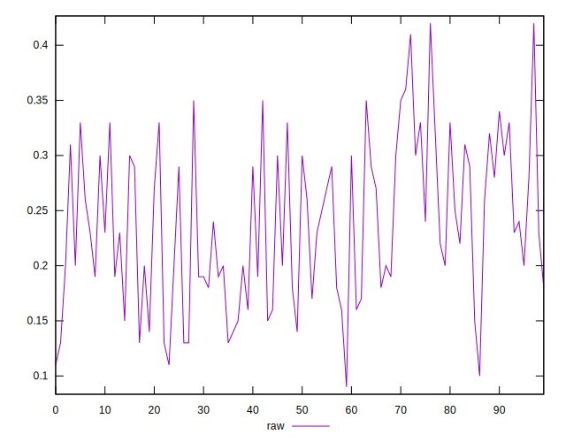

# //meta/score/samples/pages+cached

[→ Parent](../..)


## Raw


```yaml
p90min: 0.11
p90max: 0.36
p90range: 0.25
p90mean: 0.23531914893617006
p90median: 0.23
p90stdev: 0.06852087937201323
p90skewness: 0.07721915056885573
p90eccentricity: 0.9999999999999996
p90discretization: 3.9166666666666665
outlandishness: 1.0117704188725647
confidence: 0.03023713117582443
p90confidence: 0.02770365612174246

```

