# //offscreen-images/samples/pages+cached

[→ Parent](../..)


## Raw


```yaml
p90min: 0
p90max: 320
p90range: 320
p90mean: 161.80851063829786
p90median: 150
p90stdev: 76.78323683906488
p90skewness: 0.0715737129078124
p90eccentricity: 0.9999999999999989
p90discretization: 7.833333333333333
outlandishness: 1.0285240261584367
confidence: 35.24926433349141
p90confidence: 31.044207383196365

```

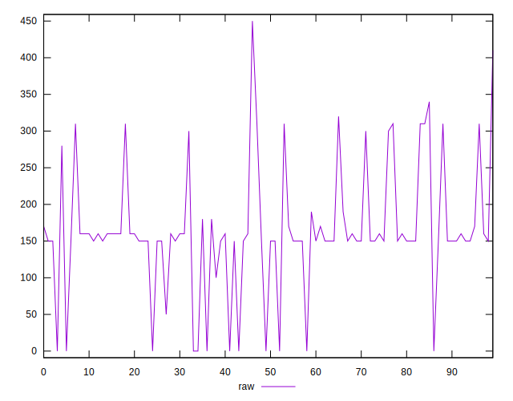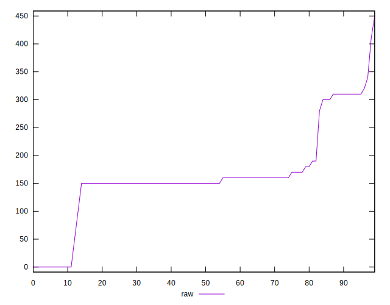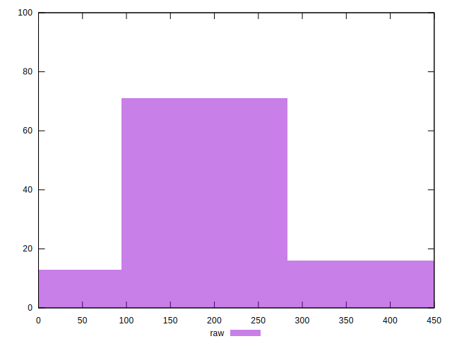
## Score


```yaml
p90min: 0.74
p90max: 1
p90range: 0.26
p90mean: 0.8680851063829786
p90median: 0.88
p90stdev: 0.06454878735028985
p90skewness: -0.21001666158773663
p90eccentricity: 1.000000000000001
p90discretization: 8.545454545454545
outlandishness: 0.9972714716034694
confidence: 0.028637991476348077
p90confidence: 0.02609770079159696

```

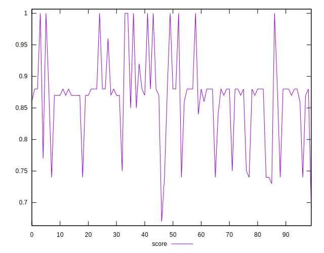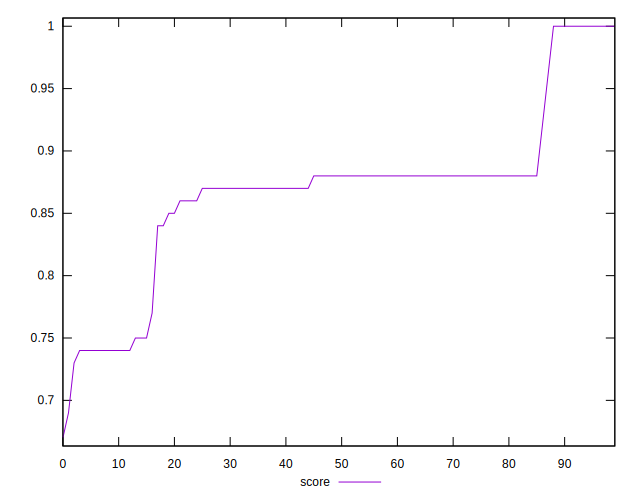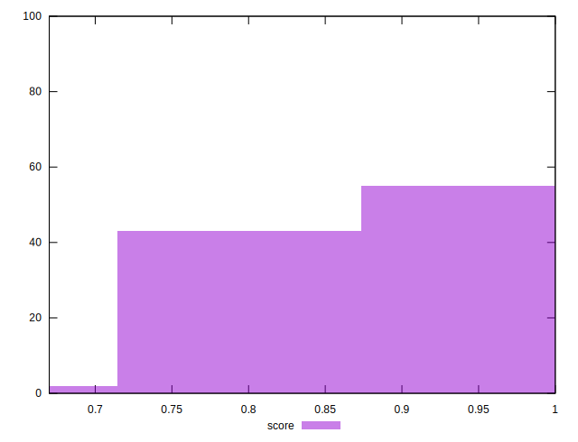
## Raw Estimate

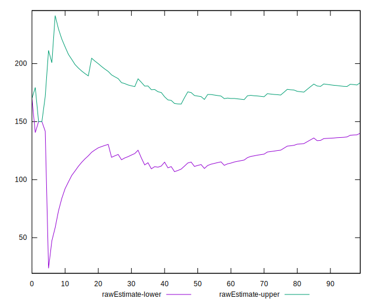
## Score Estimate

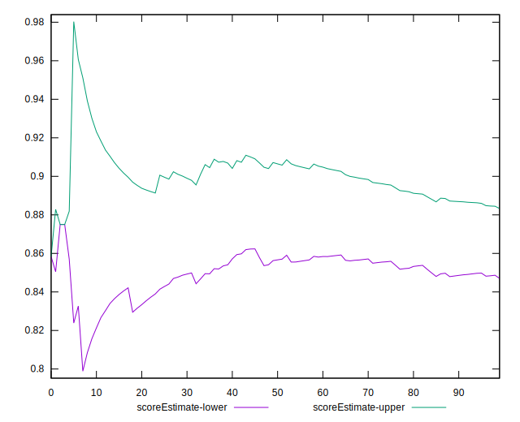
## P Score


```yaml
p90min: 0.7388888888888889
p90max: 1
p90range: 0.26111111111111107
p90mean: 0.8654846335697398
p90median: 0.875
p90stdev: 0.06335537514301713
p90skewness: -0.030731639911535838
p90eccentricity: 1.0000000000000004
p90discretization: 7.833333333333333
outlandishness: 0.9974695078203469
confidence: 0.028298183439625056
p90confidence: 0.025615192661158737

```

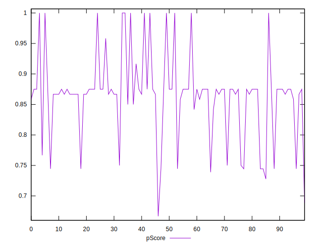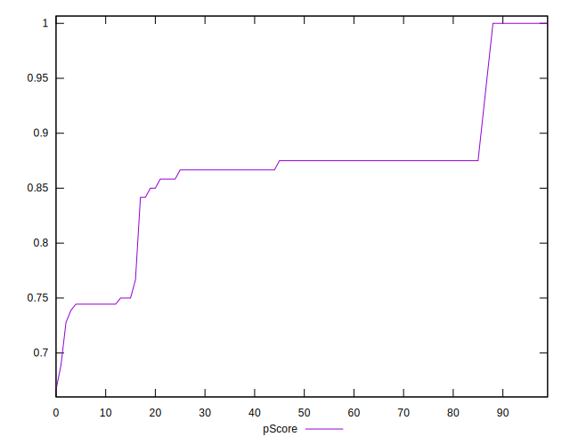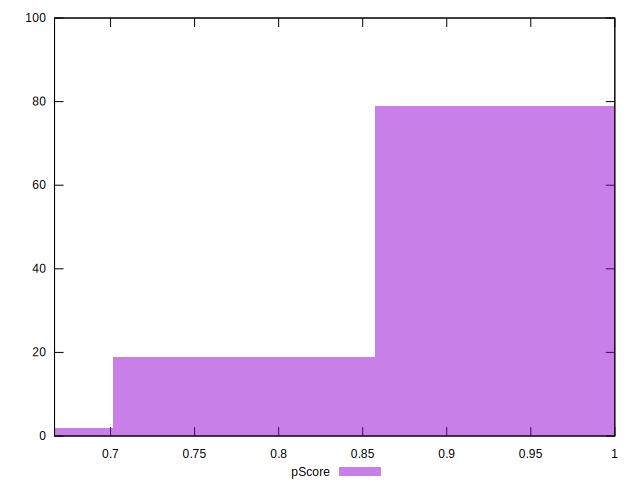
## Score Difference


```yaml
p90min: 0
p90max: 0
p90range: 0
p90mean: 0
p90median: 0
p90stdev: 0
p90skewness: .nan
p90eccentricity: .nan
p90discretization: 94
outlandishness: .inf
confidence: 4.330179641073931e-18
p90confidence: 0

```


## P Score Difference


```yaml
p90min: -0.0050000000000000044
p90max: 0.004444444444444473
p90range: 0.009444444444444478
p90mean: -0.0026536643026004625
p90median: -0.0033333333333332993
p90stdev: 0.00270732675762851
p90skewness: 1.1466541141250206
p90eccentricity: 0.9999999999999987
p90discretization: 10.444444444444445
outlandishness: 0.8954470186159786
confidence: 0.001145945392023509
p90confidence: 0.0010945984667728376

```

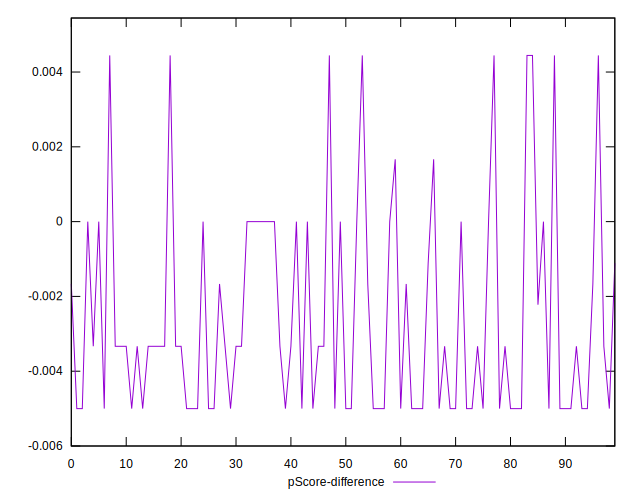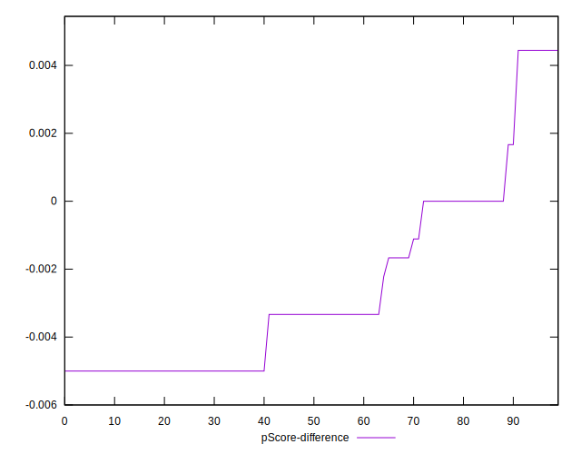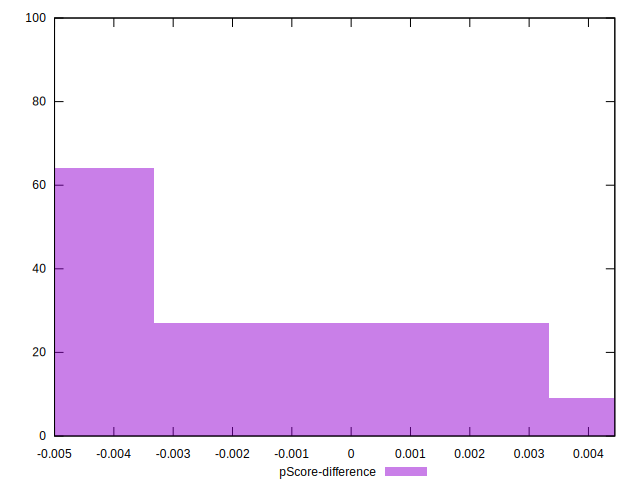