# //render-blocking-resources/samples/pages+cached+noadtech

[→ Parent](../..)


## Raw


```yaml
p90min: 472
p90max: 1161
p90range: 689
p90mean: 631.3297872340426
p90median: 606
p90stdev: 123.08234471607125
p90skewness: 1.3487789837313797
p90eccentricity: 1
p90discretization: 1.175
outlandishness: 1.0445194762469765
confidence: 65.5254356143118
p90confidence: 49.763385758071855

```

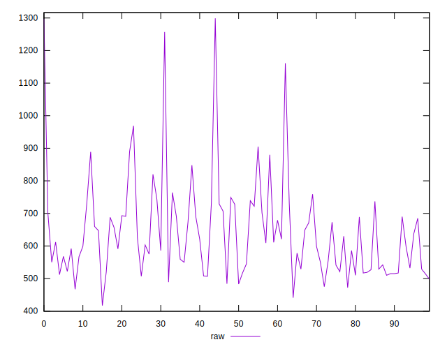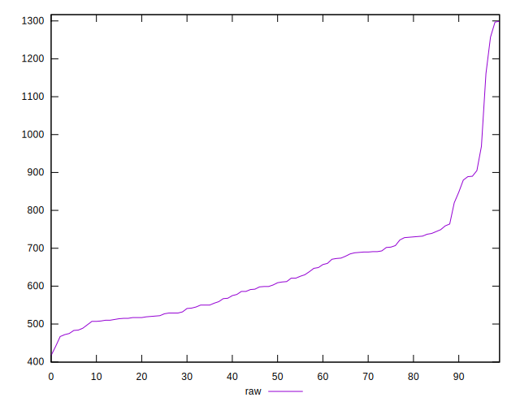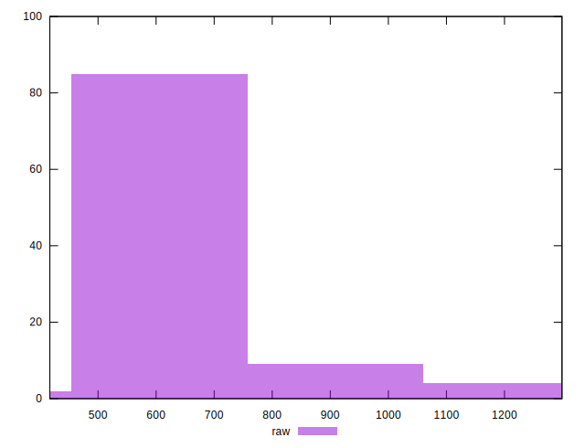
## Score


```yaml
p90min: 0.45
p90max: 0.65
p90range: 0.2
p90mean: 0.5720212765957448
p90median: 0.58
p90stdev: 0.053506408191161925
p90skewness: -0.2879037651706789
p90eccentricity: 0.9999999999999994
p90discretization: 4.7
outlandishness: 0.9967814668923205
confidence: 0.023275890612747898
p90confidence: 0.02163315979629672

```

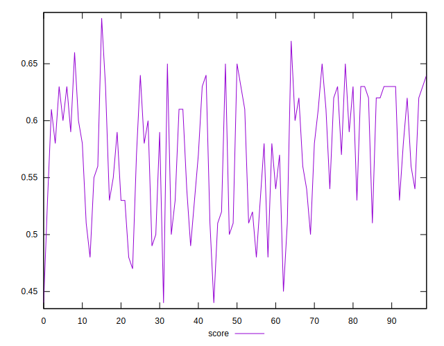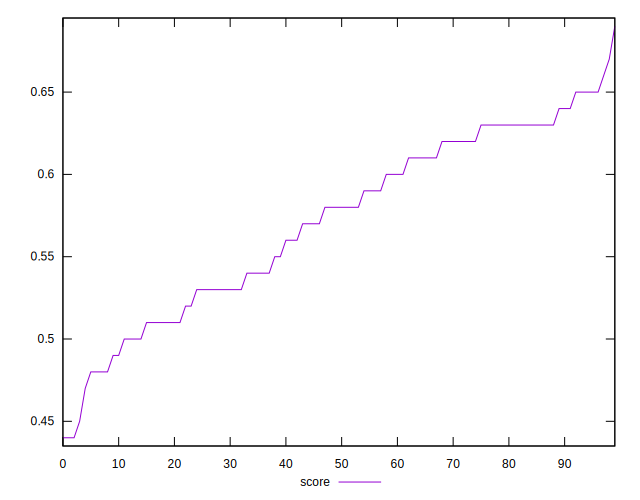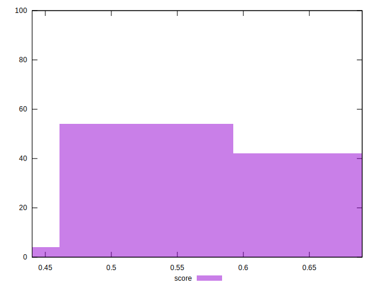
## Raw Estimate

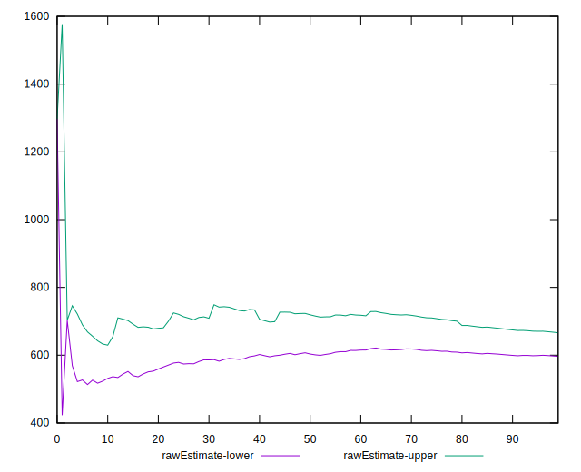
## Score Estimate

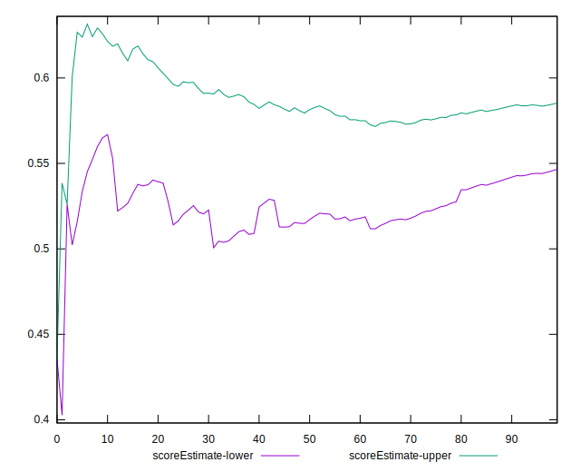
## P Score


```yaml
p90min: 0.4516470588235294
p90max: 0.6544444444444444
p90range: 0.20279738562091498
p90mean: 0.5723800584063412
p90median: 0.5800000000000001
p90stdev: 0.05297512820988281
p90skewness: -0.27720830440775124
p90eccentricity: 1.0000000000000002
p90discretization: 1.175
outlandishness: 0.9961956763528453
confidence: 0.02313442161379058
p90confidence: 0.021418358146921886

```

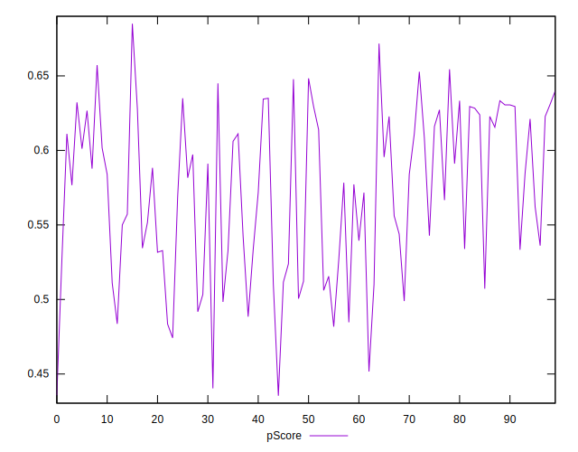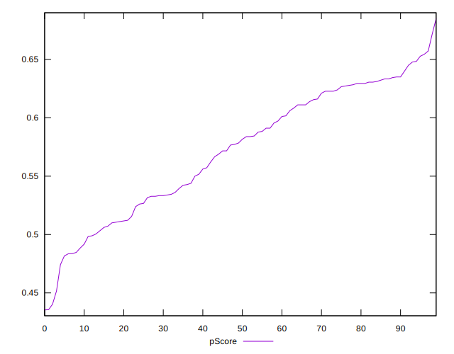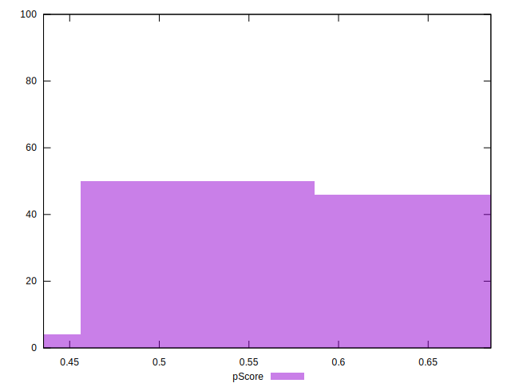
## Score Difference


```yaml
p90min: 0
p90max: 1.1102230246251565e-16
p90range: 1.1102230246251565e-16
p90mean: 2.9527208101732887e-18
p90median: 0
p90stdev: 1.6920919490504968e-17
p90skewness: 5.856608956366599
p90eccentricity: 0.9999999999999992
p90discretization: 31.333333333333332
outlandishness: 4.276624
confidence: 9.680130628467232e-18
p90confidence: 6.841291867893116e-18

```

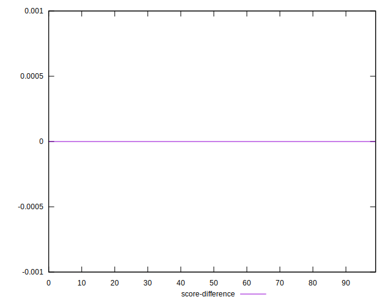
## P Score Difference


```yaml
p90min: -0.004999999999999893
p90max: 0.004444444444444473
p90range: 0.009444444444444366
p90mean: 0.0002173550271172305
p90median: 0.0011111111111110628
p90stdev: 0.002730182431023847
p90skewness: -0.2728095814541531
p90eccentricity: 0.9999999999999992
p90discretization: 2.41025641025641
outlandishness: 0.7662353263181025
confidence: 0.0011348436247683143
p90confidence: 0.001103839237206293

```

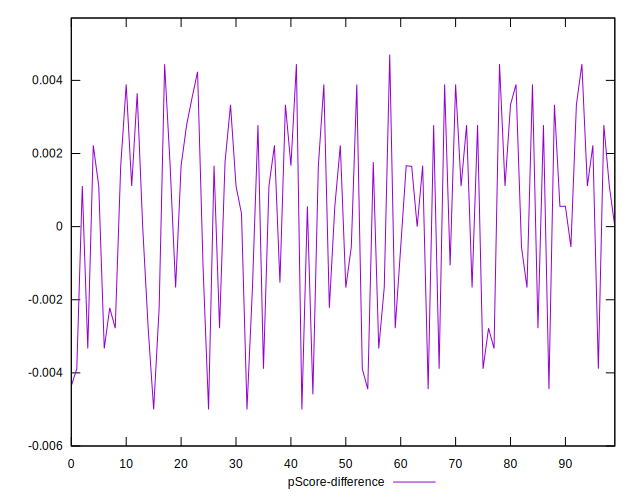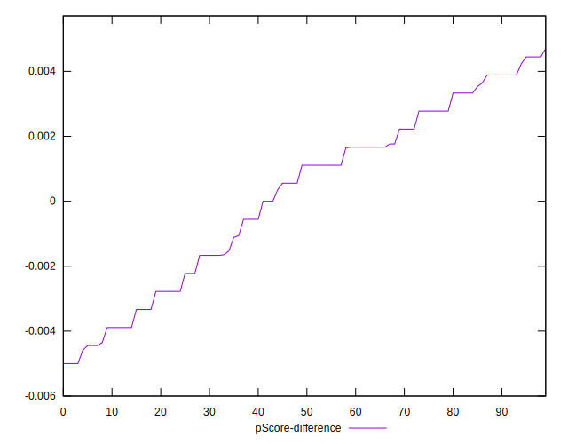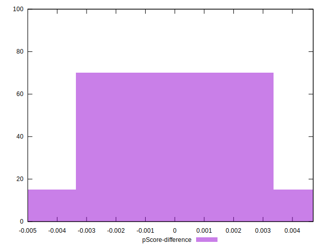