# //render-blocking-resources/samples/pages+cached

[→ Parent](../..)


## Raw


```yaml
p90min: 1180
p90max: 2117
p90range: 937
p90mean: 1436.0851063829787
p90median: 1384.5
p90stdev: 227.1649349052811
p90skewness: 1.4118058614611853
p90eccentricity: 1.0000000000000002
p90discretization: 1.146341463414634
outlandishness: 1.0226250642636163
confidence: 106.03891506104401
p90confidence: 91.84498648019922

```

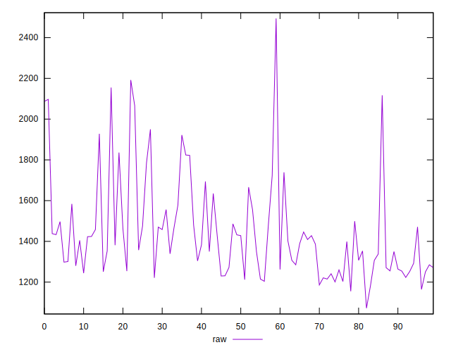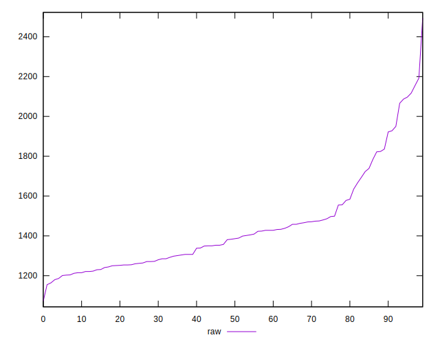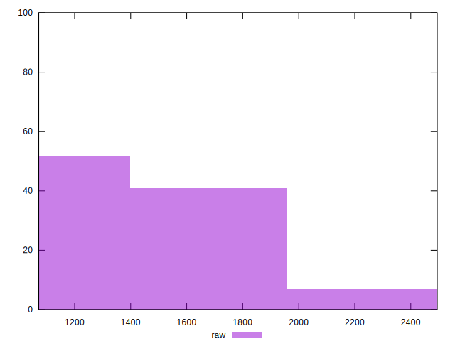
## Score


```yaml
p90min: 0.34
p90max: 0.45
p90range: 0.10999999999999999
p90mean: 0.4193617021276596
p90median: 0.43
p90stdev: 0.027085699714381677
p90skewness: -1.3812058683879374
p90eccentricity: 0.9999999999999991
p90discretization: 7.833333333333333
outlandishness: 0.9901915975711748
confidence: 0.01268815955295242
p90confidence: 0.010951011101741511

```

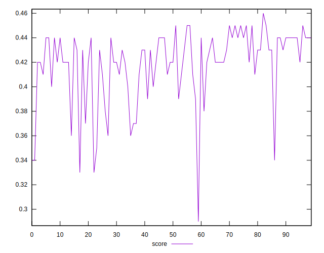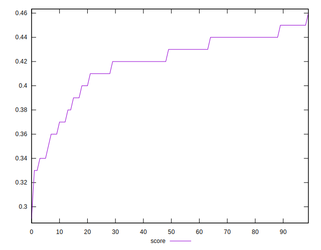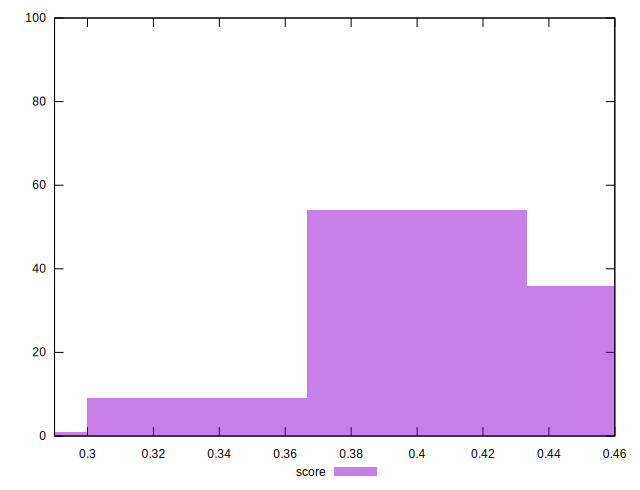
## Raw Estimate

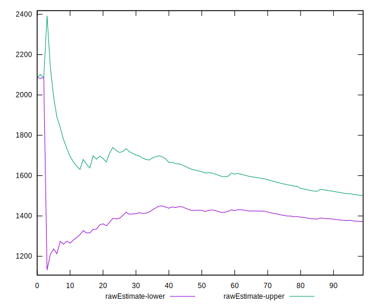
## Score Estimate

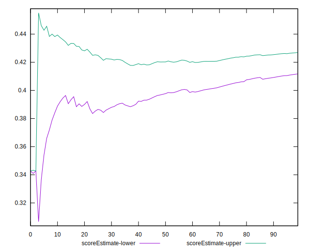
## P Score


```yaml
p90min: 0.3391764705882353
p90max: 0.44941176470588234
p90range: 0.11023529411764704
p90mean: 0.4192841051314142
p90median: 0.4253529411764706
p90stdev: 0.026725286459444834
p90skewness: -1.4118058614611613
p90eccentricity: 0.9999999999999997
p90discretization: 1.146341463414634
outlandishness: 0.9909547338892302
confidence: 0.012475166477769879
p90confidence: 0.01080529252708226

```

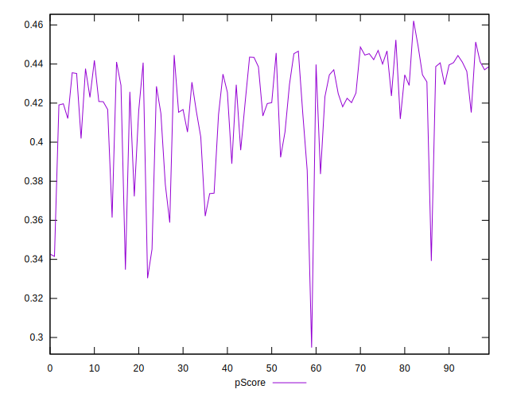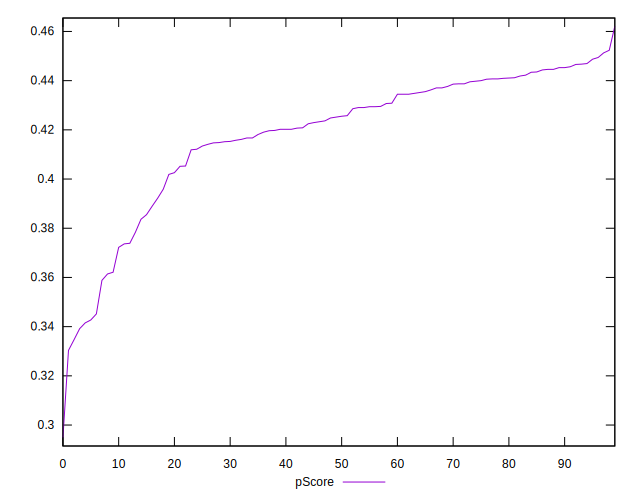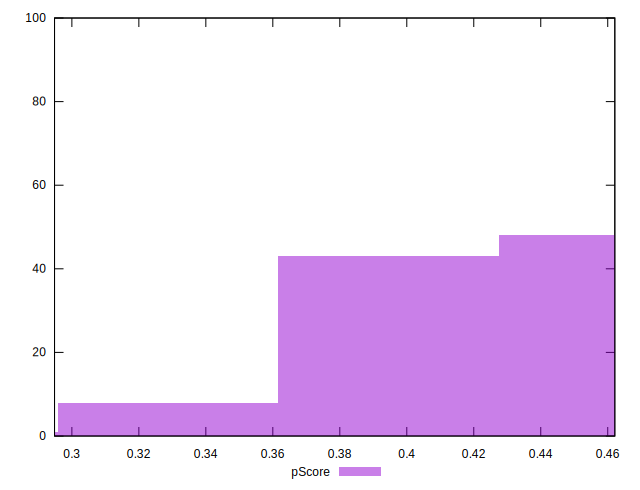
## Score Difference


```yaml
p90min: 0
p90max: 5.551115123125783e-17
p90range: 5.551115123125783e-17
p90mean: 3.543264972207946e-18
p90median: 0
p90stdev: 1.3569671737421589e-17
p90skewness: 3.5685919470917966
p90eccentricity: 0.9999999999999972
p90discretization: 47
outlandishness: 1.9881000000000004
confidence: 6.2273069308442164e-18
p90confidence: 5.486349897196451e-18

```

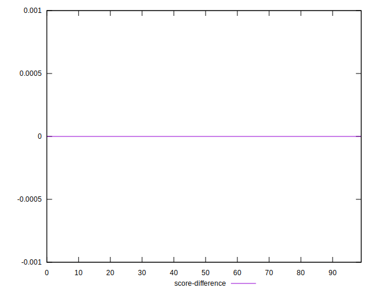
## P Score Difference


```yaml
p90min: -0.004823529411764671
p90max: 0.0048235294117647265
p90range: 0.009647058823529397
p90mean: 0.00008886107634543152
p90median: 0.00023529411764705577
p90stdev: 0.0028961096032770494
p90skewness: -0.1402062393071928
p90eccentricity: 1.0000000000000007
p90discretization: 1.540983606557377
outlandishness: 0.8835999999999999
confidence: 0.0011941721536233123
p90confidence: 0.0011709252022943793

```

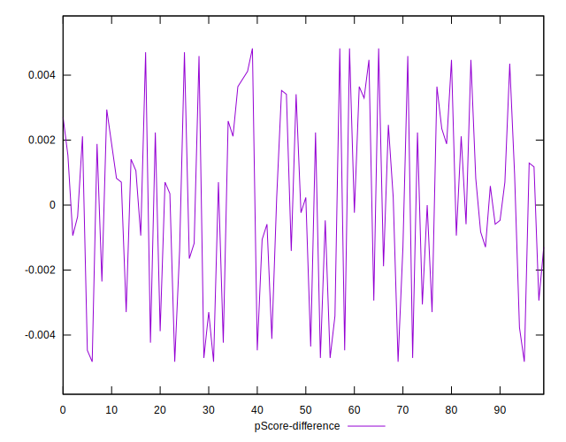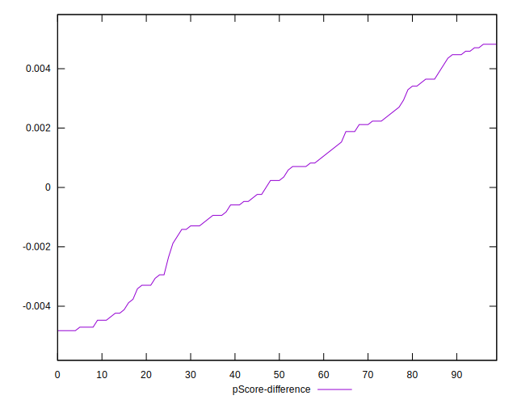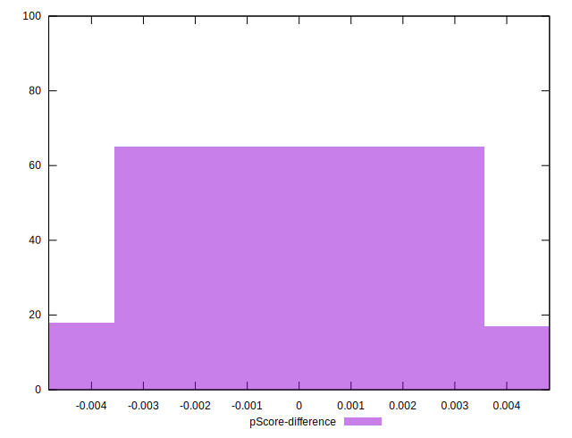