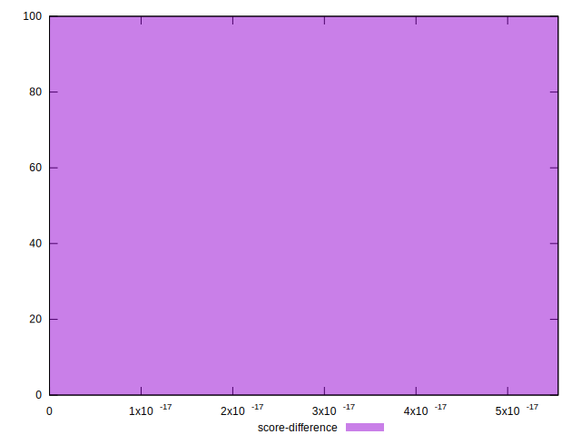

# //render-blocking-resources/samples/pages

[→ Parent](../..)


## Raw


```yaml
p90min: 1504
p90max: 2371
p90range: 867
p90mean: 1758.9148936170213
p90median: 1709.5
p90stdev: 196.02505590902814
p90skewness: 1.3122984306431378
p90eccentricity: 1.0000000000000002
p90discretization: 1.0681818181818181
outlandishness: 1.0174671415267431
confidence: 94.1626963097011
p90confidence: 79.25483137286095

```


## Score


```yaml
p90min: 0.31
p90max: 0.41
p90range: 0.09999999999999998
p90mean: 0.38191489361702113
p90median: 0.39
p90stdev: 0.023351003247146732
p90skewness: -1.2592128937062326
p90eccentricity: 0.9999999999999994
p90discretization: 8.545454545454545
outlandishness: 0.9905184040781806
confidence: 0.011245411855228886
p90confidence: 0.009441037096801603

```


## Raw Estimate


## Score Estimate


## P Score


```yaml
p90min: 0.30929411764705883
p90max: 0.4112941176470588
p90range: 0.10199999999999998
p90mean: 0.38130413016270337
p90median: 0.38711764705882357
p90stdev: 0.023061771283415074
p90skewness: -1.312298430643138
p90eccentricity: 1.0000000000000002
p90discretization: 1.0681818181818181
outlandishness: 0.990584007470341
confidence: 0.011077964271729543
p90confidence: 0.009324097808571876

```


## Score Difference


```yaml
p90min: 0
p90max: 5.551115123125783e-17
p90range: 5.551115123125783e-17
p90mean: 6.495985782381235e-18
p90median: 0
p90stdev: 1.784381735719593e-17
p90skewness: 2.382852212357381
p90eccentricity: 0.9999999999999979
p90discretization: 47
outlandishness: 1.4312859504132236
confidence: 7.550427891356825e-18
p90confidence: 7.214428426685427e-18

```


## P Score Difference


```yaml
p90min: -0.004588235294117671
p90max: 0.004117647058823504
p90range: 0.008705882352941174
p90mean: -0.000627033792240305
p90median: -0.0005294117647058894
p90stdev: 0.0025422231827670586
p90skewness: 0.08739950785365412
p90eccentricity: 1.0000000000000004
p90discretization: 1.4461538461538461
outlandishness: 0.9013247341644095
confidence: 0.0010655839174770778
p90confidence: 0.0010278454900983988

```

