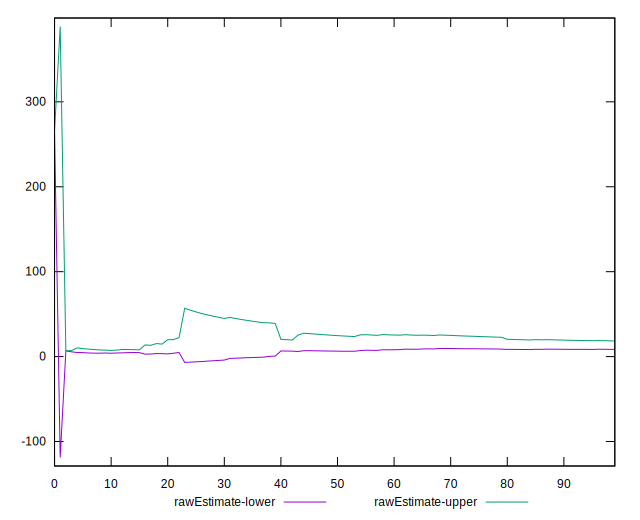

# //server-response-time/samples/pages+cached+noadtech

[→ Parent](../..)


## Raw


```yaml
p90min: 2.762
p90max: 84.66900000000001
p90range: 81.90700000000001
p90mean: 13.441425531914893
p90median: 6.451999999999999
p90stdev: 17.559924496087227
p90skewness: 2.318841511249867
p90eccentricity: 1.0000000000000007
p90discretization: 1
outlandishness: 2.1052847510898607
confidence: 16.610891165453577
p90confidence: 7.099647789430713

```


## Score


```yaml
p90min: 1
p90max: 1
p90range: 0
p90mean: 1
p90median: 1
p90stdev: 0
p90skewness: .nan
p90eccentricity: .nan
p90discretization: 94
outlandishness: 1
confidence: 0
p90confidence: 0

```


## Raw Estimate


## Score Estimate


## P Score


```yaml
p90min: 1
p90max: 1
p90range: 0
p90mean: 1
p90median: 1
p90stdev: 0
p90skewness: .nan
p90eccentricity: .nan
p90discretization: 94
outlandishness: 1
confidence: 0
p90confidence: 0

```


## Score Difference


```yaml
p90min: 0
p90max: 0
p90range: 0
p90mean: 0
p90median: 0
p90stdev: 0
p90skewness: .nan
p90eccentricity: .nan
p90discretization: 94
outlandishness: .nan
confidence: 0
p90confidence: 0

```


## P Score Difference


```yaml
p90min: 0
p90max: 0
p90range: 0
p90mean: 0
p90median: 0
p90stdev: 0
p90skewness: .nan
p90eccentricity: .nan
p90discretization: 94
outlandishness: .nan
confidence: 0
p90confidence: 0

```

