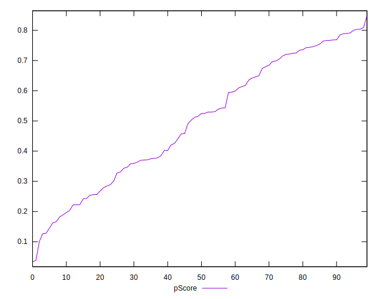

# //speed-index/samples/pages+cached

[→ Parent](../..)


## Raw


```yaml
p90min: 4055.598180679387
p90max: 9373.880072036958
p90range: 5318.281891357571
p90mean: 5987.0183752726925
p90median: 5677.89129043329
p90stdev: 1449.9996186821413
p90skewness: 0.49428998265703156
p90eccentricity: 0.9999999999999997
p90discretization: 1
outlandishness: 1.0355190402864207
confidence: 685.4363614407762
p90confidence: 586.2489095409209

```


## Score


```yaml
p90min: 0.13
p90max: 0.8
p90range: 0.67
p90mean: 0.49904255319148927
p90median: 0.52
p90stdev: 0.20616079837100598
p90skewness: -0.1235093836601271
p90eccentricity: 0.9999999999999999
p90discretization: 1.88
outlandishness: 0.985455109915571
confidence: 0.08672067906279828
p90confidence: 0.08335281035793314

```


## Raw Estimate


## Score Estimate


## P Score


```yaml
p90min: 0.1263656361551384
p90max: 0.802988616765608
p90range: 0.6766229806104695
p90mean: 0.4992286318444064
p90median: 0.520224890733191
p90stdev: 0.20637968663968057
p90skewness: -0.12605559051031998
p90eccentricity: 0.9999999999999994
p90discretization: 1
outlandishness: 0.9855836651788671
confidence: 0.08678968133642292
p90confidence: 0.08344130900797997

```


## Score Difference


```yaml
p90min: 0
p90max: 5.551115123125783e-17
p90range: 5.551115123125783e-17
p90mean: 5.905441620346577e-19
p90median: 0
p90stdev: 5.695001657605474e-18
p90skewness: 9.539955591519892
p90eccentricity: 1.000000000000004
p90discretization: 47
outlandishness: 43.29640000000001
confidence: 7.696388387997905e-18
p90confidence: 2.3025444066249988e-18

```


## P Score Difference


```yaml
p90min: -0.0048273536304038744
p90max: 0.004669046437146496
p90range: 0.00949640006755037
p90mean: 0.0002354232623891707
p90median: 0.0002602992839957907
p90stdev: 0.0028397889290283484
p90skewness: -0.0684219061731359
p90eccentricity: 1.0000000000000004
p90discretization: 1
outlandishness: 0.849961230882414
confidence: 0.001177372856324792
p90confidence: 0.0011481542074351396

```

