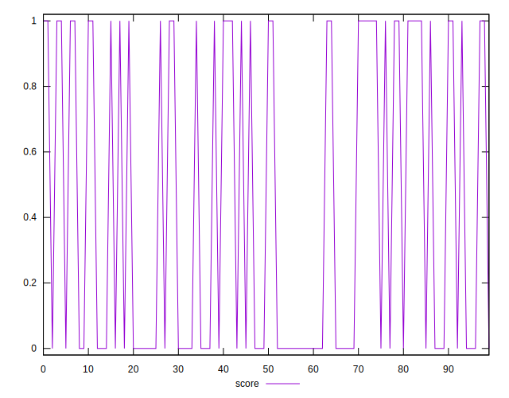
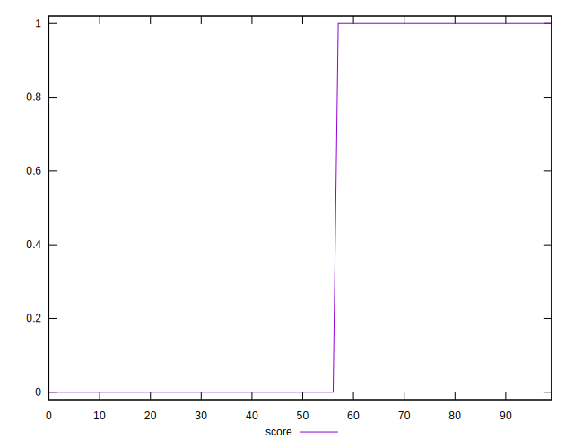
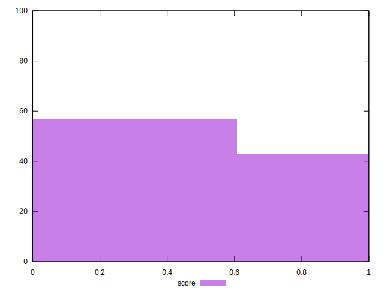

# //third-party-summary/samples/pages+cached+noadtech+nomedia

[→ Parent](../..)


## Raw


```yaml
p90range: 0

```


## Score


```yaml
p90min: 0
p90max: 1
p90range: 1
p90mean: 0.425531914893617
p90median: 0
p90stdev: 0.4944234058988192
p90skewness: 0.3012320380383549
p90eccentricity: 0.9999999999999997
p90discretization: 47
outlandishness: 1.02111025
confidence: 0.19406612862136766
p90confidence: 0.19990017847255093

```

