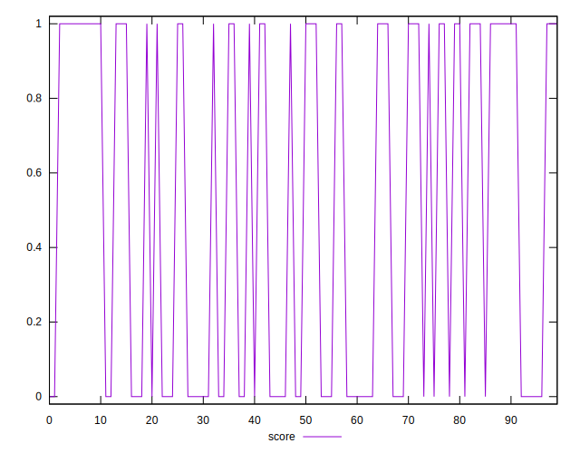
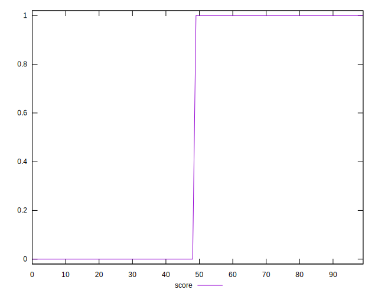
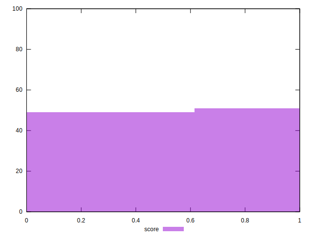

# //third-party-summary/samples/pages+cached+noadtech

[→ Parent](../..)


## Raw


```yaml
p90range: 0

```


## Score


```yaml
p90min: 0
p90max: 1
p90range: 1
p90mean: 0.5106382978723404
p90median: 1
p90stdev: 0.4998868138072653
p90skewness: -0.042562826537937005
p90eccentricity: 0.9999999999999982
p90discretization: 47
outlandishness: 0.9975015625000003
confidence: 0.19595719525360245
p90confidence: 0.20210908728013724

```

