# //total-blocking-time/samples/pages+cached+noadtech+nomedia+nocss

[→ Parent](../..)


## Raw


```yaml
p90min: 53.5
p90max: 900
p90range: 846.5
p90mean: 323.26321808510636
p90median: 308
p90stdev: 205.2356581691268
p90skewness: 0.827601339595364
p90eccentricity: 1.0000000000000002
p90discretization: 1.010752688172043
outlandishness: 1.2237100808796935
confidence: 130.99975203895914
p90confidence: 82.97876720127559

```

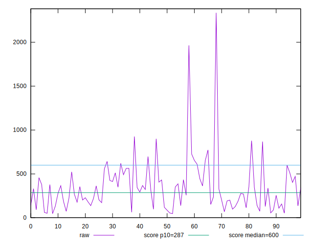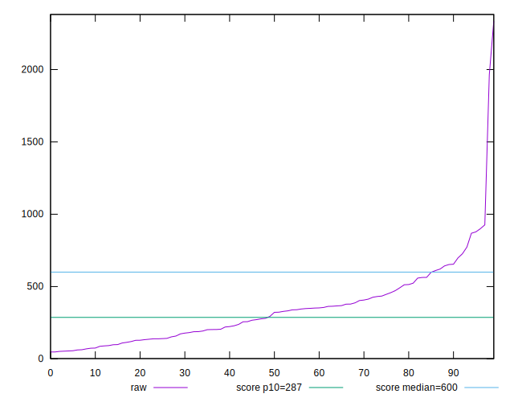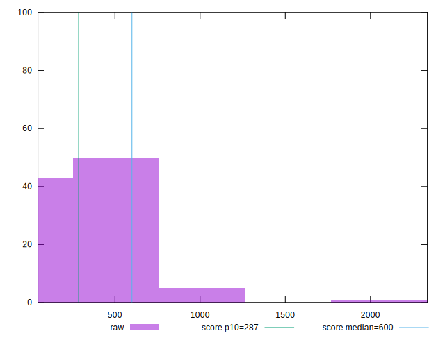
## Score


```yaml
p90min: 0.24
p90max: 1
p90range: 0.76
p90mean: 0.8161702127659575
p90median: 0.875
p90stdev: 0.2080819518535636
p90skewness: -1.1489256157792538
p90eccentricity: 1.0000000000000007
p90discretization: 2.238095238095238
outlandishness: 0.9602875945300595
confidence: 0.09417618583742118
p90confidence: 0.0841295513444127

```

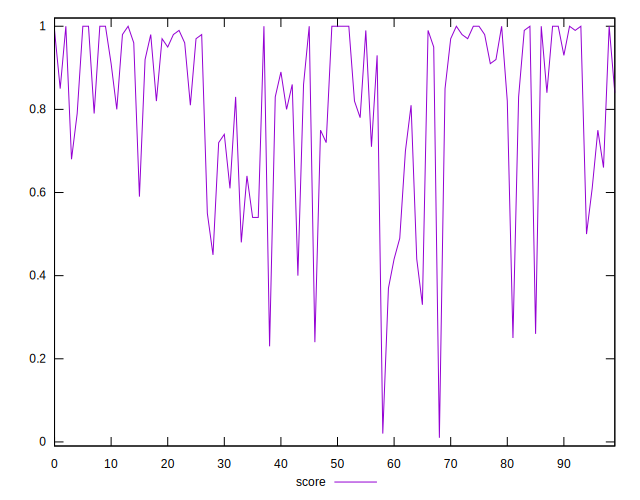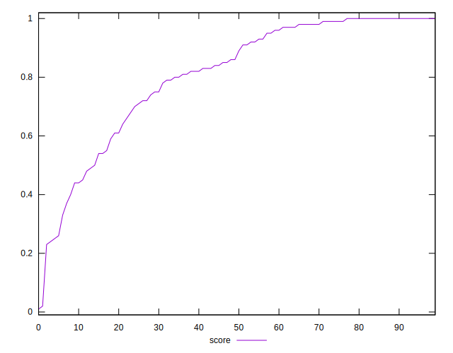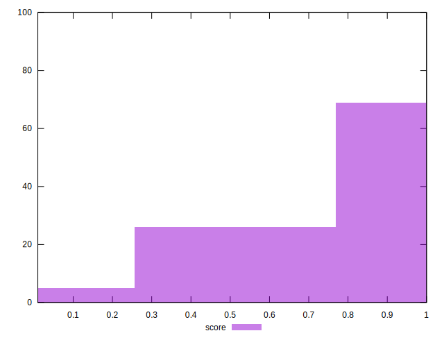
## Raw Estimate

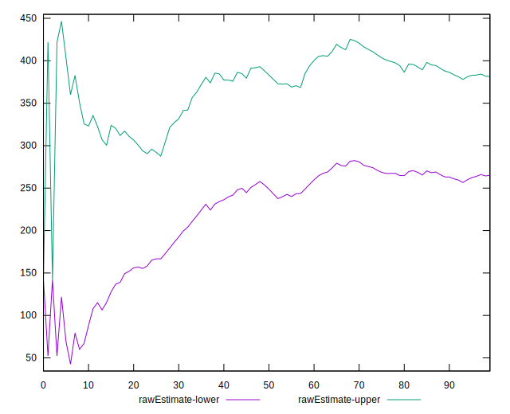
## Score Estimate

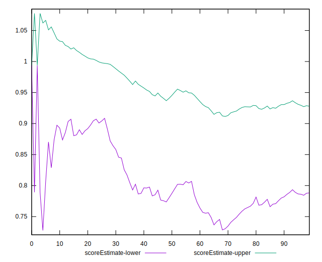
## P Score


```yaml
p90min: 0.24052152022843154
p90max: 0.9999866897103327
p90range: 0.7594651694819011
p90mean: 0.815956637731634
p90median: 0.8763663662284282
p90stdev: 0.20783112815949453
p90skewness: -1.1478325459679524
p90eccentricity: 1
p90discretization: 1.010752688172043
outlandishness: 0.9601607653723091
confidence: 0.09415207138264578
p90confidence: 0.08402814089213365

```

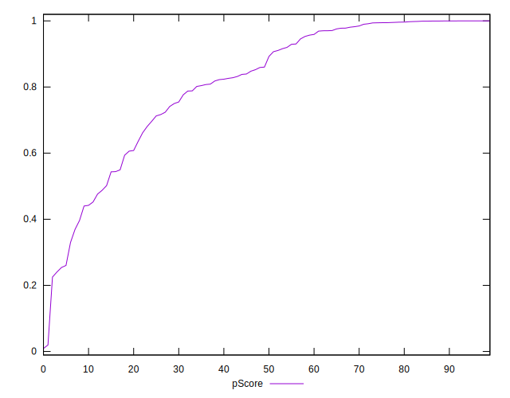
## Score Difference


```yaml
p90min: 0
p90max: 1.1102230246251565e-16
p90range: 1.1102230246251565e-16
p90mean: 7.086529944415892e-18
p90median: 0
p90stdev: 2.7139343474843184e-17
p90skewness: 3.5685919470917984
p90eccentricity: 0.9999999999999984
p90discretization: 47
outlandishness: 1.9881000000000004
confidence: 1.245461386168844e-17
p90confidence: 1.0972699794392905e-17

```

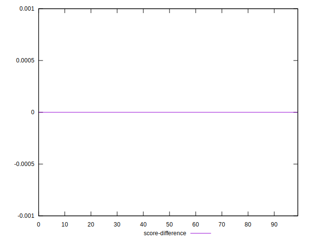
## P Score Difference


```yaml
p90min: -0.004431275898061915
p90max: 0.004480860197322856
p90range: 0.00891213609538477
p90mean: -0.00027458855169617484
p90median: -0.0001679360404273078
p90stdev: 0.002313062460963795
p90skewness: 0.1658696072847042
p90eccentricity: 0.9999999999999996
p90discretization: 1.010752688172043
outlandishness: 0.9110763902816315
confidence: 0.0009882299208956635
p90confidence: 0.0009351935876179861

```

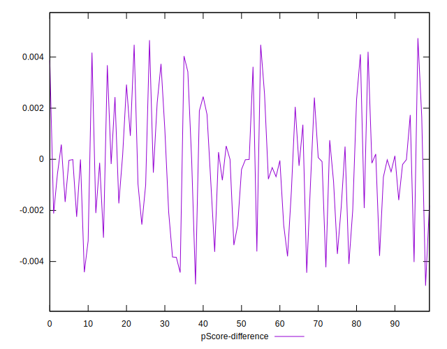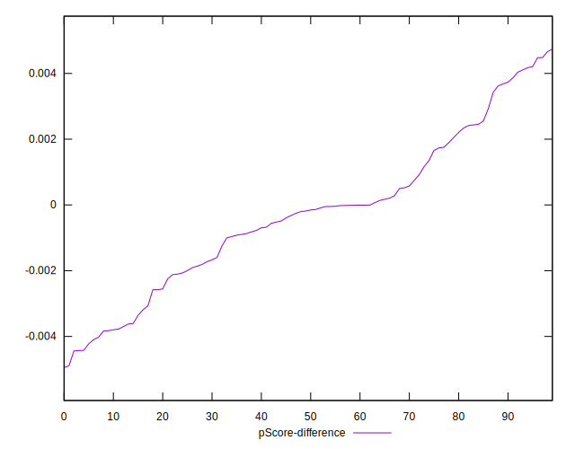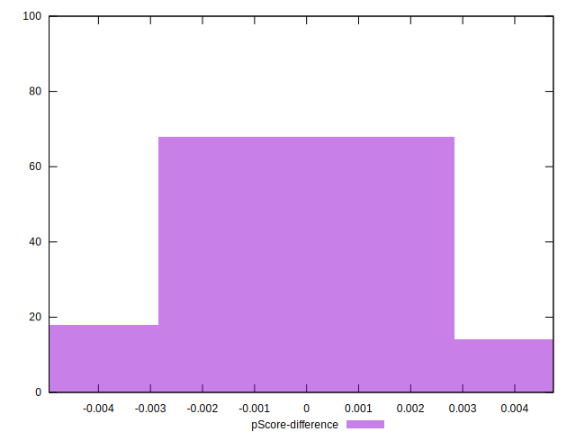