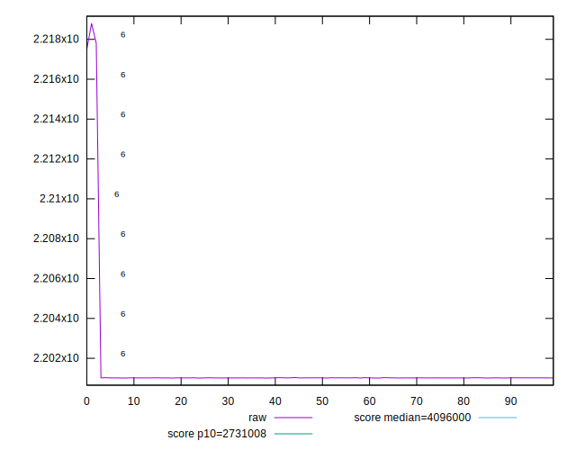
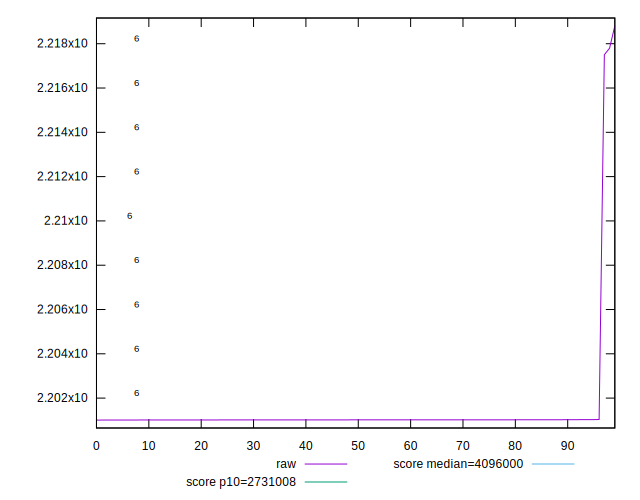
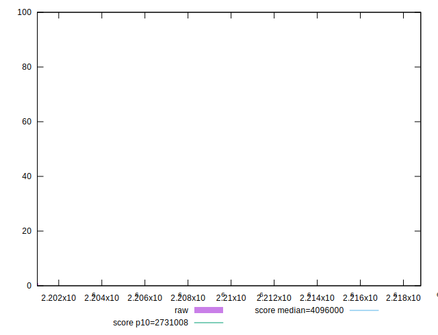
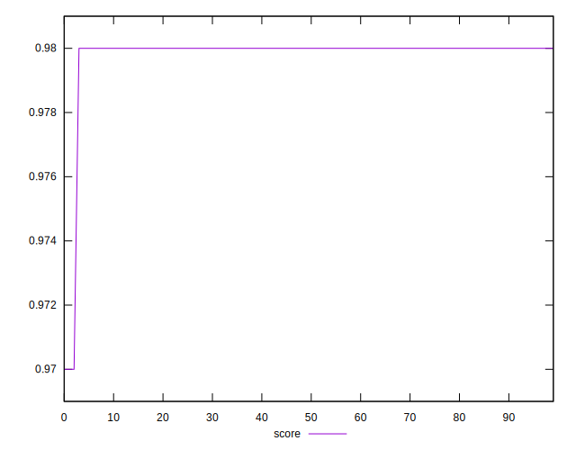
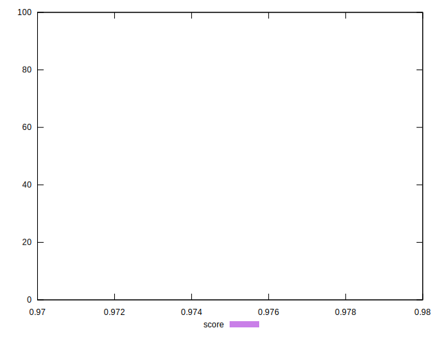
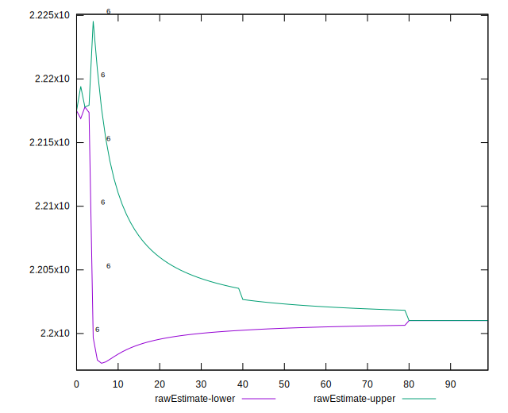
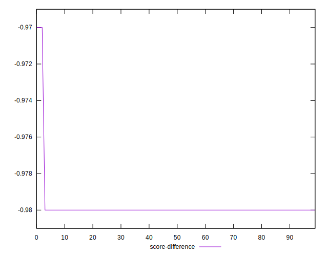
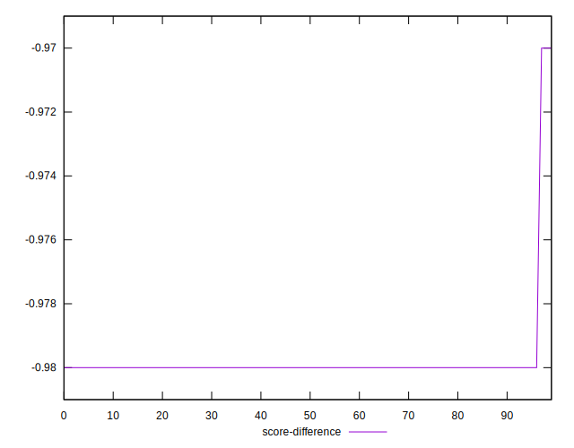
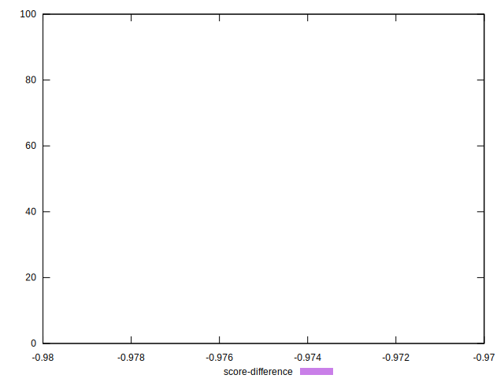

# //total-byte-weight/samples/pages+cached

[→ Parent](../..)


## Raw


```yaml
p90min: 2201009
p90max: 2201034
p90range: 25
p90mean: 2201017.4680851065
p90median: 2201018
p90stdev: 4.394634367817125
p90skewness: 0.9986250283954812
p90eccentricity: 1.0000000000000022
p90discretization: 5.529411764705882
outlandishness: 1.000463722866016
confidence: 1138.66059767658
p90confidence: 1.776793298956455

```


## Score


```yaml
p90min: 0.98
p90max: 0.98
p90range: 0
p90mean: 0.9800000000000002
p90median: 0.98
p90stdev: 2.220446049250313e-16
p90skewness: -1
p90eccentricity: 1
p90discretization: 94
outlandishness: 0.9993878488129951
confidence: 0.0006686896191274374
p90confidence: 8.977478740653372e-17

```


## Raw Estimate


## Score Estimate


## P Score


```yaml
p90min: 0
p90max: 0
p90range: 0
p90mean: 0
p90median: 0
p90stdev: 0
p90skewness: .nan
p90eccentricity: .nan
p90discretization: 94
outlandishness: .nan
confidence: 0
p90confidence: 0

```


## Score Difference


```yaml
p90min: -0.98
p90max: -0.98
p90range: 0
p90mean: -0.9800000000000002
p90median: -0.98
p90stdev: 2.220446049250313e-16
p90skewness: 1
p90eccentricity: 1
p90discretization: 94
outlandishness: 0.9993878488129951
confidence: 0.0006686896191274374
p90confidence: 8.977478740653372e-17

```


## P Score Difference


```yaml
p90min: -0.98
p90max: -0.98
p90range: 0
p90mean: -0.9800000000000002
p90median: -0.98
p90stdev: 2.220446049250313e-16
p90skewness: 1
p90eccentricity: 1
p90discretization: 94
outlandishness: 0.9993878488129951
confidence: 0.0006686896191274374
p90confidence: 8.977478740653372e-17

```

