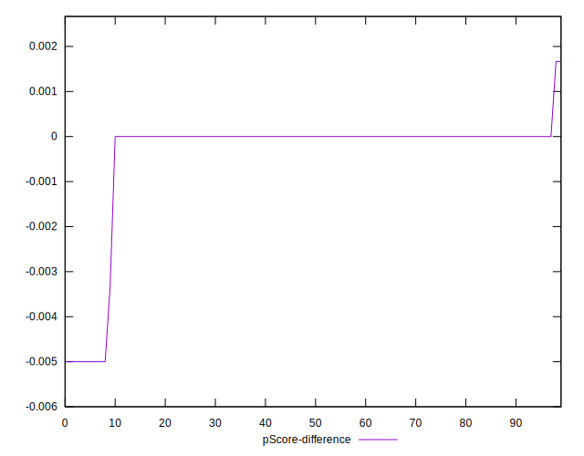

# //unminified-css/samples/pages+cached

[→ Parent](../..)


## Raw


```yaml
p90min: 0
p90max: 150
p90range: 150
p90mean: 13.51063829787234
p90median: 0
p90stdev: 42.09178033693754
p90skewness: 2.886569455961558
p90eccentricity: 0.999999999999998
p90discretization: 23.5
outlandishness: 1.7163063054126106
confidence: 19.065967110749266
p90confidence: 17.018115043087445

```


## Score


```yaml
p90min: 0.88
p90max: 1
p90range: 0.12
p90mean: 0.9891489361702129
p90median: 1
p90stdev: 0.03369637819000115
p90skewness: -2.8793258982374237
p90eccentricity: 1.0000000000000022
p90discretization: 23.5
outlandishness: 0.9930386148770839
confidence: 0.01539543912398591
p90confidence: 0.013623772527140973

```


## Raw Estimate


## Score Estimate


## P Score


```yaml
p90min: 0.875
p90max: 1
p90range: 0.125
p90mean: 0.988741134751773
p90median: 1
p90stdev: 0.03507648361411462
p90skewness: -2.8865694559615553
p90eccentricity: 0.9999999999999968
p90discretization: 23.5
outlandishness: 0.992950690073622
confidence: 0.015888305925624374
p90confidence: 0.014181762535906204

```


## Score Difference


```yaml
p90min: 0
p90max: 0
p90range: 0
p90mean: 0
p90median: 0
p90stdev: 0
p90skewness: .nan
p90eccentricity: .nan
p90discretization: 94
outlandishness: .inf
confidence: 4.3301796410739334e-18
p90confidence: 0

```


## P Score Difference


```yaml
p90min: -0.0050000000000000044
p90max: 0
p90range: 0.0050000000000000044
p90mean: -0.0003546099290780141
p90median: 0
p90stdev: 0.0012602379889302745
p90skewness: -3.3167806313790287
p90eccentricity: 1.0000000000000009
p90discretization: 31.333333333333332
outlandishness: 1.6103609999999957
confidence: 0.0005832882673996998
p90confidence: 0.0005095264421130679

```

