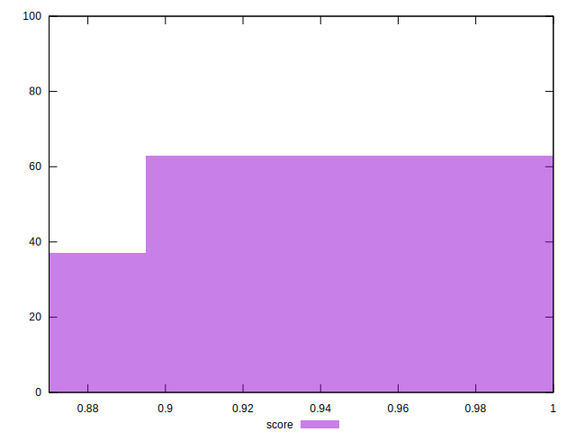

# //unminified-css/samples/pages

[→ Parent](../..)


## Raw


```yaml
p90min: 0
p90max: 150
p90range: 150
p90mean: 61.48936170212766
p90median: 5
p90stdev: 69.7710152404111
p90skewness: 0.38328926359839666
p90eccentricity: 1.000000000000001
p90discretization: 7.230769230769231
outlandishness: 1.0331421139593637
confidence: 27.60906868748629
p90confidence: 28.209098178542682

```


## Score


```yaml
p90min: 0.88
p90max: 1
p90range: 0.12
p90mean: 0.9506382978723402
p90median: 0.995
p90stdev: 0.055959873743988996
p90skewness: -0.37770326664944887
p90eccentricity: 0.9999999999999991
p90discretization: 8.545454545454545
outlandishness: 0.998237124976657
confidence: 0.02216045914017631
p90confidence: 0.022625119715740247

```


## Raw Estimate


## Score Estimate


## P Score


```yaml
p90min: 0.875
p90max: 1
p90range: 0.125
p90mean: 0.948758865248227
p90median: 0.9958333333333333
p90stdev: 0.05814251270034261
p90skewness: -0.38328926359839055
p90eccentricity: 1.0000000000000004
p90discretization: 7.230769230769231
outlandishness: 0.9982254188939612
confidence: 0.023007557239571912
p90confidence: 0.023507581815452244

```


## Score Difference


```yaml
p90min: 0
p90max: 0
p90range: 0
p90mean: 0
p90median: 0
p90stdev: 0
p90skewness: .nan
p90eccentricity: .nan
p90discretization: 94
outlandishness: .inf
confidence: 4.330179641073931e-18
p90confidence: 0

```


## P Score Difference


```yaml
p90min: -0.0050000000000000044
p90max: 0.0016666666666667052
p90range: 0.00666666666666671
p90mean: -0.0019503546099290782
p90median: 0
p90stdev: 0.002450916481649291
p90skewness: -0.34702502522273015
p90eccentricity: 0.9999999999999997
p90discretization: 13.428571428571429
outlandishness: 0.9324535867768607
confidence: 0.0010190765676516965
p90confidence: 0.000990929305242626

```

