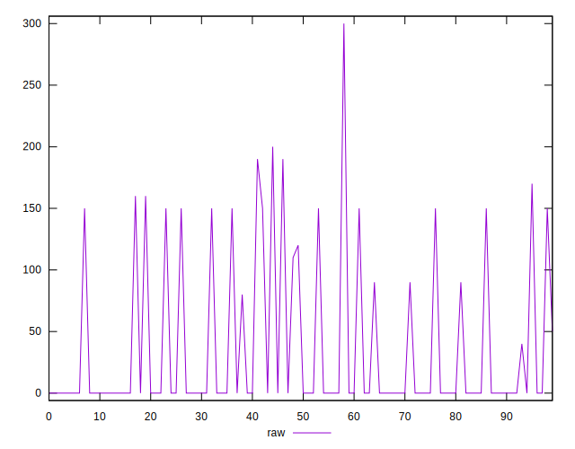

# //unminified-javascript/samples/pages+cached

[→ Parent](../..)


## Raw


```yaml
p90min: 0
p90max: 190
p90range: 190
p90mean: 31.914893617021278
p90median: 0
p90stdev: 59.18374913064308
p90skewness: 1.4602817069972303
p90eccentricity: 0.9999999999999989
p90discretization: 8.545454545454545
outlandishness: 1.3367984399999997
confidence: 26.439587246610053
p90confidence: 23.928563803290785

```


## Score


```yaml
p90min: 0.84
p90max: 1
p90range: 0.16000000000000003
p90mean: 0.974255319148936
p90median: 1
p90stdev: 0.04785815392635374
p90skewness: -1.4753573908655484
p90eccentricity: 1.0000000000000002
p90discretization: 9.4
outlandishness: 0.9912835456033535
confidence: 0.02163430938840834
p90confidence: 0.01934951581398783

```


## Raw Estimate


## Score Estimate


## P Score


```yaml
p90min: 0.8416666666666667
p90max: 1
p90range: 0.15833333333333333
p90mean: 0.9734042553191488
p90median: 1
p90stdev: 0.04931979094220259
p90skewness: -1.4602817069972118
p90eccentricity: 0.999999999999998
p90discretization: 8.545454545454545
outlandishness: 0.9914826946460031
confidence: 0.022032989372175047
p90confidence: 0.019940469836075666

```


## Score Difference


```yaml
p90min: 0
p90max: 0
p90range: 0
p90mean: 0
p90median: 0
p90stdev: 0
p90skewness: .nan
p90eccentricity: .nan
p90discretization: 94
outlandishness: .inf
confidence: 4.330179641073933e-18
p90confidence: 0

```


## P Score Difference


```yaml
p90min: -0.0050000000000000044
p90max: 0.0016666666666667052
p90range: 0.00666666666666671
p90mean: -0.000726950354609927
p90median: 0
p90stdev: 0.0016940744775826113
p90skewness: -1.905719238718983
p90eccentricity: 1.0000000000000016
p90discretization: 15.666666666666666
outlandishness: 1.064419988102322
confidence: 0.0007470465854920201
p90confidence: 0.0006849307423036103

```

